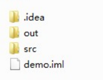
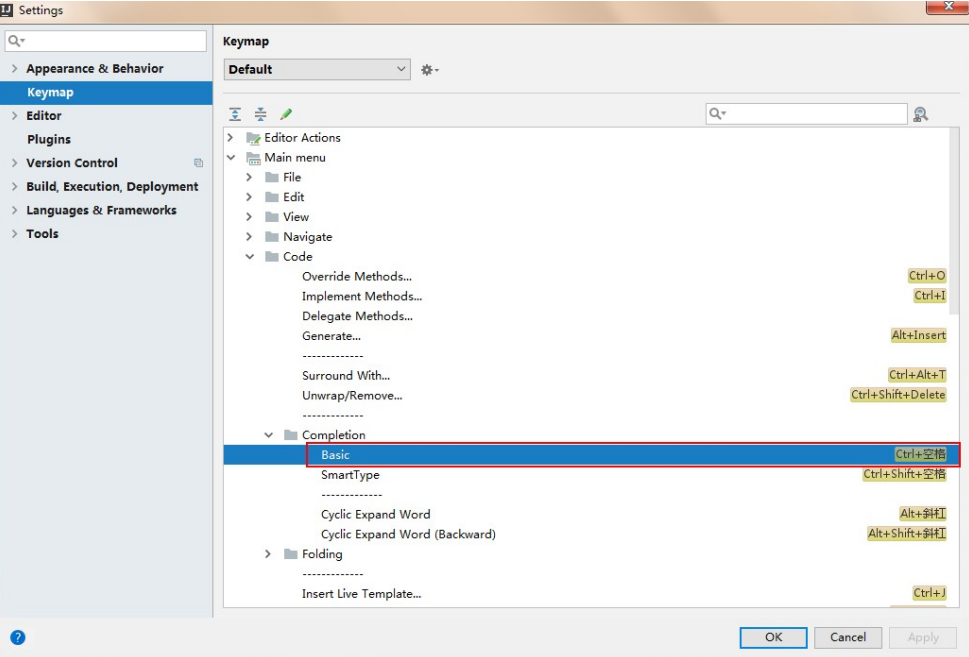
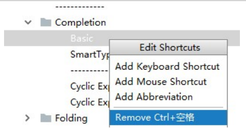
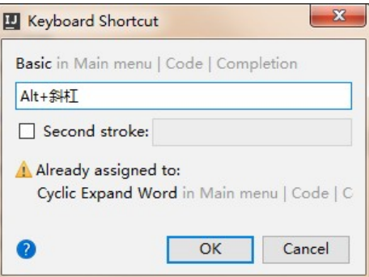
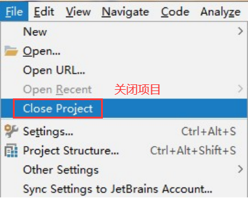
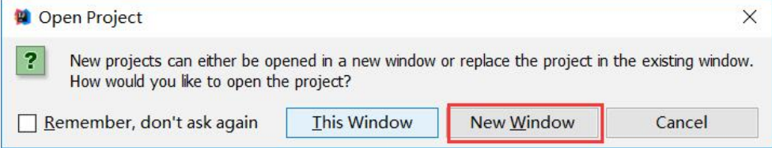
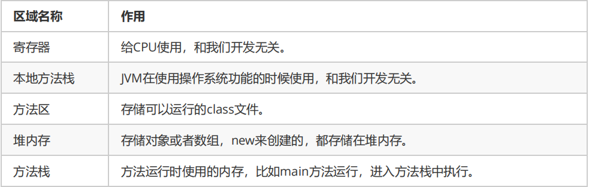
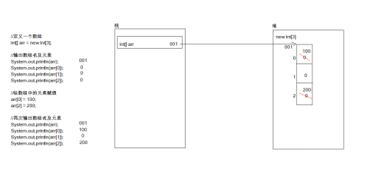
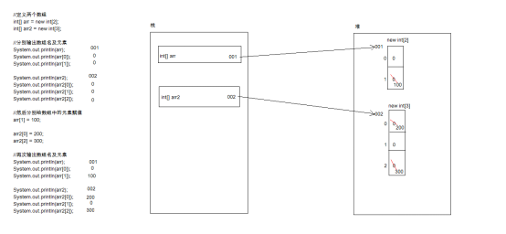
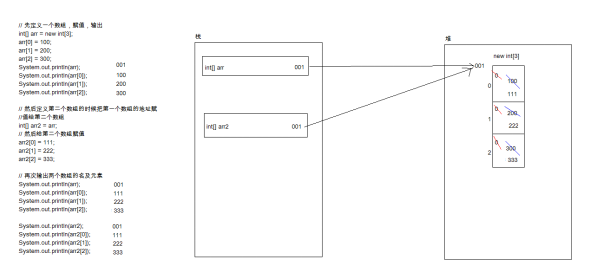

# Java基础知识 第4天

【学习目标】理解、了解、应用、记忆


**1. 【应用】IDEA工具的安装及使用**

a) 【应用】掌握idea开发工具的安装 

b) 【应用】能够使用idea创建Java工程 

c) 【应用】能够使用idea创建包和类 

d) 【了解】idea的Java工程目录 

e) 【了解】idea字体的设置 

f) 【应用】idea常用开发快捷键 

g) 【了解】项目的导入和删除 


**2. 【理解】一维数组内存结构及静态初始化**

a) 【记忆】能够阐述Java中的内存划分哪几块区域

b) 【理解】能够根据代码阐述一个数组在内存中的分布图

c) 【理解】能够根据代码阐述两个数组在内存中的分布图

d) 【理解】能够根据代码阐述两个数组指向同一个地址值的内存图

e) 【应用】能够独立写出数组初始化之静态初始化


**3. 【应用】一维数组常见问题及练习**

a) 【应用】能够独立写出数组操作的两个常见小问题的代码

b) 【应用】能够独立编写数组操作之遍历数组的代码

c) 【应用】能够独立编写数组操作之获取最值的代码


**4.【理解】二维数组的定义和使用**

a) 【理解】能够阐述二维数组的概述和基本使用

b) 【应用】能够独立编写二维数组遍历代码


**5.【应用】Arrays数组的工具类**

a) 【应用】Arrays的API使用

b) 【了解】快速排序原理的解析

c) 【应用】冒泡排序实现

d) 【理解】折半查找法

e) 【应用】数组拷贝及扩容


# 第1章 开发工具IntelliJ IDEA的使用

## 1.1 开发工具概述

​	IDEA是一个专门针对Java的集成开发工具(IDE)，由Java语言编写。所以，需要有JRE运行环境并配置好环境变量。 它可以极大地提升我们的开发效率。可以自动编译，检查错误。在公司中，使用的就是IDEA进行开发。 


## 1.2 IDEA软件安装 

此软件集成了32位和64位，双击 ideaIU-2019.2.4.exe 进入安装。 

**PS:**破解详情见《IDEA开发工具安装及使用.pdf》文件


## 1.3 IDEA常用快捷键

Alt+Enter   导入包，自动修正代码 

Ctrl+Y         删除光标所在行 

Ctrl+D        复制光标所在行的内容，插入光标位置下面 

Ctrl+Alt+L  格式化代码 

Ctrl+/         单行注释 

Ctrl+Shift+/     选中代码注释，多行注释，再按取消注释 

Alt+Ins       自动生成代码，toString，get，set等方法 

Alt+Shift+上下箭头  移动当前代码行 


## 1.4 字体设置

IDEA工具的默认字体非常小，代码编辑器和控制台的输出字体都需要进行调整。 

点击菜单栏上的 File->Settings->Editor->Font 修改字体。


## 1.5 IDEA的项目目录 

我们创建的项目，在项目所在目录的demo下 

.idea 目录和 demo.iml 与开发无关，是IDEA工具自己使用的 

out 目录是存储编译后的.class文件 

src 目录是存储我们编写的.java源文件 




## 1.6 IDEA修改快捷键 

​		在IDEA工具中， Ctrl+空格 的快捷键，可以帮助我们补全代码，但是这个快捷键和Windows中的输入法切换快捷 键冲突，需要修改IDEA中的快捷键。 

**1. File->Settings->keymap->Main menu->code->Completion->Basic** 




**2.双击 Basic->remove->Ctrl+空格**




**3.双击 Basic->Add Keyboard->键入 Alt+/->点击OK** 




## 1.7 IDEA导入和关闭项目 

1.关闭IDEA中已经存在的项目

 File->Close Project 




File->Close Project后，此时IDEA回到了刚启动界面，点击项目上的 X ，IDEA中就没有这个项目了


2.在IDEA的启动界面上，点击 OPEN ，选择项目目录打开即可 

3.若想通过IDEA同时开启多个项目，点击OPEN打开项目时，点击New Window按钮 




# 第2章 数组

## 2.1 数组概述

> **容器：**是将多个数据存储到一起，每个数据称为该容器的元素。


那么数组到底是什么呢?有什么特点呢?

数组是存储多个变量(元素)的东西(容器)

这多个变量的数据类型要一致


> **数组概念：** 数组就是存储数据长度固定的容器，保证多个数据的数据类型要一致。 


> **数组特点：**
>
> 1.数组长度固定
>
> 2.数组容器中存储元素的数据类型一致

 

## 2.2 数组的定义格式

### 2.2.1 数组概念

数组是存储同一种数据类型多个元素的容器。

数组既可以存储基本数据类型，也可以存储引用数据类型。


### 2.2.2 数组的定义格式

格式1：数据类型[] 数组名;  int[] arr;

格式2：数据类型 数组名[];

注意：这两种定义做完了，数组中是没有元素值的。     	    


## 2.3 数组的初始化

### 2.3.1 数组初始化概述

Java中的数组必须先初始化,然后才能使用。

所谓初始化：就是为数组中的数组元素分配内存空间，并为每个数组元素赋值。


### 2.3.2 数组的初始化方式

#### 2.3.2.1 动态初始化:初始化时只指定数组长度，由系统为数组分配初始值

```java
	格式：数据类型[] 数组名 = new 数据类型[数组长度];
```

数组长度其实就是数组中元素的个数。


#### 2.3.2.2 案例一

```java
//数组：存储同一种数据类型的多个元素的容器。
//动态初始化：数据类型[] 数组名 = new 数据类型[数组长度];
public class ArrayDemo1 {
	public static void main(String[] args) {
		//数据类型[] 数组名 = new 数据类型[数组长度];  数组中的元素默认值为0
		int[] arr = new int[3];
		/*
		 * 左边：
		 * 		int:说明数组中的元素的数据类型是int类型
		 * 		[]:说明这是一个数组
		 * 		arr:是数组的名称
		 * 右边：
		 * 		new:为数组分配内存空间
		 * 		int:说明数组中的元素的数据类型是int类型
		 * 		[]:说明这是一个数组
		 * 		3:数组的长度，其实就是数组中的元素个数
		 */
	}
}
```


#### 2.3.2.3 静态初始化:初始化时指定每个数组元素的初始值，由元素个数决定数组长度

```java
	格式：数据类型[] 数组名 = new 数据类型[]{元素1,元素2,元素3...};

	格式：数据类型[] 数组名 = {元素1,元素2,元素3...};
```


#### 2.3.2.4 案例二

```java
//静态初始化的格式
//数据类型[] 数组名 = new 数据类型[]{元素1,元素2,...};
//简化格式：数据类型[] 数组名 = {元素1,元素2,...};
public class ArrayDemo2 {
	public static void main(String[] args) {
		//定义数组
        int[] arr1 = new int[]{1,2,3};
		int[] arr2 = {1,2,3};
	}
}
```


## 2.4 数组的内存分配

**内存概述：**内存是计算机中的重要原件，临时存储区域，作用是运行程序。我们编写的程序是存放在硬盘中的，在硬盘中的程序是不会运行的，必须放进内存中才能运行，运行完毕后会清空内存。 


### 2.4.1 JVM内存划分

Java程序在运行时，需要在内存中的分配空间。为了提高运算效率，就对空间进行了不同区域的划分，因为每一片区域都有特定的处理数据方式和内存管理方式。

```
栈 存储局部变量。空间相对小
	- 局部变量即定义在方法内部的变量
	- 使用完毕立即回收。

堆 存储new出来的东西，真正的对象。空间相对大
	- 每个对象都有首地址
	- 每个对象的数据都有默认值
	- 使用结束后会被垃圾回收器在空闲的时候回收
```




### 2.4.2 一个数组的内存图

需求：定义一个数组，输出数组名及元素。然后给数组中的元素赋值，再次输出数组名及元素。


#### 2.4.2.1 案例三

```java
/**  
 * 需求：定义一个数组，输出数组名及元素。然后给数组中的元素赋值，再次输出数组名及元素。
 */
public class ArrayTest1 {
	public static void main(String[] args) {
		//定义一个数组
		int[] arr = new int[3];
		
		//输出数组名及元素
		System.out.println(arr);
		System.out.println(arr[0]);
		System.out.println(arr[1]);
		System.out.println(arr[2]);
		
		//给数组中的元素赋值
		arr[0] = 100;
		arr[2] = 200;
		
		//再次输出数组名及元素
		System.out.println(arr);
		System.out.println(arr[0]);
		System.out.println(arr[1]);
		System.out.println(arr[2]);
	}
}
```


#### 2.4.2.2 代码内存图解




### 2.4.3 两个数组的内存图

需求：定义两个数组，分别输出数组名及元素。然后分别给数组中的元素赋值，分别再次输出数组名及元素


#### 2.4.3.1 案例四

```java
/**  
 * 需求：定义两个数组，分别输出数组名及元素。然后分别给数组中的元素赋值，分别再次输出数组名及元素。
 */
public class ArrayTest2 {
	public static void main(String[] args) {
		//定义两个数组
		int[] arr = new int[2];
		int[] arr2 = new int[3];
        //分别输出数组名及元素
		System.out.println(arr);
		System.out.println(arr[0]);
		System.out.println(arr[1]);
		
		System.out.println(arr2);
		System.out.println(arr2[0]);
		System.out.println(arr2[1]);
		System.out.println(arr2[2]);
		
		//然后分别给数组中的元素赋值
		arr[1] = 100;
		
		arr2[0] = 200;
		arr2[2] = 300;
		
		//再次输出数组名及元素
		System.out.println(arr);
		System.out.println(arr[0]);
		System.out.println(arr[1]);
		
		System.out.println(arr2);
		System.out.println(arr2[0]);
		System.out.println(arr2[1]);
		System.out.println(arr2[2]);
	}
}	
```


#### 2.4.3.2 代码内存图解




### 2.4.4 两个数组指向同一个地址的内存图

需求：定义两个数组，先定义一个数组，赋值，输出。然后定义第二个数组的时候把第一个数组的地址赋值给第二个数组。然后给第二个数组赋值，再次输出两个数组的名及元素


#### 2.4.4.1 案例五

```java
/**  
 * 需求：定义两个数组，先定义一个数组，赋值，输出。然后定义第二个数组的时候把第一个数组的地址赋值给第二个数 
 * 组。然后给第二个数组赋值，再次输出两个数组的名及元素。
 */
public class ArrayTest3 {
	public static void main(String[] args) {
		// 先定义一个数组，赋值，输出
		int[] arr = new int[3];
		arr[0] = 100;
		arr[1] = 200;
		arr[2] = 300;
		System.out.println(arr);
		System.out.println(arr[0]);
		System.out.println(arr[1]);
		System.out.println(arr[2]);

		// 然后定义第二个数组的时候把第一个数组的地址赋值给第二个数组
		int[] arr2 = arr;
		
        // 然后给第二个数组赋值
		arr2[0] = 111;
		arr2[1] = 222;
		arr2[2] = 333;

		// 再次输出两个数组的名及元素
        System.out.println(arr);
		System.out.println(arr[0]);
		System.out.println(arr[1]);
		System.out.println(arr[2]);

		System.out.println(arr2);
		System.out.println(arr2[0]);
		System.out.println(arr2[1]);
		System.out.println(arr2[2]);
	}
}
```


#### 2.4.4.2 代码内存图解




## 2.5 数组的使用

### 2.5.1 数组的元素访问

**索引：** 每一个存储到数组的元素，都会自动的拥有一个编号，从0开始，这个自动编号称为**数组索引 (index)**，可以通过数组的索引访问到数组中的元素。 

**格式：** 数组名[索引] 


**数组的长度属性：** 每个数组都具有长度，而且是固定的，Java中赋予了数组的一个属性，可以获取到**数组的长度，语句为： 数组名.length** ，属性length的执行结果是数组的长度，int类型结果。

**数组的最大索引值为：数组名.length-1** 。 


**索引访问数组中的元素：** 

数组名[索引]=数值，为数组中的元素赋值 

变量=数组名[索引]，获取出数组中的元素 


### 2.5.2 案例六

```java
public class ArrayDemo3 {
	public static void main(String[] args) {
		//数据类型[] 数组名 = new 数据类型[数组长度];
		int[] arr = new int[3];
        //[I@3fa5ac,地址值
		System.out.println(arr); 
		
        //我们获取到地址值没有意义，我要的是数组中的数据值，该怎么办呢?
		//不用担心，java已经帮你想好了
		//其实数组中的每个元素都是有编号的，编号是从0开始的，最大的编号就是：数组的长度-1
		//用数组名和编号的配合我们就可以获取数组中的指定编号的元素，这个编号的专业叫法：索引
		//格式：数组名[编号] <--> 数组名[索引]
		System.out.println(arr[0]);
		System.out.println(arr[1]);
		System.out.println(arr[2]);
	}
}
```


### 2.5.3 数组使用的两个小问题

ArrayIndexOutOfBoundsException  数组越界异常

NullPointerException  空指针异常


### 2.5.4 案例七

```java
/**  
 * 数组越界异常、空指针异常
 *    
 * 两个常见小问题：
 * 		A:java.lang.ArrayIndexOutOfBoundsException
 * 			数组越界异常
 * 			产生的原因：就是你访问了不存在的索引元素。
 * 		B:java.lang.NullPointerException
 * 			空指针异常
 * 			产生的原因：数组已经不指向堆内存的数据了，你还使用数组名去访问元素。
 * 
 * 为什么我们要记住这样的小问题呢?
 * 		编程不仅仅是把代码写出来，还得在出现问题的时候能够快速的解决问题。
 */
public class ArrayDemo4 {
	public static void main(String[] args) {
		// 定义数组
		int[] arr = {1, 2, 3};
		
        //ArrayIndexOutOfBoundsException  数组越界异常
		//System.out.println(arr[3]);
		
		//引用类型：类,接口,数组
		//常量：空常量 null，是可以赋值给引用类型的
		//arr = null;
		System.out.println(arr[1]);
	}
}
```


### 2.5.5 数组的迭代 

需求：声明数组，迭代遍历(依次输出数组中的每一个元素)，获取数组中元素的个数：数组名.length


### 2.5.6 案例八

```java
public class ArrayDemo5 {
	public static void main(String[] args){
		//申明数组，创建数组
		int[] arry = new int[]{1,2,3,4,5};
		
        //取值
/*		System.out.println(i[0]);
		System.out.println(i[1]);
		System.out.println(i[2]);
		System.out.println(i[3]);
		System.out.println(i[4]);
*/
		
		//第一种：for循环，迭代取值
		for(int j = 0;j < arry.length;j++){
			System.out.println(arry[j]);
		}

		//第二种：for循环，加强for
		for(int x : arry){
			System.out.println(x);
		}
	}
	
}
```


## 2.6 一维数组的课堂练习

```java
//练习1：需求：定义整型数组，从键盘输入5个元素，并求其最大值

//练习2：有一个数列：8,4,2,1,23,344,12，此时从键盘中任意输入一个数据，判断数列中是否包含此数
//方法一
//方法二：先冒泡排序，再折半查找出是否包含

//练习3：把一个数组元素逆序交换，int[] a ={5,11,15,24,36,47,59,66}; 交换元素后int[] a = {66,59,47,36,24,15,11,5}
```


## 2.7 二维数组

### 2.7.1 二维数组概述

我们极客营程序员的Java基础班每个班有很多个学生，所以，可以用数组来存储，而我们又同时有很多个Java基础班。这个也应该用一个数组来存储。如何来表示这样的数据呢？Java就提供了二维数组供我们使用。

由此可见：其实二维数组其实就是一个元素为一维数组的数组。

 

### 2.7.2 二维数组格式

```java
定义格式：

数据类型[][] 数组名;

数据类型 数组名[][]; 不推荐

数据类型[] 数组名[]; 不推荐
```

```java
初始化方式：

//动态初始化：
//m表示这个二维数组有多少个一维数组
//n表示每一个一维数组的元素有多少个
数据类型[][] 变量名 = new 数据类型[m][n];

//静态初始化:
数据类型[][] 变量名 = new 数据类型[][]{{元素…},{元素…},{元素…}};
//简化版格式：
数据类型[][] 变量名 = {{元素…},{元素…},{元素…}};
```

 

#### 2.7.2.1 案例九

```java
public class TwoArrayDemo1 {
	public static void main(String[] args) {
		// 数据类型[][] 数组名 = {{元素...},{元素...},{元素...},...};
		int[][] arr = { { 1, 2, 3 }, { 4, 5, 6 }, { 7, 8, 9 } };

		System.out.println(arr); // [[I@104c575
		System.out.println(arr.length); // 二维数组中的一维数组的个数
		System.out.println(arr[0]);// [I@3fa5ac
		System.out.println(arr[0].length);
		System.out.println(arr[1]);// [I@95cfbe
		System.out.println(arr[2]);// [I@179dce4
		
		//我如何获取到一个二维数组的元素呢?
		System.out.println(arr[0][0]);
		System.out.println(arr[1][1]);
		System.out.println(arr[2][0]);
	}
}
```


### 2.7.3 二维数组的遍历

遍历思想:首先使用循环遍历出二维数组中存储的每个一维数组,然后针对每个遍历到的一维数组在使用循环遍历该一维数组中的元素


#### 2.7.3.1 案例十

```java
public class TwoArrayDemo2 {
	public static void main(String[] args) {
		//定义二维数组
		int[][] arr={{1,2,3},{4,5,6},{7,8,9}};
		
		//二维数组中的一维数组名：二维数组名[索引]
		//arr[0]	其实就是二维数组中的第一个一维数组的名称
		//arr[1]	其实就是二维数组中的第二个一维数组的名称
		//arr[2]	其实就是二维数组中的第三个一维数组的名称
		
/*		//第一个一维数组的元素
		for(int x=0;x<arr[0].length;x++){
			System.out.println(arr[0][x]);
		}
		//第二个一维数组的元素
		for(int x=0;x<arr[1].length;x++){
			System.out.println(arr[1][x]);
		}
		//第三个一维数组的元素
		for(int x=0;x<arr[2].length;x++){
			System.out.println(arr[2][x]);
		}*/
		
		//改进代码，二维数组的长度
		for(int y=0;y<arr.length;y++){
            for(int x=0;x<arr[y].length;x++){
				System.out.println(arr[y][x]);
			}
		}
		System.out.println("---------------");
		
		//最终改进
		for(int y=0;y<arr.length;y++){
			for(int x=0;x<arr[y].length;x++){
				System.out.print(arr[y][x]+" ");
			}
			System.out.println();
		}
	}
}
```


## 2.8 二维数组的课堂练习

```java
//练习1：用二维字符数组保存一首唐诗（五言或七言），每一行代表一句，要求将这首唐诗按照古文的方式输出出来（从右至左，竖行排列）。。。
床前明月光,     
疑是地上霜,      
举头望明月,
低头思故乡。--srr[i][j]    i行下标   j列下标
    
    
低举疑床
头头是前
思望地明
故明上月
乡月霜光
。, , ,  --srr[3-i][j]     i列下标  j行下标
srr[3][0] srr[2][0] srr[1][0]  srr[0][0]
srr[3][1] srr[2][1] srr[1][1]  srr[0][1]
srr[3][2] srr[2][2] srr[1][2]  srr[0][2] 
srr[3][3] srr[2][3] srr[1][3]  srr[0][3]
srr[3][4] srr[2][4] srr[1][4]  srr[0][4]
srr[3][5] srr[2][5] srr[1][5]  srr[0][5]


//练习2：九宫格
3
08  01  06  
03  05  07  
04  09  02 

5
17  24  01  08  15  
23  05  07  14  16  
04  06  13  20  22  
10  12  19  21  03  
11  18  25  02  09  
    
n*n n只能是奇数   数字范围在[1,n*n]，把一组数组 放在二维数组中
1的落脚点 ==[0][n/2]
右上角 == i-- j++
以右上角来判断：
1.右上角没有值，直接放
2.右上角有值，则往回退 ==  i+=2 j--
3.行越界，列不越界，则放在 当前列的最后  ==  i=n-1
4.列越界，行不越界，则放在 当前行的第一个  ==  j=0
5.行列都越界 则往回退 ==  i+=2 j--
    
//练习3：二维数组3X3，求其对角线元素之和
int[][] arr = new int[3][];
```


# 第3章 Arrays类

## 3.1 Arrays 数组的工具类


## 3.2 快速排序原理的解析


## 3.3 实现冒泡排序

需求：从键盘输入十个整数，升序输出；（冒泡排序）


```java
/**
 * 冒泡排序
 */
public class BubbleDemo {

    public static void main(String[] args) {

        int[] arr = {8,4,2,1,23,344,12};

        //i 比较轮数
        for (int i = 0; i < arr.length-1; i++) {
            //j 次数
            for (int j = 0; j < arr.length-i-1 ; j++) {
                //比较
                if(arr[j]>arr[j+1]){
                    int temp = arr[j];
                    arr[j] = arr[j+1];
                    arr[j+1] = temp;
                }
            }
        }
        
        //输出
        for (int a : arr) {
            System.out.println(a);
        }
    }

}
```


## 3.4 折半查找法

需求：有一个数列：8,4,2,1,23,344,12，此时从键盘中任意输入一个数据，判断数列中是否包含此数


```java
/**
 * 二分查找法（折半查找法）：基于有序的数组
 * 练习2：有一个数列：1,2,4,8,12,23,344，此时从键盘中任意输入一个数据，判断数列中是否包含此数
 */
public class BinaryDemo {

    public static void main(String[] args) {

        int[] arr = {1,2,4,8,12,23,344};

        // 下标
        int left = 0;
        int right = arr.length - 1;
        int middle = 0;

        //key
        Scanner scanner = new Scanner(System.in);
        System.out.println("输入关键字：");
        int key = scanner.nextInt();

        boolean flag = true;
        //只要满足此条件，可以一直循环比较
        while(left <= right){
            //计算middle
            middle = (left+right)/2;

            //比较  将key与arr[middle]进行比较
            if(arr[middle] > key){
                right = middle - 1;
            }else if(arr[middle] < key){
                left = middle + 1;
            }else if(arr[middle] == key){
                flag = false;
                System.out.println("包含");
                break;
            }
        }

        if(flag){
            System.out.println("不包含");
        }
    }

}
```


## 3.5 数组拷贝及扩容

```java
/**
 * Arrays 数组工具类  拷贝
 */
public class ArraysDemo1 {

    public static void main(String[] args) {

        /**
         * System
         * src 源数组   srcPos 源数组的起始位置   dest目标数组   destPos目标数组的起始位置    length 拷贝长度
         * static void arraycopy(Object src, int srcPos, Object dest, int destPos, int length)
         */
        int[] arr = {10,25,3,45,12};
        int[] brr = new int[arr.length];
        System.arraycopy(arr,0,brr,0,arr.length);
        System.out.println("arr:"+Arrays.toString(arr));
        System.out.println("brr:"+Arrays.toString(brr));

        //equals比较两个数组中的元素内容
        System.out.println(Arrays.equals(arr,brr));  //true
        //== 比较的地址
        System.out.println(arr == brr);  //false

        /**
         * Arrays
         * original 源数组   newLength 新数组的长度
         * static int[] copyOf(int[] original, int newLength)
         */
        int[] crr = Arrays.copyOf(arr, arr.length);
        System.out.println("crr:"+Arrays.toString(crr));
        System.out.println("equals:"+Arrays.equals(arr,crr));  //true
        System.out.println("==:"+(arr==crr)); //false


        //数组扩容
        int[] drr = Arrays.copyOf(arr, arr.length*3/2+1);
        int[] err = Arrays.copyOf(drr, drr.length*3/2+1);
        System.out.println("drr:"+Arrays.toString(drr));
        System.out.println("err:"+Arrays.toString(err));
    }

}
```


## 3.6 API中其它方法

```java
/**
 * Arrays工具类  排序 二分法
 */
public class ArraysDemo2 {

    public static void main(String[] args) {

        int[] arr = {10,25,9,12,11,7};

        /**
         * 先排序
         * static void sort(int[] a)
         * 第一个参数：参与排序的数组  第二个参数：起始位置   第三个参数：终止位置（取不到）
         * static void sort(int[] a, int fromIndex, int toIndex)
         */
        Arrays.sort(arr);
        //Arrays.sort(arr,1,4);
        System.out.println(Arrays.toString(arr));  //[7, 9, 10, 11, 12, 25]

        /**
         * 再二分搜索
         * static int binarySearch(int[] a, int key)
         *           使用二分搜索法来搜索指定的 int 型数组，以获得指定的值。
         * static int binarySearch(int[] a, int fromIndex, int toIndex, int key)
         *           使用二分搜索法来搜索指定的 int 型数组的范围，以获得指定的值。
         *
         * 返回值：
         * 1.若包含，则直接返回下标
         * 2.若不包含，且元素大于数组中所有值，则插入点为数组的长度，返回下标(-arr.length)-1
         * 3.若不包含，且元素不大于数组中所有值，则插入点为第一个大于key的元素下标，返回下标(-index)-1
         */
        int index = Arrays.binarySearch(arr,8);
        System.out.println(index);
    }

}
```


```java
/**
 * Arrays工具类   深层迭代   填充元素
 */
public class ArraysDemo3 {

    public static void main(String[] args) {

        //deepToString  深层迭代
        int[][] arr = {{1,2,3},{4,5,6,7}};
        System.out.println(Arrays.toString(arr));  //地址
        System.out.println(Arrays.deepToString(arr));  //元素的数值

        //static void fill(Object[] a, Object val)  填充元素
        String[] strs = new String[5];
        Arrays.fill(strs,"aaa");
        System.out.println(Arrays.toString(strs));  //[aaa,aaa,aaa,aaa,aaa]

        //static void fill(Object[] a, int fromIndex, int toIndex, Object val)  指定范围填充元素
        Arrays.fill(strs,1,4,"bbb");
        System.out.println(Arrays.toString(strs));  //[aaa,bbb,bbb,bbb,aaa]
    }
    
}
```

