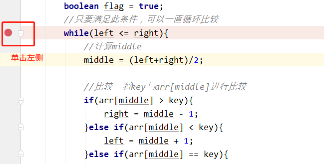
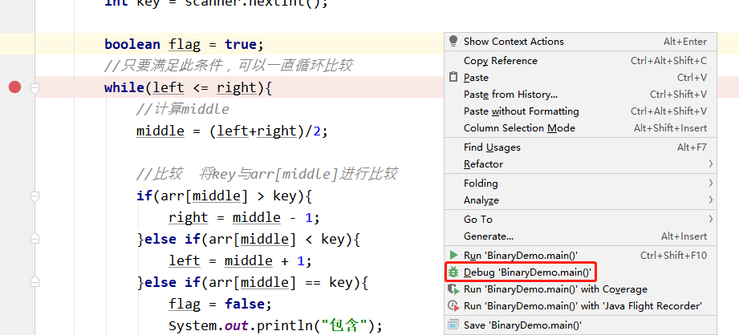
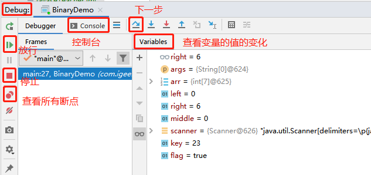
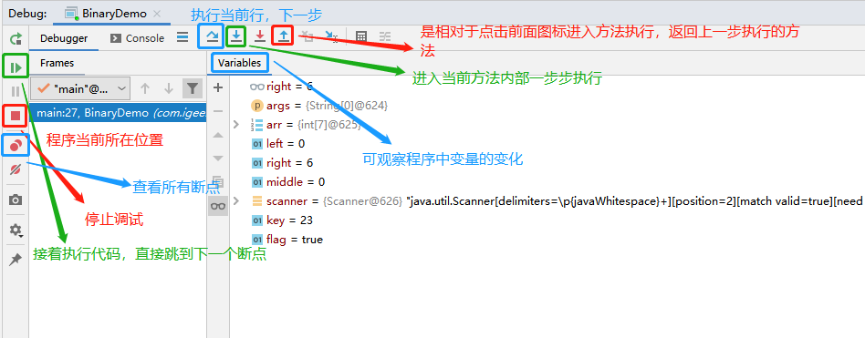

# Java基础知识 第6天

【学习目标】理解、了解、应用、记忆

**1.【应用】IDEA断点调试**

a. 【记忆】能够阐述IDEA断点调试的作用及步骤

b. 【应用】能够独立调试循环求和的代码

c. 【应用】能够独立调试方法调用执行流程的代码

d. 【应用】能够独立调试参数传递的代码

**2.【应用】Java基础语法练习一**

a. 【应用】能够独立写出根据月份输出对应季节的两种实现方式

b. 【应用】能够独立写出求回文数的案例

c. 【应用】能够独立写出求不死神兔的案例

d. 【理解】能够独立写出求出满足要求的数组元素和的案例

**3.【应用】Java基础语法练习二**

a. 【应用】能够独立写出评委打分案例

b. 【应用】能够独立写出数组元素反转案例

c. 【应用】能够独立写出数组基本查找案例

d. 【应用】能够独立写出数据加密案例

 

# 第1章 IDEA断点调试

## 1.1 IDEA断点调试概述

 IDEA的断点调试可以查看程序的执行流程和解决程序中的bug

## 1.2 IDEA断点调试常用操作

A:什么是断点：

​	就是一个标记，从哪里开始。

​	 

B:如何设置断点：

​	你想看哪里的程序，你就在那个有效程序的左边单击即可。

​	 

​	 

C:在哪里设置断点：

​	哪里不会点哪里。

​	目前：我们就在每个方法的第一条有效语句上都加。

D:如何运行设置断点后的程序：

​	右键 -- 点击Debug

​	

​	

E:如何让程序往下执行呢?

​	点击Step Over 执行下一步 

​	或按F8

F:看哪些地方：

​		 Debug：断点测试的地方

​		 Debugger：查看断点的界面

​		 Variables：查看程序的变量变化

​		 Console：控制台

​	 G:如何去断点：

​		 再次单击代码左侧即可

​		 或者在debug视图中，找到View Breakpoints查看所有，勾掉选中断点

# 第2章 基础语法的练习

## 2.1 循环,if和switch练习

### 需求1：如果一个数的平方的末尾和原数相等，那么称其为自守数

比如原数是5,5 * 5=25,25的末尾5==原数5，那么该原数5就是自守数

 25 * 25=625，76 * 76=5776，要求寻找10000以内的自守数

### 需求2：打印5位数中所有的回文数

什么是回文数呢?举例：12321是回文数，个位与万位相同，十位与千位相同。

## 2.2 数组练习

### 需求1：不死神兔问题

有一对兔子，从出生后第3个月起每个月都生一对兔子，小兔子长到第三个月后每个月又生一对兔子，假如兔子都不死，问第二十个月的兔子对数为多少？ 

### 需求2：求数组中满足要求的元素和

 (1)定义一个int类型的一维数组，内容为{171,72,19,16,118,51,210,7,18}

 (2)求出该数组中满足要求的元素和。

要求：求和的元素的个位和十位不能包含7,并且只能为偶数。

### 需求3：在编程竞赛中，有6个评委为参赛的选手打分，分数为0-100的整数

选手的最后得分为：去掉一个最高分和一个最低分后 其余4个评委打分的平均值。(不考虑小数部分)

### 需求4：数组反转

(1)键盘录入5个int类型的数据存储数组arr中

(2)定义方法将arr数组中的内容反转

(3)定义方法对反转后的数组进行遍历

### 需求5：数组基本查找(查找指定元素第一次在数组中出现的索引)

(1)给定数组int[] arr = {5,7,3,2,5};

(2)要查询的元素通过键盘录入的方式确定

(3)定义一个查找数组元素第一次出现位置的方法(注,要查找的元素就是键盘录入的数据)

### 需求6：键盘录入数据,要求数据是四位的整数,现需要对数据进行加密

加密规则如下:

每位数字都加上5,然后除以10的余数代替该数字,

再将第一位和第四位交换,第二位和第三位交换,

请把加密后的数据输出到控制台

### 需求7：有n个人坐在一起，顺序排号，从第一个人开始报数，从1依次喊到3，凡喊到3的退出，问最后留下来的是几号嘉宾

提示：数组种 初始值都为0，喊到3值为-1