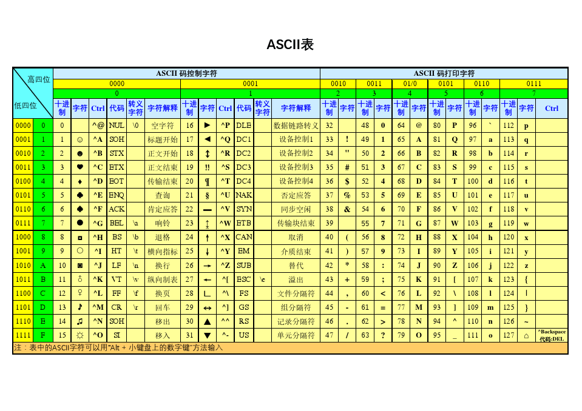

# Java基础知识 第1天

【学习目标】理解、了解、应用、记忆


**1.【应用】理解Java概述、helloworld案例**

a. 【了解】知道java语言的发展史

b. 【理解】JVM、JRE、JDK分别是什么？有什么作用？有什么关系

c. 【应用】能够操作常用的DOS命令

d. 【应用】独立下载安装JDK


**2.【理解】理解工具安装 、配置环境变量、注释、关键字**

a. 【应用】独立安装记事本软件

b. 【应用】独立配置环境变量

c. 【应用】独立编写HelloWorld案例,并能够调试问题,使程序正常运行

d. 【理解】阐述注释、关键字的作用及分类、特点


**3.【理解】常量、变量、数据类型、标识符**

a. 【理解】阐述常量的特点及分类

b. 【理解】阐述变量的作用及定义格式

c. 【理解】阐述数据类型分类

d. 【理解】阐述标识符的组成规则及注意事项

e. 【应用】能够定义变量，使用变量

f. 【理解】阐述数据类型转换之隐式数据类型转换和强制数据类型转换的方式及注意事项

 

 

# 第1章 Java概述

## 1.1 Java语言发展史和平台概述

### 1.1.1 Java语言发展史

 	詹姆斯·高斯林（James Gosling），1977年获得了加拿大卡尔加里大学计算机科学学士学位，1983年获得了美国卡内基梅隆大学计算机科学博士学位，毕业后到IBM工作，但不受重视。后来转至Sun公司，于1991年，和其他几位工程师一起合作参与了Green计划（绿色计划），并开发了一种称为Oak（橡树）的面向对象语言。**1995年5月23日，Oak语言改名为Java，Java语言由此诞生。**

​	 SUN(Stanford University Network，斯坦福大学网络公司) 


### 1.1.2 Java语言版本

#### Java的春天

​	**1996年1月23日，JDK 1.0出来， 1997年2月，JDK 1.1面世**，在随后的3周时间里，达到了22万次的下载量。4月2日，Java One会议召开，参会者逾一万人，创当时全球同类会议规模之纪录。9月，Java Developer Connection社区成员超过10万。

​	**1998年12月8日，第二代Java平台的企业版J2EE发布。**1999年6月，Sun公司发布了第二代Java平台（简称为Java2）的3个版本：

> J2ME（Java2 Micro Edition，Java2平台的微型版），应用于移动、无线及有限资源的环境；
>
> 
>
> **J2SE（Java 2 Standard Edition，Java 2平台的标准版），应用于桌面环境；（C/S）**  client / server
>
> 
>
> **J2EE（Java 2Enterprise Edition，Java 2平台的企业版），应用于基于Java的应用服务器。（B/S）** browser/server

​	Java 2（ J2SE 1.2  Playground	运动场）平台的发布，是Java发展过程中最重要的一个里程碑，标志着Java的应用开始普及。

​	1999年4月27日，HotSpot虚拟机发布。HotSpot虚拟机发布时是作为JDK 1.2的附加程序提供的，后来它成为了JDK 1.3及之后所有版本的Sun JDK的默认虚拟机 。

​	2000年5月，JDK1.3、JDK1.4和J2SE1.3相继发布，几周后其获得了Apple公司Mac OS X的工业标准的支持。2001年9月24日，J2EE1.3发布。**2002年2月26日，J2SE1.4（ Merlin 灰背隼）发布**。自此Java的计算能力有了大幅提升，与J2SE1.3相比，其多了近62%的类和接口。在这些新特性当中，还提供了广泛的XML支持、安全套接字（Socket）支持（通过SSL与TLS协议）、全新的I/OAPI、正则表达式、日志与断言。

​	**2004年9月30日，J2SE1.5发布**，成为Java语言发展史上的又一里程碑。为了表示该版本的重要性，J2SE 1.5更名为Java SE 5.0（内部版本号1.5.0），代号为“Tiger”，Tiger包含了从1996年发布1.0版本以来的最重大的更新，其中包括泛型支持、基本类型的自动装箱、改进的循环、枚举类型、格式化I/O及可变参数。


#### Java的稳进之路

​	**2005年6月，在Java One大会上，Sun公司发布了Java SE 6（Mustang 野马）**。此时，Java的各种版本已经更名，已取消其中的数字2，如J2EE更名为JavaEE，J2SE更名为JavaSE，J2ME更名为JavaME。

​	2006年11月13日，Java技术的发明者Sun公司宣布，将Java技术作为免费软件对外发布。Sun公司正式发布的有关Java平台标准版的第一批源代码，以及Java迷你版的可执行源代码。从2007年3月起，全世界所有的开发人员均可对Java源代码进行修改。


#### Java进入Oracle

  2009年，甲骨文公司宣布收购Sun 。

  2010年，Java编程语言的共同创始人之一詹姆斯·高斯林从Oracle公司辞职。

  2011年，甲骨文公司举行了全球性的活动，以庆祝Java7的推出，随后**Java7（Dolphin 海豚）正式发布**。

  2014年，甲骨文公司发布了**Java8（Spider 蜘蛛）正式版**。2017年，甲骨文公司发布JDK9.0版本。

  2018年甲骨文在3月、7月份又分别发布了10.0和11.0版本。

  2019年3月、7月甲骨文分别发布12.0和13.0新版本。

  2020年3月份甲骨文发布最新版本Java SE 14.0.1。


## 1.2 JVM,JRE,JDK的概述

### 1.2.1 什么是跨平台?

平台：指的是操作系统(Windows，Linux，Mac)

跨平台：Java程序可以在任意操作系统上运行，一次编写到处运行

原理：实现跨平台需要依赖Java的虚拟机 JVM （Java Virtual Machine）


### 1.2.2 JVM  JRE  JDK说明

**A:什么是JVM **   Java Virtual Machine

JVM是java虚拟机(JVM Java Virtual Machine)，java程序需要运行在虚拟机上，不同平台有自己的虚拟机，因此java语言可以跨平台。


**B:什么是JRE**  Java  Runtime  Environment

包括Java虚拟机(JVM Java Virtual Machine)和Java程序所需的核心类库等如果想要运行一个开发好的Java程序，计算机中只需要安装JRE即可。

**JRE:JVM+类库。**


**C:什么是JDK**

JDK是提供给Java开发人员使用的，其中包含了java的开发工具，也包括了JRE。所以安装了JDK，就不用在单独安装JRE了。

其中的开发工具：编译工具(javac.exe) 打包工具(jar.exe)等。

**JDK:JRE+JAVA的开发工具。**


**D:为什么JDK中包含一个JRE**

开发完的程序，需要运行一下看看效果。


**E:JDK,JRE,JVM的作用和关系**

JDK包含JRE和开发工具包。

JRE包含核心类库和JVM。


## 1.3 常用dos命令

专业术语：

MS-DOS( Microsoft Disk Operating System )

命令提示符 cmd


### 1.3.1 打开控制台

– win + R，然后cmd回车


### 1.3.2 常用命令

– d: 回车	盘符切换  

– dir(directory): 列出当前目录下的文件以及文件夹

– cd (change directory): 改变指定目录(进入指定目录)

​	• 进入文件夹	cd 目录

​	• 进入多级文件夹	cd 目录1\目录2\目录3

​	• 返回上一级	cd..    

​	• 直接回根路径	cd \

– cls : (clear screen)清屏

– exit : 退出dos命令行


## 1.4 下载安装JDK

请参考《JDK下载安装文档.doc》安装步骤


## 1.5 重点和小结

1、java语言的发展史

2、JVM、JRE、JDK分别是什么？有什么作用？有什么关系

3、常用的DOS命令

4、如何下载安装JDK


# 第2章 环境配置

## 2.1 工具安装

为了让我们写的程序错误看起来更直接，我们安装一款高级记事本软件。


## 2.2 环境变量配置

**为什么要配置**

– 程序的编译和执行需要使用到javac和java命令，所以只能在bin目录下写程序

– 实际开发中，不可能把程序写到bin目录下，所以我们必须让javac和java命令在任意目录下能够访问


**如何配置**

**计算机-右键属性-高级系统设置-高级-环境变量-系统变量**


## 2.3 HelloWorld案例

### 2.3.1 执行流程


**编译**：是指将我们编写的Java源文件翻译成JVM认识的class文件，在这个过程中， javac 编译器会检查我们 

所写的程序是否有错误，有错误就会提示出来，如果没有错误就会编译成功。 

**运行**：是指将 class文件 交给JVM去运行，此时JVM就会去执行我们编写的程序了。 


### 2.3.2 编写代码步骤

首先定义一个类：

```java
public class 类名

在类定义后加上一对大括号：

{}

在大括号中间添加一个主(main)方法/函数：

public static void main(String [] args){ }

在主方法的大括号中间添加一行输出语句：

System.out.println(“HelloWorld”);
```


**注意：main方法，称为主方法。写法是固定格式不可以更改。main方法是程序的入口点或起始点，无论我们编写多少程序，JVM在运行的时候，都会从main方法这里开始执行**。


### 2.3.3 案例代码一

```java
public class HelloWorld {
	public static void main(String[] args) {
		System.out.println("HelloWorld");
	}
}
```


运行代码步骤：

• 在命令行模式中，输入javac命令对源代码进行编译，生成字节码文件

– **javac  源文件名.java**


• 编译完成后，如果没有报错信息，输入java命令对class字节码文件进行解释运行,执行时不需要添加.class扩展名，运行名是class关键字后面的类名

– **java  源文件名**


### 2.3.4 HelloWorld案例常见问题

**找不到文件**

​	 a:文件扩展名隐藏导致编译失败

​	 b:文件名写错了


**单词拼写问题**

​	 a:class写成Class

​	 b:String写成string

​	 c:System写成system

​	 d:main写成mian


**括号匹配问题**

​	 a:把类体的那对大括号弄掉一个

​	 b:把方法体的那对大括号弄掉一个

​	 c:把输出语句的那对小括号弄掉一个

**注意：java编程中需要的基本上都是英文字符**


## 2.4 注释

### 2.4.1 注释概述

**什么是注释**

– 用于解释或说明程序的文字


**Java中注释分类**

单行注释

– 格式： //注释文字

多行注释

– 格式： /*  注释文字 */

文档注释

– 格式：/** 注释文字 */


**注释的作用**

– 解释说明程序

– 提高程序的阅读性


### 2.4.2 案例代码二

```java
/**
	注释：用于解释说明程序的文字
	
	分类：
		单行
		多行
		文档注释
		
	作用：解释说明程序，提高程序的阅读性
*/
	
//这是我的HelloWorld案例
public class HelloWorld {
	/*
		这是main方法
		main是程序的入口方法
		所有代码的执行都是从main方法开始的
	*/
	public static void main(String[] args) {
		//这是输出语句
		System.out.println("HelloWorld");
	}
}
```


## 2.5 关键字

### 2.5.1 关键字概述

– 被Java语言赋予特定含义的单词


### 2.5.2 关键字特点

– 组成关键字的字母全部小写

– 常用的代码编辑器,针对关键字有特殊的颜色标记，非常直观，所以我们不需要去死记硬背，在今后的学习中重要的关键字也会不断的出来。


### 2.5.3 案例代码三

```java
/*
	关键字：被Java语言赋予特定含义的单词
	
	特点：
		A:组成关键字的字母全部小写
		B:常见的代码编辑器,针对关键字有特殊的颜色标记
*/
public class HelloWorld {
	public static void main(String[] args) {
		System.out.println("HelloWorld");
	}
}
```


关键字举例:


## 2.6 重点和小结

1、安装高级记事本软件

2、配置环境变量

3、编写HelloWorld案例,并能够调试问题,使程序正常运行

4、阐述注释、关键字的作用及分类、特点


## 2.7 课堂作业

需求：输出格式如简历


# 第3章 语法格式

## 3.1 计算机基础知识

### 3.1.1 二进制

​	计算机中的数据不同于人们生活中的数据，人们生活采用十进制数，而计算机中全部采用二进制数表示，它只包含 0、1两个数，逢二进一，1+1=10。每一个0或者每一个1，叫做一个bit（比特）。 


**十进制数据转成二进制数据：**使用除以2获取余数的方式

**二进制数据转成十进制数据：**使用8421编码的方式 


```
练习题：
1.将15数字转换成二进制
2.将7数字转换成二进制
3.将0111转成十进制
4.将1110转成十进制
```


### 3.1.2 计算机存储单元

​		变量是内存中的小容器，用来存储数据。那么计算机内存是怎么存储数据的呢？无论是内存还是硬盘，计算机存储设备的最小信息单元叫“**位（bit）**”，我们又称之为“比特位”，通常用小写的字母b表示。而计算机最小的存储单元叫“**字节（byte）**”，通常用大写字母B表示，字节是由连续的8个位组成。

**总结：**

**位（bit）：一个数字0或者一个数字1，代表一位。**

**字节（Byte）：每逢8位是一个字节，这是数据存储的最小单位。**


除了字节外还有一些常用的存储单位，大家可能比较熟悉，我们一起来看看：

– 1B（字节） = 8bit

– 1KB = 1024B

– 1MB = 1024KB

– 1GB = 1024MB

– 1TB = 1024GB


## 3.2 标识符

### 3.2.1 作用

– 给包,类,方法,变量等起名字


### 3.2.2 组成规则

– 由字符(字母、数字)，下划线_，美元符$组成

• 这里的字符采用的是unicode字符集，所以包括英文大小写字母，中文字符，数字字符等。ASCII码   a-97  A-65

– 不能以数字开头   123Test 

– 不能是Java中的关键字   int  class


### 3.2.3 命名原则:见名知意

包

​	 最好是域名倒过来,要求所有的字母小写   igeekhome.com    com.igeek

类或者接口

​	 如果是一个单词首字母大写   EmpDao

​	 如果是多个单词每个单词首字母大写(驼峰标识)  HelloWorld

方法或者变量

​	 如果是一个单词全部小写   a  b   empDao  email

​	 如果是多个单词,从第二个单词首字母大写(驼峰标识)    selectUserByNameAndPwd()

常量

​	 如果是一个单词,所有字母大写   ERROR_MESSAGE   LEVEL

​	 如果是多个单词,所有的单词大写,用下划线区分每个单词   LEVEL   LEVLE_CORE


不合法或者不合规：

12Demo   Test#123   SelectUser


## 3.3 常量

### 3.3.1 常量(Constant)概述

– 在程序执行的过程中，其值不可以发生改变的量


### 3.3.2 常量分类

– 字符串常量	用双引号括起来的内容(“HelloWorld”)

– 整数常量	所有整数(12,-23)

– 小数常量	所有小数(12.34)

– 字符常量	用单引号括起来的内容(‘a’,’A’,’0’)

– 布尔常量	较为特有，只有true和false

– 空常量		null(数组部分讲解)


### 3.3.3 案例代码四

```java
/*
	常量：在程序执行的过程中，其值不可以发生改变的量
	
	常量分类：
		A:字符串常量	   "HelloWorld"
		B:整数常量		12,-23
		C:小数常量		12.34
		D:字符常量		'a','0'
		E:布尔常量		true,false
		F:空常量		 null(后面讲解)
*/
public class ConstantDemo {
	public static void main(String[] args) {
        //字符串常量
		System.out.println("HelloWorld");
		
		//整数常量
		System.out.println(12);
		System.out.println(-23);
		
		//小数常量
		System.out.println(12.34);
		
		//字符常量
		System.out.println('a');
		System.out.println('0');
		
		//布尔常量
		System.out.println(true);
		System.out.println(false);
	}
}
```


## 3.4 变量

### 3.4.1 变量(Variable)概述

– 在程序执行的过程中，在某个范围内其值可以发生改变的量

– 从本质上讲，变量其实是内存中的一小块区域


### 3.4.2 变量定义格式

– 数据类型 变量名 = 初始化值;

– 注意：格式是固定的，记住格式，以不变应万变


### 3.4.3 变量图解


### 3.4.4 案例代码五

```java
/*
	标识符：就是给包,类,方法,变量起名字的符号。
	
	组成规则：
		A:unicode字符
			数字字符,英文大小写,汉字(不建议使用汉字)
		B:下划线_
		C:美元符$
		
	注意事项
		A:不能以数字开头
		B:不能是java中的关键字
		
	常见命名规则：
		A:基本要求
			见名知意
		B:常见的命名
			a:包(其实就是文件夹,用于对类进行管理)
				全部小写,多级包用.隔开
				举例：com，com.igeek
			b:类
				一个单词首字母大写
					举例：Student,Car
				多个单词每个单词的首字母大写
					举例：HelloWorld
			c:方法和变量
				一个单词首字母小写
					举例：age,show()
				多个单词从第二个单词开始每个单词的首字母大写
					举例：maxAge,getAge()
*/
public class VariableDemo {
	public static void main(String[] args) {
		//定义变量
		//数据类型 变量名 = 初始化值;
		int a = 10;
        //正确
		int b2 = 20;
		//错误
		//int 2b = 30;
		
		//不能是java中的关键字
		//错误
		//int public = 40;
	}
}
```


## 3.5 数据类型

**为什么有数据类型**

Java语言是强类型语言，对于每一种数据都定义了明确的具体数据类型，在内存中分配了不同大小的内存空间


**==Java中数据类型的分类==**

**基本数据类型**：包括整数 、 浮点数 、 字符 、 布尔 。 

**引用数据类型**：包括类 、 数组 、API中的类等，除了基本数据类型都是引用数据类型 。 


### 3.5.1 基本数据类型变量的定义和使用

变量的定义格式：

```java
	数据类型 变量名 = 初始化值;
```


基本数据类型：

​		byte,short,int,long,float,double,char,boolean

| **数据类型** |      **关键字**      | **内存占用** |      **取值范围**      |                  备注                  |
| :----------: | :------------------: | :----------: | :--------------------: | :------------------------------------: |
|    字节型    |         byte         |   1个字节    |        -128~127        |               8位，2^7-1               |
|    短整型    |        short         |   2个字节    |      -32768~32767      |              16位，2^15-1              |
|     整型     |   int（整数默认）    |   4个字节    | -2的31次方~2的31次方-1 |               默认值为0                |
|    长整型    |         long         |   8个字节    | -2的63次方~2的63次方-1 | 定义long类型的数据时，要在数据后面加L  |
| 单精度浮点数 |        float         |   4个字节    | 1.4013E-45~3.4028E+38  | 定义float类型的数据时，要在数据后面加F |
| 双精度浮点数 | double（浮点数默认） |   8个字节    |  4.9E-324~1.7977E+308  |              默认值为0.0               |
|    字符型    |         char         |   2个字节    |        0-65535         |       用单引号，例如'A','b','陈'       |
|   布尔类型   |       boolean        |   1个字节    |      true，false       |             默认值为false              |


==注意事项：==

1. 字符串不是基本类型，而是引用类型。
2. 浮点型可能只是一个近似值，并非精确的值。
3. 数据范围与字节数不一定相关，例如float数据范围比long更加广泛，但是float是4字节，long是8字节。
4. 浮点数当中默认类型是double。如果一定要使用float类型，需要加上一个后缀F。
   如果是整数，默认为int类型，如果一定要使用long类型，需要加上一个后缀L。推荐使用大写字母后缀。


### 3.5.2 案例代码六

```java
public class Demo1 {
	public static void main(String[] args) {
		//定义byte类型的变量
		byte b = 10;
		System.out.println(10);
		System.out.println(b);
		
		//定义short类型的变量
		short s = 100;
		System.out.println(s);
        //定义int类型的变量
		int i = 10000;
		System.out.println(i);
		
		//定义long类型的变量
		long l = 3425254552485412415L;
		System.out.println(l);
		
		//定义float类型的变量
		float f = 12.34F;
		System.out.println(f);
		
		//定义double类型的变量
		double d = 12.34;
		System.out.println(d);
		
		//定义char类型的变量
		char c = 'a';
		System.out.println(c);
		
		//定义boolean类型的变量
		boolean bb = false;
		System.out.println(bb);
	}
}
```


### 3.5.3 变量定义的注意事项

• 变量未赋值,不能直接使用

• 变量只在它所属的范围内有效

• 一行上可以定义多个变量，但是不建议


### 3.5.4 案例代码七

```java
/*	
	变量定义注意事项：
		1:变量未赋值,不能直接使用
		2:变量只在它所属的范围内有效
			变量属于它所在的那对大括号
		3:一行上可以定义多个变量,但是不建议
*/
public class Demo2 {
	public static void main(String[] args) {
		//定义变量
		int a = 10;
		System.out.println(a);
		
		int b;
		b = 20; //变量在使用前赋值都是可以的
		System.out.println(b);
		
		
		{
			int c = 100;
			System.out.println(c);
		}
		//System.out.println(c);
		
		/*
		int aa,bb,cc;
		aa = 10;
		bb = 20;
		cc = 30;
		*/
		
		/*
		int aa = 10;
		int bb = 20;
		int cc = 30;
		*/
		
		int aa=10,bb=20,cc=30;
	}
}
```


## 3.6 数据类型转换

### 3.6.1 隐式数据类型转换

取值范围小的数据类型与取值范围大的数据类型进行运算,会先将小的数据类型提升为大的,再运算


### 3.6.2 案例代码八

```java
/*
	+:是一个运算符，做加法运算的。
	我们在做运算的时候，一般要求参与运算的数据类型必须一致。
	
	类型转换：
		隐式转换
		强制转换
		
	隐式转换	
		byte,short,char --> int --> long --> float --> double
*/
public class TypeCastDemo1 {
	public static void main(String[] args) {
		//直接输出了运算的结果
		System.out.println(3 + 4);
		
		//定义两个int类型的变量
		int a = 3;
		int b = 4;
		int c = a + b;
		System.out.println(c);
        
        //定义一个byte类型,定义一个int类型
		byte bb = 2;
		int cc = 5;
		System.out.println(bb + cc);
		
		//我能不能不直接输出，用一个变量接受呢?
		//用变量接受，这个变量应该有类型
		//可能损失精度
		//byte dd = bb + cc;
		int dd = bb + cc;
		System.out.println(dd);
	}
}
```


### 3.6.3 强制类型数据转换

强制转换的格式

​	 b = (byte)(a + b);

强制转换的注意事项

​	 如果超出了被赋值的数据类型的取值范围得到的结果会与你期望的结果不同


### 3.6.4 案例代码九

```java
/*
	强制转换：
		目标类型 变量名 = (目标类型) (被转换的数据);
		不建议强制转换，因为会有精度的损失。
*/
public class TypeCastDemo2 {
	public static void main(String[] args) {
		int a = 3;
		byte b = 4;
		int c = a + b;
		//byte d = a + b;
		byte d = (byte) (a + b);
	}
}
```


注意：

字符类型  转  整型，直接转换，根据Unicode（ASCII 0~127）码对照

整型  转  字符类型，强制转换


**ASCII码表：**American Standard Code for Information Interchange，美国信息交换标准代码。
**Unicode码表：**万国码。也是数字和符号的对照关系，开头0-127部分和ASCII完全一样，但是从128开始包含有更多字符。其中：48 - '0'    65 - 'A'    97 - 'a'




## 3.7 重点和小结

1、常量的特点及分类

2、变量的作用及定义格式

3、数据类型分类

4、标识符的组成规则及注意事项

5、定义变量，使用变量

6、数据类型转换之隐式数据类型转换和强制数据类型转换的方式及注意事项


重点和总结

1、Java概述、helloworld案例

2、工具安装 、配置环境变量、注释、关键字

3、常量、变量、数据类型、标识符