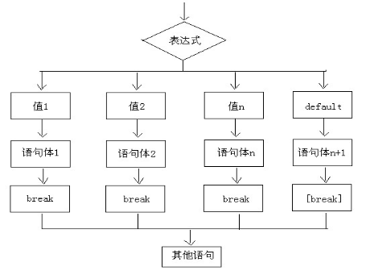

# Java基础知识 第3天

【学习目标】理解、了解、应用、记忆


**1. 【应用】能够独立使用选择流程语句完成指定操作**

a) 【理解】阐述if语句的的第一种第二种及第三种书写格式及执行流程

b) 【应用】独立编写代码,使用if语句完成获取两个数较大值的练习

c) 【应用】独立编写代码,使用if语句完成判断学生等级练习

d) 【理解】阐述switch语句的的格式及执行流程

e) 【应用】独立编写代码，使用switch语句完成根据数字输出对应星期的练习


**2. 【理解】能够独立使用循环控制语句完成指定操作**

a) 【理解】阐述使用for循环的基本格式及执行流程

b) 【应用】独立编写代码，使用for循环完成获取1-5之间数据之和

c) 【应用】独立编写代码，使用for循环完成获取1-100之间的偶数和

d) 【应用】独立编写代码，使用for循环完成控制台打印100-999之间水仙花数，并获取水仙花个数练习

e) 【理解】阐述while循环的基本格式及执行流程

f) 【应用】独立编写代码，使用while循环完成1-100之间数据之和

g) 【理解】阐述do…while循环的格式及执行流程

h) 【理解】阐述for、while、do…while三种循环的区别


**3. 【应用】能够灵活使用控制循环语句**

a) 【理解】阐述break的作用及使用场景

b) 【理解】阐述continue的作用及使用场景


**4.【应用】理解如何产生随机数**

a) 【记忆】能够阐述Random类的概述和基本使用

b) 【应用】能够独立编写猜数字小游戏案例

 

# 第1章 选择流程控制语句

## 1.1 顺序结构的基本使用

### 1.1.1 顺序结构概述

​		是程序中最简单最基本的流程控制，没有特定的语法结构，按照代码的先后顺序，依次执行，程序中大多数的代码都是这样执行的


### 1.1.2 顺序流程流程图


### 1.1.3 案例一

```java
//顺序结构：从上往下，依次执行
public class OrderDemo {
	public static void main(String[] args) {
		System.out.println("开始");
		System.out.println("语句A");
		System.out.println("语句B");
		System.out.println("语句C");
		System.out.println("结束");
	}
}
```


## 1.2 if语句的格式

### 1.2.1 if语句格式1及执行流程

```java
//if语句第一种格式

if(关系表达式) {
	语句体
}
```


执行流程

首先判断关系表达式看其结果是true还是false

如果是true就执行语句体

如果是false就不执行语句体


### 1.2.2 if语句格式1执行流程图


### 1.2.3 案例二

```java
//if语句
public class IfDemo {
    public static void main(String[] args) {
		System.out.println("开始");
		// 定义两个变量
		int a = 10;
		int b = 20;

		if (a == b) {
			System.out.println("a等于b");
		}

		int c = 10;
		if (a == c) {
			System.out.println("a等于c");
		}

		System.out.println("结束");
	}
}
```


### 1.2.4 if语句格式2及执行流程

```java
//if语句第二种格式

if(关系表达式) {
	语句体1;
}else {
	语句体2;
}
```


执行流程

首先判断关系表达式看其结果是true还是false

如果是true就执行语句体1

如果是false就执行语句体2


### 1.2.5 if语句格式2执行流程图


### 1.2.6 案例三

```java
//if-else语句格式
public class IfDemo2 {
	public static void main(String[] args) {
		System.out.println("开始");
		// 判断给定的数据是奇数还是偶数
		// 定义变量
		int a = 100;
		// 给a重新赋值
		a = 99;

		if (a % 2 == 0) {
			System.out.println("a是偶数");
		} else {
			System.out.println("a是奇数");
		}

		System.out.println("结束");
	}
}
```


### 1.2.7 if语句格式3及执行流程

```java
//if语句第三种格式

if(关系表达式1) {
	语句体1;
}else  if (关系表达式2) {
	语句体2;
}
…
else {
	语句体n+1;
}
```


执行流程

首先判断关系表达式1看其结果是true还是false

如果是true就执行语句体1

如果是false就继续判断关系表达式2看其结果是true还是false

如果是true就执行语句体2

如果是false就继续判断关系表达式…看其结果是true还是false

…

如果没有任何关系表达式为true，就执行语句体n+1


### 1.2.8 if语句格式3执行流程图


### 1.2.9 案例四

```java
//多重if-else if结构
public class IfDemo3 {
	public static void main(String[] args) {
		// x和y的关系满足如下：
		// x>=3 y = 2x + 1;
		// -1<=x<3 y = 2x;
		// x<=-1 y = 2x – 1;
		// 根据给定的x的值，计算出y的值并输出。

		// 定义变量
		int x = 5;
		
		/**
		int y;
		if (x >= 3) {
		y = 2  x + 1;
		} else if (x >= -1 && x < 3) {
			y = 2  x;
		} else if (x < -1) {
			y = 2  x - 1;
		}else {
			y = 0;
		}
		*/
		
		int y = 0;
		if (x >= 3) {
			y = 2  x + 1;
		} else if (x >= -1 && x < 3) {
			y = 2  x;
		} else if (x < -1) {
			y = 2  x - 1;
		}
		
		System.out.println("y的值是："+y);
	}
}
```


## 1.3 if语句的课堂练习

```java
//练习1：if语句实现，获取键盘输入的两个数据，并比较出较大值

/**
	练习2：if语句实现判断学生等级
    键盘录入学生考试成绩，请根据成绩判断该学生属于哪个级别
    90-100	优秀
    80-90	好
    70-80	良
    60-70	及格
    60以下   不及格
*/

 /**
  练习3
  需求：飞机票在淡季是有优惠政策的,而放假期间是没有优惠的， 
  假设在元旦三天（1.01---1.03），
  五一三天（5.01---5.03）， 
  十一七天（10.01---10.07）无任何优惠，
  除了以上13天，都打8折， 请输入您哪天订票，以及票价（自己设定一个吧），
  输出应付多少钱？
 */
```


## 1.4 switch语句的格式及执行流程

### 1.4.1 格式

```java
//switch语句格式

switch(表达式) {

	case 值1:

        语句体1;

        break;//提前结束switch结构

 	case 值2:

        语句体2;

        break;

 	 ...

 	 default:

        语句体n+1;

        break;
 }
```


switch表示这是switch语句

表达式的取值：byte,short,char,int

JDK5以后可以是枚举

JDK7以后可以是String


### 1.4.2 执行流程

首先计算出表达式的值

其次，和case依次比较，一旦有对应的值，就会执行相应的语句，在执行的过程中，遇到break就会结束。

最后，如果所有的case都和表达式的值不匹配，就会执行default语句体部分，然后程序结束掉。


### 1.4.3 switch语句执行流程图




### 1.4.4 案例五

```java
/**
	switch语句实现根据数字输出对应星期
	需求：
  		根据键盘录入的数值1，2，3，…7输出对应的星期一，星期二，星期三…星期日。
 */
import java.util.Scanner;

public class SwitchDemo {
	public static void main(String[] args) {
		//创建键盘录入对象
		Scanner sc = new Scanner(System.in);
		
		//接收数据
		System.out.println("请输入一个数字(1-7)：");
		int weekday = sc.nextInt();
		
		//switch语句实现选择
		switch(weekday) {
		case 1:
			System.out.println("星期一");
			break;
		case 2:
                System.out.println("星期二");
			break;
		case 3:
			System.out.println("星期三");
			break;
		case 4:
			System.out.println("星期四");
			break;
		case 5:
			System.out.println("星期五");
			break;
		case 6:
			System.out.println("星期六");
			break;
		case 7:
			System.out.println("星期日");
			break;
		default:
			System.out.println("你输入的数字有误");
			break;
		}
	}
}
```


### 1.4.5 注意

1.case后面跟的是要和表达式进行比较的值

2.语句体部分可以是一条或多条语句

3.在switch语句中，如果case的后面不写break，将出现穿透现象，也就是不会在判断下一个case的值，直接向后运行，直到遇到break，或者整体switch结束。 break表示中断，结束的意思，可以结束switch语句。

4.default语句表示所有情况都不匹配的时候，就执行该处的内容，和if语句的else相似。


### 1.4.6 switch语句的课堂练习

```java
/**
  练习1
  需求：switch示例：从键盘接收两个数字,再接收一个符号,然后进行运算.
  如果输入的是错误的字符,不进行计算而是提示不存在字符
  -------请输入第一个数字:8 
  -------请输入第二个数字:9 
  -------请输入运算符号:+
  -------8+9=17
 */


/**
  练习2
  输入学员的考试成绩，输出这学员考试成绩的级别。
    100      A级
    90~99    A级
    80~89    B级
    70~79    C级
    60~69    D级
    < 60     不合格
*/
```


# 第2章 循环流程控制语句

​		循环语句可以在满足循环条件的情况下，反复执行某一段代码，这段被重复执行的代码被称为循环体语句，当反复 执行这个循环体时，需要在合适的时候把循环判断条件修改为false，从而结束循环，否则循环将一直执行下去，形成死循环。


## 2.1 for循环的格式及基本使用

### 2.1.1 for循环语句格式

```java
for(初始化语句①;判断条件语句②;控制条件语句④) {
     循环体语句③;
}
```


### 2.1.2 执行流程

执行顺序：①②③④>②③④>②③④…②不满足为止。 

①负责完成循环变量初始化 

②负责判断是否满足循环条件，不满足则跳出循环 

③具体执行的语句 

④循环后，循环条件所涉及变量的变化情况 


### 2.1.3 for循环的执行流程图


### 2.1.4 案例六

```java
/** 
  for循环语句格式
  需求：在控制台输出10次”HelloWorld”的案例。
 */
public class ForDemo {
	public static void main(String[] args) {
		//原始写法
		System.out.println("HelloWorld");
		System.out.println("HelloWorld");
		System.out.println("HelloWorld");
		System.out.println("HelloWorld");
		System.out.println("HelloWorld");
		System.out.println("HelloWorld");
		System.out.println("HelloWorld");
		System.out.println("HelloWorld");
		System.out.println("HelloWorld");
		System.out.println("HelloWorld");
		System.out.println("-------------------------");
		
		//用循环改进
        for(int x=1; x<=10; x++) {
			System.out.println("HelloWorld");
		}
	}
}
```


### 2.1.5 案例七

```java
// for循环实现1-5之间数据求和
public class ForTest2 {
	public static void main(String[] args) {
		//定义求和变量，初始化值是0
		int sum = 0;
		
		//获取1-5之间的数据，用for循环实现
		for(int x=1; x<=5; x++) {
			//把每一次获取到的数据，累加起来就可以了
			//sum = sum + x;
			/**
			  第一次：sum = 0 + 1 = 1
			  第二次：sum = 1 + 2 = 3
			  第三次：sum = 3 + 3 = 6
			  第四次：sum = 6 + 4 = 10
			  第五次：sum = 10 + 5 = 15
			 */
			sum += x;
		}
		
		//输出求和结果
        System.out.println("sum:"+sum);
	}
}
```


### 2.1.6 for循环的练习

```java
//练习1：for循环实现1-100之间偶数和

//练习2：for循环实现在控制台打印水仙花数
分析：
 	什么是水仙花数呢?
  	所谓的水仙花数是指一个三位数[100,999]，其各位数字的立方和等于该数本身。
 	举例：153就是一个水仙花数。
 	153 = 1*1*1 + 5*5*5 + 3*3*3

//练习3：for循环实现统计水仙花的个数
```


## 2.2 while循环的格式及基本使用

### 2.2.1 while循环语句格式

```java
初始化表达式① 
while(布尔表达式②){ 
    循环体语句;③ 
    控制条件语句;④ 
}
```


### 2.2.2 执行流程

执行顺序：①②③④>②③④>②③④…②不满足为止。 

①负责完成循环变量初始化。 

②负责判断是否满足循环条件，不满足则跳出循环。 

③具体执行的语句。 

④循环后，循环变量的变化情况。 


### 2.2.3 while循环的执行流程图


### 2.2.4 案例八

```java
//while循环语句的基本格式
public class WhileDemo {
	public static void main(String[] args) {
		//输出10次HelloWorld
		/**
		for(int x=1; x<=10; x++) {
			System.out.println("HellloWorld");
		}
		*/
		
		//while循环实现
		int x=1;
		while(x<=10) {
			System.out.println("HellloWorld");
			x++;
		}
	}
}
```


### 2.2.5 while循环的练习

```java
//练习1：while循环实现1-100之间数据求和

//练习2：有口井7米深，一只青蛙白天爬3米，晚上坠下2米，问这青蛙几天才能爬出这口井(while)
```


## 2.3 do…while循环的格式及基本使用 

### 2.3.1 do…while循环语句格式

```java
初始化表达式① 
do{ 
    循环体③ 
    控制条件语句④ 
}while(布尔表达式②);
```


### 2.3.2 执行流程

执行顺序：①③④>②③④>②③④…②不满足为止。 

①负责完成循环变量初始化。 

②负责判断是否满足循环条件，不满足则跳出循环。 

③具体执行的语句 

④循环后，循环变量的变化情况 


### 2.3.3 do...while循环的执行流程图


### 2.3.4 案例九

```java
//do...while循环的基本格式
public class DoWhileDemo {
	public static void main(String[] args) {
		//输出10次 HelloWorld
		/**
		for(int x=1; x<=10; x++) {
			System.out.println("HelloWorld");
		}
		*/
		
		//do...while改写
		int x=1;
		do {
			System.out.println("HelloWorld");
			x++;
		}while(x<=10);
	}
}
```


## 2.4 三种循环的区别

### 2.4.1 区别概述

虽然可以完成同样的功能，但是还是有小区别：

do…while循环至少会执行一次循环体。

for循环和while循环只有在条件成立的时候才会去执行循环体


for循环语句和while循环语句的小区别：

控制条件语句所控制的那个变量，在for循环结束后，就不能再被访问到了，而while循环结束还可以继续使用，如果你想继续使用，就用while，否则推荐使用for。原因是for循环结束，该变量就从内存中消失，能够提高内存的使用效率。


循环的使用推荐：

for -- while -- do...while


### 2.4.2 案例十

```java
//三种循环的区别
public class DoWhileDemo {
	public static void main(String[] args) {
		/**
		int x = 3;
		while(x<3) {
			System.out.println("我爱极客营");
			x++;
		}
		System.out.println("--------------");
		
		int y = 3;
		do {
			System.out.println("我爱极客营");
			y++;
		}while(y<3);
		*/
		
		
		for(int x=1; x<=10; x++){
			System.out.println("爱生活，爱Java");
		}
		
        //这里的x无法继续访问
		//System.out.println(x);
		System.out.println("-----------------");
		
		int y = 1;
		while(y<=10) {
			System.out.println("爱生活，爱Java");
			y++;
		}
		System.out.println(y);
	}
}
```


# 第3章 控制循环语句

## 3.1 控制跳转语句break

### 3.1.1 Break的使用场景和作用

break的使用场景：

在选择结构switch语句中

在循环语句中


注意：

离开使用场景的存在是没有意义的，不能单独使用


> break的作用：

跳出单层循环，让循环提前结束


### 3.1.2 案例十一

```java
//break:中断的意思
public class BreakDemo {
	public static void main(String[] args) {
		for(int x=1; x<=10; x++) {
			if(x == 3) {
				break;
			}
			System.out.println("HelloWorld");
		}
	}
}
```


## 3.2 控制跳转语句continue

### 3.2.1 continue的使用场景

在循环语句中

离开使用场景的存在是没有意义的


> continue的作用：单层循环对比break，然后总结两个的区别
>
> 
>
> break  退出当前循环
>
> continue  结束本次循环，进入循环的下一次


### 3.2.2 案例十二

```java
//continue:继续的意思
public class ContinueDemo {
	public static void main(String[] args) {
		for(int x=1; x<=10; x++) {
			if(x == 3) {
				//break;
				continue;
			}
			System.out.println("HelloWorld");
		}
	}
}
```


### 3.2.3 控制跳转语句的课堂练习

按要求分析结果，并验证

​	for(int x=1; x<=10; x++) {

​		if(x%3==0) {

​			//分别写break，continue，说说输出几次

​		}

​		System.out.println(“我爱Java”);

​	}


## 3.3 死循环

### 3.3.1 概念

死循环：也就是循环中的条件永远为true，死循环的是永不结束的循环。


### 3.3.2 死循环格式

```java
死循环的标准格式：
while (true) {
	循环体
}
```

在后期的开发中，会出现使用死循环的场景，例如：我们需要读取用户的输入数据，但是用户输入多少数据我们并 

不清楚，也只能使用死循环，当用户不想输入数据了，就可以结束循环了，如何去结束一个死循环呢，就需要使用 

到跳出语句了。 


### 3.3.3 案例十三

```java
//永远停不下来的循环，叫做死循环
public class DeadLoop {
	public static void main(String[] args) {
		while (true) {
			System.out.println("Hello Java");
		}
	}
}
```


## 3.4 嵌套循环

### 3.4.1 概念

所谓嵌套循环，是指一个循环的循环体是另一个循环。比如for循环里面还有一个for循环，就是嵌套循环。总 

共的循环次数=外循环次数 * 内循环次数 


### 3.4.2 嵌套循环格式

```java
for(初始化表达式①; 循环条件②; 步进表达式⑦) { 
    for(初始化表达式③; 循环条件④; 步进表达式⑥) { 
        执行语句⑤; 
    } 
}
```


### 3.4.3 执行流程

执行顺序：①②③④⑤⑥>④⑤⑥>⑦②③④⑤⑥>④⑤⑥ 

外循环一次，内循环多次。 


### 3.4.4 案例十四

```java
//打印出n行的金字塔图案
import java.util.Scanner;

public class Test{

	public static void main(String[] args){
		
		int n=0; //输入的行数
		int r=0; //当前行
		int s=0; //的数量
		int p=0; //空格的数量

		Scanner scanner = new Scanner(System.in);
		n = scanner.nextInt();

		for(r=1;r<=n;r++){
			//打印空格
			for(p=1;p<=n-r;p++){
				System.out.print(" ");
			}
			//打印
			for(s=1;s<=2*r-1;s++){
                char c = (char)('A'+(r-1));
				System.out.print(c);
			}
			//行换
			System.out.print("n");
		}
	}
}
```


### 3.4.5 嵌套循环的课堂练习

```java
//练习1：打印出n行金字塔，用*完成
	/**
     *    *
     *   ***
     *  *****
     * *******
     */

//练习2：乘法口诀表
1*1=1
2*1=2 2*2=4
3*1=3 3*2=6 3*3=9
...
```


# 第4章 随机数

## 4.1 Random产生整数随机数

### 4.1.1 Random的使用步骤

我们想产生1~100(包含1和100)的随机数该怎么办呢? 我们不需要自己去写算法,因为Java已经为我们提供好了产生伪随机数的类---Random


作用

– 用于产生一个伪随机数


使用步骤(和Scanner类似)

– 导包

• import java.util.Random;

– 创建对象

• Random r = new Random();

– 获取伪随机数

• int number = r.nextInt(10);

• 产生的数据在0到10之间，包括0，不包括10。

• 括号里面的10是可以变化的，如果是100，就是0-100之间的数据


### 4.1.2 案例十五

```java
//Random:用于产生伪随机数  需求：如何获取到一个1-100之间的伪随机数呢?
import java.util.Random;

public class RandomDemo1 {
	public static void main(String[] args) {
		// 创建对象
		Random r = new Random();

		for (int x = 0; x < 10; x++) {
			// 获取随机数
			int number = r.nextInt(10);
			// 输出随机数
			System.out.println("number:" + number);
		}
		System.out.println("--------------------");

		// 如何获取到一个1-100之间的随机数呢?
		int i = r.nextInt(100) + 1;
		System.out.println("i:" + i);
	}
}
```


## 4.2 Math产生随机数

### 4.2.1 使用步骤

Math.random()  无需导包，直接使用，产生的是0~1  [0,1) 之间的随机小数


### 4.2.2 案例十六

```java
//用来生成随机数
public class RandomDemo2{

	public static void main(String[] args){
		//第一种方式：Math类 java.lang.Math 在java的内置包下，所以不需要import
		int d = (int)(Math.random()*100)+1;  //d 1~100
		System.out.println("随机数："+d);

		//第二种方式:Random类
		Random ran = new Random();
		double dd = ran.nextDouble(); //0.0~1.0
		System.out.println("随机数："+dd);
	}
}
```


## 4.3 随机数的课堂练习

```java
/**
猜数字的游戏(GuessNumber)
游戏运行时产生一个1－100之间的随机整数，要求用户从控制台输入数字，
若输入的数字比产生的数字小，则输出：“太小了，再大一点！”；
若输入的数字比产生的数字大，则输出：“太大了，再小一点！”，
若输入的数字和产生的数字相等，则输出：“恭喜你猜对了！”，break
若用户猜了7次还未猜对，则输出：“你太笨了，下次再来吧！”,然后退出程序。
提示：
   	(1)、int num=(int)(Math.random()*100); //java.lang.Math;
	(2)、Scanner in=new Scanner(System.in); // java.util.Scanner;
         int n = in.nextInt();
*/
```


