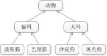
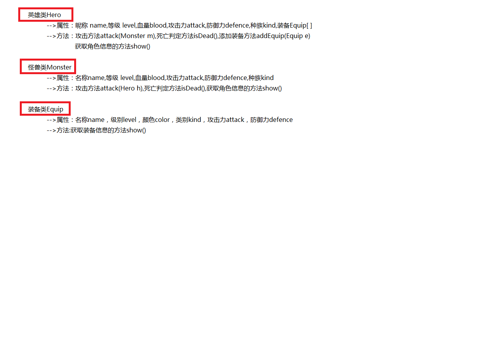
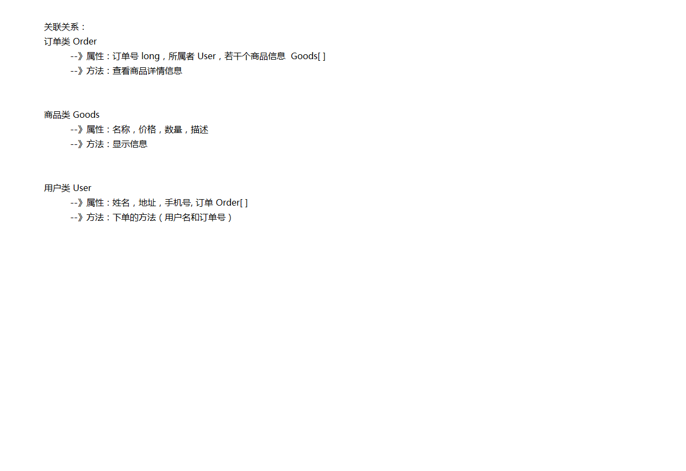

# Java面向对象 第2章 - 类与类之间的关系

**【学习目标】理解、了解、应用、记忆**

通过今天的学习，参训学员能够


**1. 【应用】继承的概述及特点**

a. 【应用】独立编写代码完成一个对象作为另一个类的成员变量的练习

b. 【理解】阐述继承的作用和好处

c. 【应用】阐述继承的代码格式,独立编写一个继承的案例

d. 【应用】独立编写代码通过set和get方法给对象设置属性

e. 【理解】阐述java中继承的特点


**2. 【理解】方法重写及继承内存图解**

a. 【理解】阐述方法重写的概念及格式

b. 【了解】阐述Override注解的作用及使用方法

c. 【理解】阐述继承中子父类创建的先后顺序

d. 【理解】描述继承后子父类内存关系图


**3. 【应用】this与super**

a. 【应用】阐述this和super访问普通成员的格式

b. 【应用】阐述super和this如何访问父类构造方法

c. 【理解】能够独立写出继承的案例


**4. 【应用】关联关系和依赖关系**

a. 【应用】关联关系

b. 【应用】依赖关系

c. 【理解】能够独立写出关联关系和依赖关系的案例


# 第1章 继承的概述及特点

## 1.1 继承的概念

### 1.1.1 继承的概述  is-a

继承是面向对象的核心特性，是面向对象的学习重点。

继承是代码复用的重要方式，是类与类之间的一种关系。

从类与类之间的设计关系来看,子类必须属于父类的一种时，才会继承。

父类抽取出了共性的内容，子类可以在父类基础上扩展新的属性与行为。

子类拥有父类的所有属性与方法，无需重新定义。并且可以直接使用非私有的父类成员。


下例展示了一个继承关系




### 1.1.2 案例

```java
/**  
 * @ClassName: ExtendsDemo  
 * @Description: 继承关系
 *    
 * 继承关系:类与类之间的关系
 *
 * 人:定义一些共性内容定义为父类
 * 		共性的成员变量:年龄,姓名
 * 		共性的成员方法:吃饭,睡觉
 * 
 * 程序员、老师、工人定义为人类的子类,子类可以在父类的基础上扩展新的成员变量与成员方法
 * 
 * 当有了子父类关系后,子类拥有了父类的成员,可以直接访问父类的非私有成员
 * 继承通过这样的方式,提高了代码的复用性,让类与类之间产生了关系
 * 继承关系必须符合is a的关系,即我是你的一种
 * 
 */

public class ExtendsDemo {
	public static void main(String[] args) {
		
	}
}
```


## 1.2 继承的代码格式

### 1.2.1 继承格式说明

使用**extends**关键字完成继承关系。

格式：

```java
class 子类 extends 父类 {
    
}
```

**注意：所有的类都直接或间接继承自Object，所以如果没有继承其他类，则默认继承Object类。即Object是所有类的父类(或超类)**


### 1.2.2 案例

父类Person类：

```java
/**  
* @ClassName: Person  
* @Description: Person类
*    
* 父类-人类:
* 		年龄,姓名
* 		吃饭,睡觉
*/
public class Person extends Object {
	/**  
	* @Fields name : 姓名  
	*/  
	String name;
	/**  
	* @Fields age : 年龄  
	*/  
	int age;
	
	/**  
	* @Title: Person      
	*/
	public Person() {
	}

	/**  
	* @Title: Person  
	* @param name
	* @param age    
	*/
	public Person(String name, int age) {
		this.name = name;
		this.age = age;
	}
	
	/**  
	* @Title: eat  
	* @Description: 吃东西的方法      
	*/
	public void eat() {
		System.out.println("我吃了");
	}

	/**  
	* @Title: sleep  
	* @Description: 睡觉的方法      
	*/
	public void sleep() {
		System.out.println("我睡了");
	}

}
```


定义子类Coder：

```java
/**  
* @ClassName: Coder  
* @Description: 程序员类
*    
* 定义子类程序员类,继承人类
* 在人类共性内容的基础上,添加编程功能
*/
public class Coder extends Person {
	
	/**  
	* @Title: code  
	* @Description: 编写代码的方法      
	*/
	public void code() {
		System.out.println("我写了一个百度!");
	}

}
```


定义子类Teacher：

```java
/**  
* @ClassName: Teacher  
* @Description: 老师类
*    
* 定义子类老师类,继承人类
* 在人类共性内容的基础上,添加教学功能
*/
public class Teacher extends Person {
	/**  
	* @Title: teach  
	* @Description: 教书的方法      
	*/
	public void teach() {
		System.out.println("传授知识!");
	}

}
```


测试类ExtendsDemo：

```java
/**  
* @ClassName: ExtendsDemo  
* @Description: 继承关系的测试类
*    
*    继承关系：类与类之间的关系
*    
*    人：定义一些共性内容	定义为父类
*    		共性的成员变量：姓名、年龄
*    		共性的成员方法：吃饭、睡觉
*    
*    程序员、老师、工人	定义为人类的子类，子类可以在父类的基础上扩展新的成员变量与方法
*    
*    当有了子父类关系后，子类拥有了父类的成员，可以直接访问父类的非私有成员
*    继承通过这样的方式，提高了代码的复用性，让类与类之间产生了关系
*    继承关系必须符合is a的关系，即我是你的一种
* 	
		继承的格式:
* 		public class 子类   extends  父类 {
* 			
* 		}
* 
* 注意:
* 		所有的类(除Object类)都有父类,所有的类都直接或间接是Object的子类
*/
public class ExtendsDemo {
	public static void main(String[] args) {
		//创建子类对象
		Coder coder = new Coder();
		
		//使用子类可以访问父类的非私有成员变量
		coder.name = "拜伦";
		coder.age = 18;
		System.out.println(coder.name+"的年龄是:"+coder.age);
		//使用子类可以访问父类的非私有成员方法
		coder.eat();
		coder.sleep();
		//使用子类可以访问子类的自身的成员方法
		coder.code();
	}
}
```


## 1.3 子类通过get&set方法访问父类成员变量

​		当父类的成员变量用private修饰后,子类无法访问父类的成员变量,但是如果父类提供了public修饰的get/set方法,则子类可以通过get/set方法,正常访问父类的成员变量。


**案例**

父类Person类：

```java
/**  
* @ClassName: Person  
* @Description: Person类
*    
* 父类-人类:
* 		年龄,姓名
* 		吃饭,睡觉
*/
public class Person extends Object {
    //使用private修饰后,子类无法访问
	/**  
	* @Fields name : 姓名  
	*/  
	private String name;
	/**  
	* @Fields age : 年龄  
	*/  
	private int age;
	
	/**  
	* @Title: Person      
	*/
	public Person() {
	}

	/**  
	* @Title: Person  
	* @param name
	* @param age    
	*/
	public Person(String name, int age) {
		this.name = name;
		this.age = age;
	}
	
	/**  
	* @Title: eat  
	* @Description: 吃东西的方法      
	*/
	public void eat() {
		System.out.println("我吃了");
	}

	/**  
	* @Title: sleep  
	* @Description: 睡觉的方法      
	*/
	public void sleep() {
		System.out.println("我睡了");
	}

	//成员变量被private修饰,子类无法直接访问,但是可以通过get/set方法访问
	/**
	 * @return the name
	 */
	public String getName() {
		return name;
	}

	/**
	 * @param name the name to set
	 */
	public void setName(String name) {
		this.name = name;
	}

	/**
	 * @return the age
	 */
	public int getAge() {
		return age;
	}

	/**
	 * @param age the age to set
	 */
	public void setAge(int age) {
		this.age = age;
	}
}
```


定义子类Coder：

```java
/**  
* @ClassName: Coder  
* @Description: 程序员类
*    
* 定义子类程序员类,继承人类
* 在人类共性内容的基础上,添加编程功能
*/
public class Coder extends Person {
	
	/**
	 * @Title: code  
	 * @Description: 编写代码的方法      
	 */
	public void code() {
		System.out.println("我写了一个百度!");
	}

}
```


测试类ExtendsDemo：

```java
/**  
* @ClassName: ExtendsDemo  
* @Description: 继承关系的测试类
*    
* 当父类的成员变量用private修饰后,子类无法访问父类的成员变量,
* 但是如果父类提供了public修饰的get/set方法,则子类可以通过get/set方法,正常访问父类的成员变量
*/
public class ExtendsDemo {
	public static void main(String[] args) {
		//创建子类对象
		Coder coder = new Coder();
		
		//使用子类可以通过public修饰的get/set方法访问父类的私有成员变量
		coder.setName("拜伦");
		coder.setAge(18);
		System.out.println(coder.getName()+"的年龄是:"+coder.getAge());		//使用子类可以访问父类的非私有成员方法
		coder.eat();
		coder.sleep();
		//使用子类可以访问子类的自身的成员方法
		coder.code();

	}
}
```


## 1.4 继承的特点

### 1.4.1 特点概述

Java支持单继承

Java支持多层继承

父类定义了继承树中共性内容，子类定义了该类个性内容。

在结合多态后，能使用父类时尽量使用父类，提高程序扩展性。


### 1.4.2 案例

测试类：ExtendsNotesDemo

```java
/**  
* @ClassName: ExtendsNotesDemo  
* @Description: 继承特点
*    
* Java支持单继承
* Java支持多层继承
*/

public class ExtendsNotesDemo {
	public static void main(String[] args) {
		
	}
}
```


父类Fu1

```java
/**  
* @ClassName: Fu1  
* @Description: 父类1
*/
public class Fu1 {

}
```


父类Fu2

```java
/**  
* @ClassName: Fu2  
* @Description: 父类2
*/
public class Fu2 {

}
```


子类Zi1

```java
/**  
* @ClassName: Zi1  
* @Description: 子类
*    
* 一个子类不能拥有多个直接父类,继承只支持单继承
* public class Zi1 extends Fu1,Fu2{
* 
* }
* 
* 一个子类可以有一个父类
*/
public class Zi1 extends Fu1 {

}
```


孙子类Sun1

```java
/**  
* @ClassName: Sun1  
* @Description: 孙子类
*    
* Sun1类直接继承Zi1类,间接继承Fu1类与Object类
* 继承存在多层继承
*/

public class Sun1 extends Zi1 {

}
```


# 第2章 方法重写及继承内存图解

## 2.1 方法重写的概念与格式

### 2.1.1 方法重写的概述

当子类继承父类后，拥有了父类的成员并可以直接调用父类非私有方法。如果子类认为父类提供的方法不够强大，子类可以按照子类自身的逻辑重新定义继承过来的父类方法，这个重新定义父类方法的过程叫做方法重写。

方法重写后，调用该方法时不再调用父类的方法，而调用子类重写后的方法。

举例：

当描述一个人类(父类)时，它具有吃饭，睡觉等功能

中国人类(子类)吃饭比较复杂，使用筷子吃饭，则可以继承原有的人类。并重写吃饭功能，在其中修改为更为复杂的用筷子吃的逻辑即可。

(注：在学习完多态和抽象类后我们会对方法重写有更深的理解)


### 2.1.2 方法重写的案例

格式:

​		定义一个与父类方法声明完全相同的方法,方法体重写


测试类：OverrideDemo

```java
/**  
* @ClassName: OverrideDemo  
* @Description: override测试类
*    
* 方法重写:
* 		当子类想加强父类继承过来的方法时,可以重写该方法
* 
* 重写格式:
* 		定义一个与父类方法声明完全相同的方法,方法体重写
*/
public class OverrideDemo {
	public static void main(String[] args) {
		//创建子类对象
		Dog dog = new Dog();
		
		//调用方法
		//调用了子类重写的方法功能
		dog.eat();
		//调用了还是子类从父类继承下来的方法功能
		dog.sleep();	
	}
}
```


定义父类Animal

```java
/**
* @ClassName: Animal  
* @Description: 父类Animal
*/
public class Animal {
	/**  
	* @Title: eat  
	* @Description: 吃东西的方法     
	*/
	public void eat() {
		System.out.println("吃了!");
	}
	
	/**  
	* @Title: sleep  
	* @Description: 睡觉的方法      
	*/
	public void sleep() {
		System.out.println("睡了!");
	}
}
```


定义子类Dog类

```java
/**  
* @ClassName: Dog  
* @Description: 子类狗类
*    
*    子类狗类:
*    	增强父类的吃饭方法,于是可以重写该方法
*
*    格式:
*    	定义一个与父类方法声明完全相同的方法,方法体重写
*/
public class Dog extends Animal {
	
	/**  
	* @Title: eat  
	* @Description: 狗吃东西的方法  
	*/
	public void eat() {
		System.out.println("我是小狗,我汪汪汪着吃骨头!");
	}
}
```


## 2.2 Override注解解释

### 2.2.1 Override

子类重写父类的方法时在方法上添加 @Override注解,表示该方法是子类重写父类中的方法。


### 2.2.2 案例

测试类：OverrideDemo

```java
/**  
* @ClassName: OverrideDemo  
* @Description: override测试类
*    
* 方法重写:
* 		当子类想加强父类继承过来的方法时,可以重写该方法
* 
* 重写格式:
* 		定义一个与父类方法声明完全相同的方法,方法体重写
*/

public class OverrideDemo {
	public static void main(String[] args) {
		//创建子类对象
		Dog dog = new Dog();
		
		//调用方法
		//调用了子类重写的方法功能
        dog.eat();
		//调用了还是子类从父类继承下来的方法功能
		dog.sleep();
	}
}
```


定义父类Animal

```java
/**  
* @ClassName: Animal  
* @Description: 父类Animal
*/
public class Animal {
	/**  
	* @Title: eat  
	* @Description: 吃东西的方法     
	*/
	public void eat() {
		System.out.println("吃了!");
	}
	
	/**  
	* @Title: sleep  
	* @Description: 睡觉的方法      
	*/
	public void sleep() {
		System.out.println("睡了!");
	}

}
```

 

定义子类Dog类

```java
/**  
* @ClassName: Dog  
* @Description: 子类狗类
*    
*    子类狗类:
*    	增强父类的吃饭方法,于是可以重写该方法
*    
*    格式:
*    	定义一个与父类方法声明完全相同的方法,方法体重写
*/
public class Dog extends Animal {
	//方法重写的注解
	/**  
	* @Title: eat  
	* @Description: 狗吃东西的方法  
	* @see com.igeek_02.Animal#eat()
	*/
	@Override
	public void eat() {
		System.out.println("我是小狗,我汪汪汪着吃骨头!");
	}
	
//	@Override用于限定该方法必须是重写父类的方法
//	@Override
//	public void eet() {
//		System.out.println("我是小狗,我汪汪汪着吃骨头!");
//	}
}
```


## 2.3 方法重写注意事项

### 2.3.1 注意事项概述

发生在继承关系中

方法名称必须相同

参数列表必须相同

访问权限相同或子类方法访问权限更大(访问权限顺序public>默认)

返回值为一般必须相同(并不适用于所有情况)

子类抛出异常比父类小


### 2.3.2 案例

父类Animal

```java
/**  
* @ClassName: Animal  
* @Description: 父类Animal
* @date 2017年11月13日 下午5:08:09    
* Company www.igeekhome.com
*    
*/
public class Animal {
	/**  
	* @Title: eat  
	* @Description: 吃东西的方法     
	*/
	void eat() {
		System.out.println("吃了!");
	}
	
	/**  
	* @Title: sleep  
	* @Description: 睡觉的方法      
	*/
	void sleep() {
		System.out.println("睡了!");
	}

}
```


子类Dog

```java
/**  
* @ClassName: Dog  
* @Description: 子类狗类
*    
* 方法重写的注意事项:
* 		访问权限:父类的访问权限 小于等于 子类的访问权限
* 				 默认权限 < public
*/
public class Dog extends Animal {
	
	//方法重写子类权限大于或等于父类权限
    //返回值类型相同
	//方法名必须相同
	//方法参数必须相同
	/**  
	* @Title: eat  
	* @Description: 狗吃东西的方法  
	* @see com.igeek_02.Animal#eat()
	*/
	@Override
	public void eat() {
		System.out.println("我是小狗,我汪汪汪着吃骨头!");
	}
	
}
```


## 2.4 继承后子父类构造方法调用先后顺序

### 2.4.1 继承中子父类构造调用顺序概述

在每次创建子类对象时，我们均会先初始化父类内容，再初始化其子类本身内容。目的在于子类对象中包含了其对应的父类存储空间，便可以包含了其父类的成员，如果父类成员非private修饰，则子类可以随意使用父类成员。

代码体现在子类的构造方法调用时，一定先调用父类的构造方法。


### 2.4.2 案例

测试类ConstructorDemo

```java
/**  
* @ClassName: ConstructorDemo  
* @Description: 构造方法测试类
*    
*    子类的构造方法会先调用父类的无参构造，从而保证父类的相关内容会先于子类内容的初识化
*    子类就可以使用父类的内容了
*/

public class ConstructorDemo {
	public static void main(String[] args) {
		//创建子类对象,验证注释部分的结论
		Zi zi = new Zi();
	}
}
```


父类Fu

```java
/**  
* @ClassName: Fu  
* @Description: Fu父类
* @date 2017年11月13日 下午5:34:15    
* Company www.igeekhome.com
*    
*/
public class Fu {
	/**  
	* @Fields name : 姓名  
	*/  
	private String name;

	/**  
	* @Title: Fu      
	*/
	public Fu() {
		// super();
		System.out.println("父类的空参构造方法被调用了");
	}

	/**  
	* @Title: Fu  
	* @param name    
	*/
	public Fu(String name) {
		// super();
		this.name = name;
		System.out.println("父类的带参构造方法被调用了");
	}
    /**
	 * @return the name
	 */
	public String getName() {
		return name;
	}

	/**
	 * @param name the name to set
	 */
	public void setName(String name) {
		this.name = name;
	}
	
}
```


子类Zi

```java
/**  
* @ClassName: Zi  
* @Description: Zi子类
*    
*/
public class Zi extends Fu {
	public Zi() {
		super();//这个super语句决定了子类构造方法调用父类空参构造
		System.out.println("子类的构造方法被调用了");
	}
}
```


## 2.5 继承后，子父类内存图

### 2.5.1 案例

测试类：

```java
/**  
* @ClassName: ThisSuperDemo  
* @Description: 继承测试类
*    
* this:当前对象
* super:父类存储空间
* 
* Person父类
* 	name,age
* 
* Chinese子类
*  	address
*/
public class ThisSuperDemo {
	public static void main(String[] args) {
		//创建子类对象
		Chinese c = new Chinese("Jack",18,"中南海");
		//调用该类方法
		System.out.println(c.getName()+"住在"+c.getAddress());
	}
}
```


定义父类Person

```java
/**  
* @ClassName: Person  
* @Description: Person类
*    
* 父类-人类:
* 		属性：name，age
*/

public class Person extends Object {
	/**  
	* @Fields name : 姓名  
	*/  
	private String name;
	/**  
	* @Fields age : 年龄  
	*/  
	private int age;
	
	/**  
	* @Title: Person      
	*/
	public Person() {
	}

	/**  
	* @Title: Person  
	* @param name
	* @param age    
	*/
	public Person(String name, int age) {
		this.name = name;
		this.age = age;
	}
	
	/**
	 * @return the name
	 */
	public String getName() {
		return name;
	}

	/**
	 * @param name the name to set
	 */
	public void setName(String name) {
		this.name = name;
	}

	/**
	 * @return the age
	 */
	public int getAge() {
		return age;
	}

	/**
	 * @param age the age to set
	 */
    public void setAge(int age) {
		this.age = age;
	}

}
```


定义子类Chinese

```java
/**  
* @ClassName: Chinese  
* @Description: Chinese子类
* @date 2017年11月13日 下午6:33:43    
* Company www.igeekhome.com
*  
* 在父类Person的基础上,多了地址属性：
* 	address
*/
public class Chinese extends Person{
	
	/**  
	* @Fields address : 地址  
	*/  
	private String address;

	/**  
	* @Title: Chinese      
	*/
	public Chinese() {
		super();
	}

	//定义三个参数的构造方法,无需了解细节,在super的讲解时会详细介绍
	/**  
	* @Title: Chinese  
	* @param name
	* @param age
	* @param address    
	*/
	public Chinese(String name, int age,String address) {
		super(name, age);
		this.address = address;
	}
    /**
	 * @return the address
	 */
	public String getAddress() {
		return address;
	}

	/**
	 * @param address the address to set
	 */
	public void setAddress(String address) {
		this.address = address;
	}

}
```


### 2.5.2 对象内存图


 

# 第3章 this与super

## 3.1 this与super访问普通成员

### 3.1.1 this和super访问注意事项

调用普通成员：

this.成员变量    可以访问本类对象的成员变量

super.成员变量   可以访问父类的成员变量

this.成员方法()   可以访问本类对象的成员方法

super.成员方法()   可以访问父类的成员方法


子类方法中

​	访问子类自身的成员用this.

​	访问父类的成员super.

就近原则:

​	局部  > 本类成员  > 父类成员


### 3.1.2 案例

测试类ThisSuperDemo

```java
/**  
* @ClassName: ThisSuperDemo  
* @Description: 继承测试类
*    
*/
public class ThisSuperDemo {
    public static void main(String[] args) {
		//创建子类对象,测试子类中成员的访问方法
		Chinese c = new Chinese();
		
		c.testAccess();
	}
}
```


父类Person

```java
/**  
* @ClassName: Person  
* @Description: Person类
* @date 2017年11月13日 下午3:36:21    
* Company www.igeekhome.com
*    
* 父类-人类:
* 		属性：name，age
*/

public class Person extends Object {
	/**  
	* @Fields name : 姓名  
	*/  
	String name = "Rose";
	/**  
	* @Fields age : 年龄  
	*/  
	int age = 16;
	
	/**  
	* @Fields i : 父类中的测试变量  
	*/  
	int i = 300;
	
	/**  
	* @Title: Person      
	*/
	public Person() {
		super();
	}
    /**  
	* @Title: Person  
	* @param name
	* @param age    
	*/
	public Person(String name, int age) {
		super();
		this.name = name;
		this.age = age;
	}
	
	/**  
	* @Title: eat  
	* @Description: 吃饭的方法      
	*/
	public void eat() {
		System.out.println("吃饭");
	}

}
```


子类Chinese

```java
/**  
* @ClassName: Chinese  
* @Description: Chinese子类
*  
* 在父类Person的基础上,多了地址属性：
* 	address
*/
public class Chinese extends Person{
	
	/**  
	* @Fields address : 地址  
	*/  
	String address = "北京";
	
	/**  
	* @Fields i : 子类中的测试变量  
	*/  
	int i = 200;
    /**  
	* @Title: Chinese      
	*/
	public Chinese() {
		super();
	}

	//定义三个参数的构造方法,无需了解细节,在super的讲解时会详细介绍
	/**  
	* @Title: Chinese  
	* @param name
	* @param age
	* @param address    
	*/
	public Chinese(String name, int age,String address) {
		super(name, age);
		this.address = address;
	}

	/**  
	* @Title: eat  
	* @Description: 子类吃饭的方法  
	* @see com.igeek_01.Person#eat()
	*/
	@Override
	public void eat() {
		System.out.println("子类吃饭");
	}
	
	/**  
	* @Title: testAccess  
	* @Description: 测试访问成员的方法      
	*/
	public void testAccess() {
		
		//访问成员时,在不考虑private修饰的情况下
		//本类对象成员用this.调用
		//父类成员用super.调用
		System.out.println(this.address);
		System.out.println(super.name);
		System.out.println(super.age);
		
		this.eat();
        super.eat();
		
		int i = 100;
		
		System.out.println(i);
		System.out.println(this.i);
		System.out.println(super.i);
	}
}
```


## 3.2 super访问父类构造方法

### 3.2.1 super调用父类构造方法的格式

调用构造方法：

​	this(其他参数)    可以访问本类其他的构造方法

​	super(其他参数)   可以访问父类其他的构造方法

 

默认子类调用父类构造方法：

​	子类的每个构造方法中均有默认的super(),调用父类的空参构造。手动调用父类构造会覆盖默认的super();


### 3.2.2 案例

测试类ThisSuperConstructorsDemo

```java
/**  
* @ClassName: ThisSuperConstructorsDemo  
* @Description: 继承测试类
*    
* super在子类中调用父类的构造方法
* this在子类中调用子类其他的构造方法
* 
* 子类的每个构造方法中均有默认的super(),调用父类的空参构造。手动调用父类构造会覆盖默认的super();
*/

public class ThisSuperConstructorsDemo {
	public static void main(String[] args) {
		//测试:子类调用父类的带参构造
		Chinese c = new Chinese("杰克",18);
		System.out.println(c.getAge()+"岁的"+c.getName());
		
	}
}
```


父类Person类

```java
/**  
* @ClassName: Person  
* @Description: Person类
*    
* 父类-人类:
* 		属性：name，age
*/
public class Person extends Object {
	/**  
	* @Fields name : 姓名  
	*/  
	private String name = "Rose";
	/**  
	* @Fields age : 年龄  
	*/  
	private int age = 16;
		
	/**  
	* @Title: Person      
	*/
	public Person() {
		System.out.println("父类空参构造");
	}
    /**  
	* @Title: Person  
	* @param name
	* @param age    
	*/
	public Person(String name, int age) {
		System.out.println("父类带参构造");
		this.name = name;
		this.age = age;
	}
	
	/**  
	* @Title: eat  
	* @Description: 吃饭的方法      
	*/
	public void eat() {
		System.out.println("吃饭");
	}

	/**
	 * @return the name
	 */
	public String getName() {
		return name;
	}

	/**
	 * @param name the name to set
	 */
	public void setName(String name) {
		this.name = name;
	}

	/**
	 * @return the age
	 */
	public int getAge() {
		return age;
	}

	/**
	 * @param age the age to set
	 */
    public void setAge(int age) {
		this.age = age;
	}

}
```


子类Chinese

```java
/**  
* @ClassName: Chinese  
* @Description: Chinese子类
* @date 2017年11月13日 下午6:33:43    
* Company www.igeekhome.com
*  
* 子类可以使用super(参数)调用父类的构造方法
*/
public class Chinese extends Person{
		
	/**  
	* @Title: Chinese      
	*/
	public Chinese() {
		System.out.println("子类的空参构造方法");
	}

	/**  
	* @Title: Chinese  
	* @param name
	* @param age
	* @param address    
	*/
	public Chinese(String name, int age) {
		super(name,age);
		System.out.println("子类的带参构造");
	}

	/**  
	* @Title: eat  
	* @Description: 子类吃饭的方法  
	* @see com.igeek_02.Person#eat()
	*/
	@Override
    public void eat() {
		System.out.println("子类吃饭");
	}
	
}
```


## 3.3 this访问子类构造方法

在子类构造中使用this() 或 this(参数类型 参数值…)的方法可以调用本类中的其他构造方法。但是最终都是要调用父类的构造方法，完成父类成员的初始化。


### 3.3.1 案例

测试类：ThisSuperConstructorsDemo

```java
/**  
* @ClassName: ThisSuperConstructorsDemo  
* @Description: super构造调用测试类
*    
*    super在子类中调用父类的构造方法
*    this在子类中调用子类其他的构造方法
*    子类构造方法中,第一行要么是super调用父类构造,要么是this调用子类构造,
*    其最终原则就是先有父类内容,再有子类内容
*    
*    子类的每个构造方法中均有默认的super(),调用父类的空参构造。
*    手动调用父类构造会覆盖super();
*/
public class ThisSuperConstructorsDemo {
	public static void main(String[] args) {
		//测试：子类调用父类的带参构造
		Chinese c = new Chinese("杰克",18);
		System.out.println(c.getAge()+"岁的"+c.getName());
		
		System.out.println("==================");
		//测试:子类调用子类的其他构造
		Chinese c2 = new Chinese();
		System.out.println(c2.getAge()+"岁的"+c2.getName());
        }
}
```


父类Person类

```java
/**  
* @ClassName: Person  
* @Description: Person父类
* @date 2018年1月16日 下午6:17:37    
* Company www.igeekhome.com
*    
*    父类-人类：
*    	属性：name、age
*/
public class Person {
	/**  
	* @Fields name : 姓名  
	*/  
	private String name;
	/**  
	* @Fields age : 年龄  
	*/  
	private int age;
	
	/**  
	* @Title: Person      
	*/
	public Person() {
		System.out.println("父类空参构造");
	}

	/**  
	* @Title: Person  
	* @param name
	* @param age    
	*/
	public Person(String name, int age) {
		System.out.println("父类带参构造");
		this.name = name;
		this.age = age;
	}
	
	/**  
	* @Title: eat  
	* @Description: 吃饭的方法     
	*/
	public void eat(){
		System.out.println("吃饭");
	}

	/**
	 * @return the name
	 */
	public String getName() {
		return name;
	}

	/**
	 * @param name the name to set
	 */
	public void setName(String name) {
		this.name = name;
	}

	/**
	 * @return the age
	 */
	public int getAge() {
		return age;
	}

	/**
	 * @param age the age to set
	 */
	public void setAge(int age) {
		this.age = age;
	}
	
}
```


子类Chinese

```java
/**  
* @ClassName: Chinese  
* @Description: Chinese子类
*    
*    子类可以使用super(参数)调用父类的构造方法
*/
public class Chinese extends Person{
	
	/**  
	* @Title: Chinese      
	*/
	public Chinese() {
		//使用this调用本类的两个参数的构造
		this("默认",20);
		System.out.println("子类的空参构造方法");
	}

	/**  
	* @Title: Chinese  
	* @param name
	* @param age
	* @param address    
	*/
	public Chinese(String name, int age) {
		super(name, age);
		System.out.println("子类的带参构造方法");
	}

	/**  
	* @Title: eat  
	* @Description: 子类吃饭的方法
	* @see com.igeek_02.Person#eat()
	*/
	@Override
	public void eat() {
		System.out.println("子类吃饭");
	}
	
}
```


## 3.4 继承的课堂练习

**需求描述:**

员工类

  员工姓名,员工薪水,员工工作方法

经理类

  除了员工属性还多加了奖金

  工作方法为打印"管理酒店"

服务员类

  属性和员工的属性相同

  工作方法为打印"上菜与结账"

厨师类

  属性和员工的属性相同

  工作方法为打印"做饭"

共有1个经理,2个服务员,1个厨师,(所有人的属性任意定义)

让所有的员工工作

并求所有人的总收入是多少?


### 3.4.1 案例

员工类：

```java
/**  
* @ClassName: Employee  
* @Description: 父类员工类
*    
* 定义父类员工类:
* 	员工姓名,员工薪水,员工工作方法
*/
public class Employee {
	/**  
	* @Fields name : 姓名  
	*/  
	private String name;
	/**  
	* @Fields salary : 工作方法  
	*/  
	private double salary;

	/**  
	* @Title: Employee      
	*/
	public Employee() {
		super();
	}

	/**  
	* @Title: Employee  
	* @param name
	* @param salary    
	*/
	public Employee(String name, double salary) {
		super();
		this.name = name;
		this.salary = salary;
	}

	/**  
	* @Title: work  
	* @Description: 工作方法      
	*/
	public void work() {
		System.out.println("work");
	}

	/**
	 * @return the name
	 */
	public String getName() {
		return name;
	}
	/**
	 * @param name the name to set
	 */
	public void setName(String name) {
		this.name = name;
	}

	/**
	 * @return the salary
	 */
	public double getSalary() {
		return salary;
	}

	/**
	 * @param salary the salary to set
	 */
	public void setSalary(double salary) {
		this.salary = salary;
	}

}
```


 

经理类：

```java
/**  
* @ClassName: Manager  
* @Description: 经理类
* 
*	定义子类经理类
* 	经理类,多加了奖金,工作方法为打印"管理酒店"
*/
public class Manager  extends Employee {

	/**  
	* @Fields bonus : 奖金  
	*/  
	private double bonus;  

	/**  
	* @Title: Manager      
	*/
	public Manager() {
		super();
	}

	/**  
	* @Title: Manager  
	* @param name
	* @param salary
	* @param bonus    
	*/
	public Manager(String name, double salary,double bonus) {
		super(name, salary);
		this.bonus = bonus;
	}

	/**  
	* @Title: work  
	* @Description: 经理的工作方法  
	* @see com.igeek_04.Employee#work()
	*/
	@Override
	public void work() {
		System.out.println("管理酒店");
	}

	/**
	 * @return the bonus
	 */
	public double getBonus() {
		return bonus;
	}

	/**
	 * @param bonus the bonus to set
	 */
	public void setBonus(double bonus) {
		this.bonus = bonus;
	}

}
```


 

服务员类：

```java
/**  
* @ClassName: Waiter  
* @Description: 服务员类
*    
*    服务员类,工作方法为打印"上菜与结账"
*/
public class Waiter extends Employee {
	
	/**  
	* @Title: Waiter      
	*/
	public Waiter() {
		super();
	}

	/**  
	* @Title: Waiter  
	* @param name
	* @param salary    
	*/
	public Waiter(String name, double salary) {
		super(name, salary);
	}

	/**  
	* @Title: work  
	* @Description: 服务员的工作方法  
	* @see com.igeek_04.Employee#work()
	*/
	@Override
	public void work() {
		System.out.println("上菜与结账");
	}

}
```


 

厨师类：

```java
/**  
* @ClassName: Cook  
* @Description: 厨师类
*    
*    厨师类,工作方法为打印"做饭"
*/
public class Cook extends Employee{

	/**  
	* @Title: Cook      
	*/
	public Cook() {
		super();
	}

	/**  
	* @Title: Cook  
	* @param name
	* @param salary    
	*/
	public Cook(String name, double salary) {
		super(name, salary);
	}

	/**  
	* @Title: work  
	* @Description: 厨师的工作方法  
	* @see com.igeek_04.Employee#work()
	*/
	@Override
	public void work() {
		System.out.println("做饭");
	}

}
```


测试类：

```java
/**  
* @ClassName: DemoTest  
* @Description: 测试类
*    
* 	员工类
* 		员工姓名,员工薪水,员工工作方法
* 
* 	经理类,多加了奖金,工作方法为打印"管理酒店"
* 	服务员类,工作方法为打印"上菜与结账"
* 	厨师类,工作方法为打印"做饭"
* 
* 	共有1个经理,2个服务员,1个厨师,(所有人的属性任意定义)
* 	让所有的员工工作
* 	并求所有人的总收入是多少?
*/
public class DemoTest {
	public static void main(String[] args) {
		//创建四个员工
		Manager manager= new Manager("Jack", 5000, 2000);
		Waiter w1 = new Waiter("Rose", 3000);
		Waiter w2 = new Waiter("Obama", 3000);
		Cook c = new Cook("Trump", 6000);
		
		//调用让所有的员工工作的方法
		employee_work(manager, w1, w2, c);
		
		//调用方法，返回所有人的收入
		double sum = getSum(manager, w1, w2, c);
		System.out.println("sum:"+sum);	}
	
	/**  
	* @Title: employee_work  
	* @Description: 让所有的员工工作的方法  
	* @param m
	* @param w1
	* @param w2
	* @param c    
	*/
	public static void employee_work(Manager m,Waiter w1,Waiter w2,Cook c){
		m.work();
		w1.work();
		w2.work();
		c.work();
	}	
	
	/**  
	* @Title: getSum  
	* @Description: 计算所有人的总收入的方法  
	* @param m
	* @param w1
	* @param w2
	* @param c
	* @return    
	*/
	public static double getSum(Manager m,Waiter w1,Waiter w2,Cook c){
		return m.getSalary()+m.getBonus()+w1.getSalary()+w2.getSalary()+c.getSalary();
	}
}
```


### 3.4.2 课堂练习

```java
1.创建一个“人”的类，有姓名和年龄，
有学生和工人继承这个类，他们也有姓名和年龄。
学生有自己的学习方法，工人有自己的工作方法。
现在有个学生叫张三，22岁，正在学习，有个工人叫李四，25岁，正在工作。


2.
/**
	1、创建GrandFather类，其中包括
	a)属性：姓名（name），年龄（age）
	b)方法getGrandFather()：显示爷爷的信息
	c)构造方法：给爷爷的姓名，年龄赋值

	2、创建Father类，继承Grandfather类
	a)属性：除了继承爷爷的属性以外，还要增加自己的属性：“职业”(occupation)
	b)构造方法：显式调用父类的构造方法，为Father类的姓名和年龄赋初始值。再为职业输入初始值。
	c)方法getFather(): 显示父亲的相关信息

	3、创建ClassMain类，定义main()方法，构造GrandFather类的对象和Father类的对象，并分别显示详细信息
 */
 


/**
 * 3.写一个类Person,包含以下属性：
	String  name;
	int  age; 
	boolean  gender;  //性别  true男  false女
	Person  partner;  //伴侣
  为Person类写一个marry(Person  p)方法，代表当前对象和p结婚，如若可以结婚，则输出恭贺信息，
  否则输出不能结婚原因。要求在另外一个类中写一个主方法，来测试以上程序。
 （下列情况不能结婚：1，同性；2，未达到结婚年龄，男<24，女<22；3，某一方已婚）
 */
 
 
 
4.现有员工Employee类，有姓名，地址，基本工资属性，
董事类和经理类除以上属性，董事类有交通补助，经理类有所管部门，
三个类中都有显示其基本信息的方法show，但其实现方式不同，
请写出各类构造方法，及属性的get，set方法。
并要用到this和super关键字。
```


# 第4章 关联关系及依赖关系

## 4.1 关联关系

​		对象和对象之间的连接。在Java中，关联关系的代码表现形式为一个类做为另一个类的属性类型存在。即“有”的关系：**”has-a”**。

**案例**

人Person与宠物Pet就是一种组合的关系，是一种类与类之间的设计关系。

Pet宠物类:

```java
/**  
* @ClassName: Pet  
* @Description: Pet宠物类
*    
* 宠物姓名,宠物颜色,宠物种类三个成员变量
*/

public class Pet {
	/**  
	* @Fields name : 宠物姓名  
	*/  
	private String name;
	/**  
	* @Fields color : 宠物颜色  
	*/  
	private String color;
	/**  
	* @Fields kind : 宠物种类  
	*/  
	private String kind;

	/**  
	* @Title: Pet      
	*/
	public Pet() {
	}

	/**  
	* @Title: Pet  
	* @param name
	* @param color
	* @param kind    
	*/
	public Pet(String name, String color, String kind) {
		this.name = name;
		this.color = color;
        this.kind = kind;
	}

	/**
	 * @return the name
	 */
	public String getName() {
		return name;
	}

	/**
	 * @param name the name to set
	 */
	public void setName(String name) {
		this.name = name;
	}

	/**
	 * @return the color
	 */
	public String getColor() {
		return color;
	}

	/**
	 * @param color the color to set
	 */
	public void setColor(String color) {
		this.color = color;
	}

	/**
	 * @return the kind
	 */
	public String getKind() {
		return kind;
	}

	/**
	 * @param kind the kind to set
	 */
	public void setKind(String kind) {
		this.kind = kind;
	}
}
```


Person类:

```java
/**  
* @ClassName: Person  
* @Description: Person类
*    
* 姓名,年龄,宠物三个成员变量
* 有showInfo(显示信息)的方法
* 
* 当Pet作为Person的成员变量时,两个数据类型的关系为关联
*/

public class Person {

	/**  
	* @Fields name : 姓名  
	*/  
	private String name;
	/**  
	* @Fields age : 年龄  
	*/  
	private int age;
	
	/**  
	* @Fields pet : 宠物  
	*/  
	private Pet pet;

	/**  
	* @Title: Person      
	*/
	public Person() {
	}

	/**  
	* @Title: Person  
	* @param name
	* @param age    
	* @param pet
	*/
	public Person(String name, int age, Pet pet) {
		this.name = name;
		this.age = age;
		this.pet = pet;
	}

	/**  
	* @Title: showInfo  
	* @Description: 显示个人信息      
	*/
	public void showInfo() {
		System.out.println("我的名字是:" + this.name + "，我的年龄是:" + this.age);
		System.out.println("我的宠物是"+pet.getColor()+"色的"+pet.getKind()+",它叫"+pet.getName());
	}

}
```


CompositionDemo 测试类：

```java
/**  
 * @ClassName: CompositionDemo  
 * @Description: 关联关系的测试类
 *    
 * 当一个自定义类型A的成员变量的数据类型是自定义类型B时，A类与B类叫做组合关系。
 */
public class CompositionDemo {
	public static void main(String[] args) {
		//准备新创建的Person对象的属性值
		String name = "Jack";
		int age = 18;
		Pet pet = new Pet("大黄","黄","大狼狗");
		
		//创建Person对象
		Person p = new Person(name, age, pet);
		
		//调用Person对象的方法
        p.showInfo();
	}
}
```


## 4.2 依赖关系

​		**依赖关系(use-a)**：指一个类A使用到了另一个类B。依赖关系的特性：这种关系是具有偶然性的、临时性的、非常弱的，但是类B的变化会影响到类A。

**案例：**

人上班需要交通工具的 1.分析出人与交通工具的关系 2.测试类（调用执行）

Person类：

```java
/*
 * 依赖关系：use-a 用
 * 一个类作为另外一个类的方法的形式参数类型使用
 */
public class Person {

	private String name;
	private String sex;
	
	public Person() {
		super();
	}
	public Person(String name, String sex) {
		super();
		this.name = name;
		this.sex = sex;
	}
	
	public String getName() {
		return name;
	}
	public void setName(String name) {
		this.name = name;
	}
	public String getSex() {
		return sex;
	}
	public void setSex(String sex) {
		this.sex = sex;
	}
	
	//依赖关系
	public void goWork(Bus bus) {
		System.out.println("一位"+sex+"性，名字叫："+name+"，每天搭乘"+bus.getName()+"上班！");
	}
	
	public void showPerson() {
		System.out.println("姓名："+name+",性别："+sex);
	}
}
```


Bus类：

```java
public class Bus {

	private String name;

	public Bus() {
		super();
	}

	public Bus(String name) {
		super();
		this.name = name;
	}

	public String getName() {
		return name;
	}

	public void setName(String name) {
		this.name = name;
	}
	
}
```


Test测试类

```java
public class Test {

	public static void main(String[] args) {
		
		Person p = new Person("张三","男");
		p.showPerson();

		Bus bus = new Bus("公交车");
		p.goWork(bus);
	}

}
```


## 4.3 课堂练习1



```java
游戏需求：
1、定义一个英雄类Hero，可以通过这个类创建英雄角色
属性：
    游戏角色拥有昵称name，等级level，血量blood，攻击力power，防御力defence，种族kind，
装备Equip（只能装3个装备，初始没有装备）。
方法：
    游戏角色拥有基本攻击方法（拥有一定几率打出暴击）attack(Monster m)，死亡判定方法isDead()，添加装备的方法addEquip(Equip e)，获取角色信息的方法show()。

2、定义一个怪兽类Monster，可以通过这个类创建怪兽角色
属性：
    怪兽拥有名称name，等级level，血量blood，攻击力power，防御力defence，种族kind。
方法：
    怪兽拥有基本攻击方法attack(Hero h)，死亡判定方法isDead()，获取怪兽信息的方法show()。

3、定义装备类Equip，可以通过这个类创建各种装备
属性：
    装备拥有名称name，级别level，颜色color，类别kind，攻击力power，防御力defence。
方法：
    装备拥有获取装备信息的方法show()。

4、测试类
创建一个游戏角色：英雄类Hero、装备Equip、怪兽Monster，英雄类Hero装上装备，双方使用回合制的形式进行攻击（一人打一下，角色英雄类Hero先攻击，失血量=攻击-防御 ，攻击<防御，不产生攻击），直到一方死亡，游戏结束。

其中：
暴击>某个值
失血量=(攻击+暴击)-防御
```


## 4.4 课堂练习2



```java
订单和货物，用户：
1.一个订单会有多个货物（一对多的关系）,订单中一个方法（查看商品详情信息）
2.货物是订单的属性
3.订单与用户之间的关系，用户类中有下单的方法（用户姓名和订单号）
4.测试类（调用执行下单方法和查看商品详情信息的方法）
备注：用户User、订单Order、货物Goods    
```

