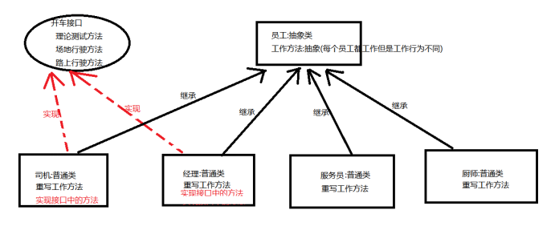

# Java面向对象 第4章 - 接口、多态

## 今日内容

- 接口
  * 更加彻底的抽象，接口中全部是抽象方法和常量（JDK1.8之后）
  * 接口体现的是规范思想，实现接口的类必须重写完接口的全部抽象方法，否则这个类必须是抽象类。 
  * JDK 1.8之后的接口新增了三个方法。接口不再纯洁。

- 多态
  - 面向对象的三大特征之一：封装，继承，多态。
  - 方法重载和方法重写是多态的体现
  - 父类的引用指向子类的实例
  - instanceof关键字的用法


## 教学目标

- [ ] 写出定义接口的格式

  - [ ] public **interface** SportMan{

    ​		

    }

    

- [ ] 写出实现接口的格式

  - [ ] 修饰符 class 实现类  **implements**  接口1 , 接口2{

    

    }

    

- [ ] 说出接口中成员的特点

  - [ ] JDK 1.8之前全部是抽象方法和常量，其他都没有。

  - [ ] JDK 1.8之后，有了静态方法，默认方法，JDK 1.9之后有了私有方法。

    

- [ ] 能够说出使用多态的前提条件

  - [ ] ```
    （1）必须有继承或者实现关系！
    （2）必须存在父类类的变量引用子类类型的对象！
    （3）存在方法重写！
    ```

  

- [ ] 理解多态的向上转型（自动类型转换）

  - [ ] 自动类型转换。Animal a = new Cat();

  

- [ ] 理解多态的向下转型

  - [ ] 强制类型转换。
  - [ ] Animal a= new Cat();
  - [ ] Cat c = (Cat)a;

 

# 第1章 接口

## 1.1 接口概念

接口是功能的集合，同样可看作是一种数据类型，是比抽象类更为抽象的”类”。

接口只描述所应该具备的方法，并没有具体实现，具体的实现由接口的实现类(相当于接口的子类)来完成。这样将功能的定义与实现分离，优化了程序设计。

请记住：一切事物均有功能，即一切事物均有接口。

**接口是更加彻底的抽象，接口中全部是抽象方法。（JDK8之前），接口同样是不能创建对象的**。


## 1.2 接口的定义

与定义类的class不同，接口定义时需要使用**interface**关键字。

定义接口所在的仍为.java文件，虽然声明时使用的为interface关键字的编译后仍然会产生.class文件。这点可以让我们将接口看作是一种只包含了功能声明的特殊类。


### 1.2.1 接口定义的格式

```java
修饰符 interface 接口名 {

	//抽象方法1

	//抽象方法2

	//抽象方法3

}

// 修饰符：public | 缺省
// 接口的声明：interface
// 接口名称：首字母大写，满足“驼峰模式”
```


### 1.2.2 接口中成员特点

 在JDK8之前，接口中的成分包含：抽象方法和静态常量

1.接口中的方法均为公共访问的抽象方法

注意：接口中的抽象方法默认会自动加上public abstract修饰程序员无需自己手写。

按照规范：以后接口中的抽象方法建议不要写上public abstract。因为没有必要啊，默认会加上。


2.接口中无法定义普通的成员变量，均为静态的常量 public static  final

注意：在接口中定义的成员变量默认会加上： public static final修饰。也就是说在接口中定义的成员变量实际上是一个常量。这里是使用public static final修饰后，变量值就不可被修改，并且是静态化的变量可以直接用接口名访问，所以也叫常量。常量必须要给初始值。常量命名规范建议字母全部大写，多个单词用下划线连接。


### 1.2.3 案例

```java
public interface InterDemo {
    // 抽象方法
    // public abstract void run();
    void run();

    // public abstract String getName();
    String getName();

    // public abstract int add(int a , int b);
    int add(int a , int b);


    // 常量
    // public static final int AGE = 12 ;
    int AGE  = 12; //常量
    String SCORE_LEVEL = "A级";

}
```

 

## 1.3 接口的实现

​		接口不可以创建对象。我们使用实现来表示一个类与一个接口之间的关系，这是接口最常用的使用方法。实现的关键字为**implements**。


### 1.3.1 接口实现的格式

```java
修饰符 class 类 implements 接口1,接口2,接口3...{

	//重写接口中方法

}
```


### 1.3.2 类实现接口的要求和意义

1.必须重写实现的全部接口中所有抽象方法。

2.如果一个类实现了接口，但是没有重写完全部接口的全部抽象方法，这个类也必须定义成抽象类。

3.**意义：接口体现的是一种规范，接口对实现类是一种强制性的约束，要么全部完成接口申明的功能，要么自己也定义成抽象类。这正是一种强制性的规范。**


### 1.3.3 接口实现的案例

**接口案例分析**

在员工,经理,服务员,厨师案例的基础上

添加新需求:

经理和司机有开车理论测试,场地行驶,路上行驶三个方法,而厨师和服务员都没有。

 


**代码实现**

员工抽象父类Employee:

```java
/**  
* @ClassName: Employee  
* @Description: 抽象的父类Employee员工类
* 
* 抽象的父类
*/
public abstract class Employee {
	
	//抽象类中定义正常的成员变量
	/**  
	* @Fields name : 姓名  
	*/  
	private String name;
	
	//构造方法
	/**  
	* @Title: Employee      
	*/
	public Employee() {
		super();
	}
	
	//该构造方法,不能直接被程序员调用,因为该类为抽象类,不能直接创建对象.
	//但是在创建子类对象时,子类的构造方法,可以调用父类的构造方法,为子类对象中的父类对象空间赋值
	/**  
	* @Title: Employee  
	* @param name    
	*/
	public Employee(String name) {
		super();
		this.name = name;
	}
	
	//抽象方法。需要abstract修饰，并分号;结束
	/**  
	* @Title: work  
	* @Description: 抽象工作方法      
	*/
	public abstract void work();

	/**
	 * @return the name
	 */
	public String getName() {
		return name;
	}

	/**
	 * @param name the name to set
	 */
	public void setName(String name) {
		this.name = name;
	}
}
```


开车接口:

```java
/**  
* @ClassName: Driveable  
* @Description: 开车接口
*    
* 具备开车功能的类,具备三个方法:理论,场地,路上行驶  
*/
public interface Driveable {
	
	/**  
	* @Title: theoryTest  
	* @Description: 理论      
	*/
	public abstract void theoryTest();
	
	/**  
	* @Title: fieldDrive  
	* @Description: 场地      
	*/
	public abstract void fieldDrive();
	
	/**  
	* @Title: roadDrive  
	* @Description: 路上行驶     
	*/
	public abstract void roadDrive();

}
```


服务员具体子类Waiter:

```java
/**  
* @ClassName: Waiter  
* @Description: 具体子类Waiter服务员类
*    
* 定义抽象父类的具体子类
*/
public class Waiter extends Employee {
	
	/**  
	* @Title: Waiter      
	*/
	public Waiter() {
		super();
	}

	//子类的构造方法可以调用父类的构造方法
	//这里,一个参数的子类构造,调用了父类一个参数的构造,为父类的成员变量赋值
	//但是最终还是子类对象自己使用这个成员变量
	/**  
	* @Title: Waiter  
	* @param name    
	*/
	public Waiter(String name) {
		super(name);
	}

	/*
	* 重写了父类的抽象方法,加入了方法体,描述出具体逻辑
	*/
	/**  
	* @Title: work  
	* @Description: 服务员的工作类  
	* @see com.igeek_03.Employee#work()
	*/
	@Override
	public void work() {
		System.out.println("等着顾客叫餐!");
	}

}
```


司机具体子类Driver：

```java
/**  
* @ClassName: Driver  
* @Description: 司机类
*    
* 定义司机类
* 		是员工的子类,继承员工
* 		会开车,实现开车接口
*/

public class Driver extends Employee implements Driveable {

	//如果需要的话,可以加入带参的构造方法
	
	//重写接口方法
	/**  
	* @Title: theoryTest  
	* @Description: 司机的理论测试  
	* @see com.igeek_03.Driveable#theoryTest()
	*/
	@Override
	public void theoryTest() {
		System.out.println("驾照理论习题1000道");		
	}

	/**  
	* @Title: fieldDrive  
	* @Description: 司机的场地测试  
	* @see com.igeek_03.Driveable#fieldDrive()
	*/
	@Override
	public void fieldDrive() {
		System.out.println("会倒车入库,会侧方停车");
		System.out.println("坡道起步");
	}

	/**  
	* @Title: roadDrive  
	* @Description: 司机的路上行驶测试  
	* @see com.igeek_03.Driveable#roadDrive()
	*/
	@Override
	public void roadDrive() {
		System.out.println("不撞人,不闯红灯,不超员");
		System.out.println("以前开公交,现在开大巴");
	}

	//重写父类方法
	/**  
	* @Title: work  
	* @Description: 司机的工作方法 
	* @see com.igeek_03.Employee#work()
	*/
	@Override
	public void work() {
		System.out.println("上班接人,下班送人");		
	}

}
```


经理具体子类Manager:

```java
/**  
* @ClassName: Manager  
* @Description: 经理类
* 
* 	经理需要具备开车的功能,则实现开车接口
*/
public class Manager extends Employee implements Driveable {

	/**  
	* @Title: Manager      
	*/
	public Manager() {
		super();
	}
	
	/**  
	* @Title: Manager  
	* @param name    
	*/
	public Manager(String name) {
		super(name);
	}

	//让经理类实现开车功能接口,重写三个方法,具备开车功能
	/**  
	* @Title: theoryTest  
	* @Description: 经理的理论测试   
	* @see com.igeek_03.Driveable#theoryTest()
	*/
	@Override
	public void theoryTest() {
		System.out.println("驾照理论习题1000道");
	}

	/**  
	* @Title: fieldDrive  
	* @Description: 经理的场地驾驶    
	* @see com.igeek_03.Driveable#fieldDrive()
	*/
	@Override
	public void fieldDrive() {
		System.out.println("会倒车入库,会侧方停车");
	}

	/**  
	* @Title: roadDrive  
	* @Description: 经理的路上驾驶 
	* @see com.igeek_03.Driveable#roadDrive()
	*/
	@Override
	public void roadDrive() {
		System.out.println("不撞人,不闯红灯");
		System.out.println("经理开的是高级车奇瑞qq~");
	}

	/**  
	* @Title: work  
	* @Description: 经理的工作  
	* @see com.igeek_03.Employee#work()
	*/
	@Override
	public void work() {
		System.out.println("管理餐厅人员及设备!");
	}

}
```


接口使用的测试类：

```java
/**  
* @ClassName: InterfaceDemo  
* @Description: 接口使用的测试类
*    
* 接口的定义格式，使用格式
*    
* 接口关键字：interface
* 使用接口，就是使用类实现接口，实现的关键字是implements，重写方法
*    
*/
public class InterfaceDemo {
	public static void main(String[] args) {
		//创建实现了接口的经理类，调用接口方法
		Manager m = new Manager("Jack");
		m.theoryTest();
		m.fieldDrive();
		m.roadDrive();
		
		System.out.println("================");
		
		//创建新的扩展类，调用方法
		Driver driver = new Driver();
		driver.theoryTest();
		driver.fieldDrive();
		driver.roadDrive();
	}
}
```


### 1.3.4 类与接口的多实现案例

**类与接口之间的关系是多实现的，一个类可以同时实现多个接口。**

首先我们先定义两个接口，代码如下：

``` java
/** 法律规范：接口*/
public interface Law {
    void rule();
}

/** 这一个运动员的规范：接口*/
public interface SportMan {
    void run();
}

```

然后定义一个实现类：

``` java
/**
 * Java中接口是可以被多实现的：
 *    一个类可以实现多个接口: Law ,SportMan
 *
 */
public class JumpMan implements Law ,SportMan {
    @Override
    public void rule() {
        System.out.println("尊长守法");
    }

    @Override
    public void run() {
        System.out.println("训练跑步！");
    }
}

```

从上面可以看出类与接口之间是可以多实现的，我们可以理解成实现多个规范，这是合理的。


## 1.4 接口与接口的多继承

Java中，接口与接口之间是可以多继承的：也就是一个接口可以同时继承多个接口。

大家一定要注意：

**类与接口是实现关系**

**接口与接口是继承关系**

接口继承接口就是把其他接口的抽象方法与本接口进行了合并。

案例演示：

```java 
public interface Abc {
    void go();
    void test();
}

/** 法律规范：接口*/
public interface Law {
    void rule();
    void test();
}

/*
 *
 *  总结：
 *     接口与类之间是多实现的。
 *     接口与接口之间是多继承的。
 * */
public interface SportMan extends Law , Abc {
    void run();
}

```


## 1.5 接口的课堂案例

```java
/*
	在现在我们要开发一个应用，模拟移动存储设备的读写，即计算机与U盘、MP3、移动硬盘等设备进行数据交换。已知要实现U盘、MP3播放器、移动硬盘三种移动存储设备，要求计算机能同这三种设备进行数据交换，并且以后可能会有新的第三方的移动存储设备，所以计算机必须有扩展性，能与目前未知而以后可能会出现的存储设备进行数据交换。各个存储设备间读、写的实现方法不同，U盘和移动硬盘只有这两个方法，MP3Player还有一个PlayMusic方法。
名词定义：数据交换={读，写}
*/
```


**课堂练习**

```java
/*
1.
1)、 定义一个接口CanFly，描述会飞的方法public void fly();　
2)、 分别定义类飞机和鸟，实现CanFly接口。　
3)、定义一个测试类，测试飞机和鸟。
测试类中定义一个makeFly()方法，让会飞的事物飞起来。　
4)、然后在main方法中创建飞机对象和鸟对象，
并在main方法中调用makeFly()方法，让飞机和鸟起飞。　
*/

/*
2.
实现一个名为Person的类和它的子类Employee，Manager是Employee的子类，
设计一个接口Add用于涨工资，普通员工一次能涨10％，经理能涨20％。
具体要求如下：
（1）Person类中的属性有：
姓名name（String类型），地址address（String类型），定义该类的构造方法；　
（2）Employee类中的属性有：
工号ID（String型），工资wage（double类型），工龄（int型），定义该类的构造方法,
且重写该类toString()方法；　
（3）Manager类中的属性有：
级别level（String类型）定义该类的构造方法，且重写toString()方法；　
（4）编写一个测试类，产生一个员工和一个经理给该员工和经理涨工资，
并输出其具有的信息。　
*/
```


## 1.6 接口新增方法

​		从JDK 8开始之后，接口不再纯洁了，接口中不再只是抽象方法，接口还可以有**默认方法**（也就是实例方法），和**静态方法**了。从JDK9之后还包含了私有方法和私有静态方法。


### 1.6.1 JDK 8，接口含有默认方法和静态方法

**1.默认方法：使用 `default` 修饰，不可省略，供子类调用或者子类重写。**

```java
格式：public default 返回值类型 方法名(参数列表){ 方法体 }
调用：子类.方法名();
```

**为什么要定义默认方法？为了解决接口升级的问题**

什么是接口升级？如果当前有一个接口，并且n多个类实现了这个接口；而当接口再次添加抽象方法的时候，n多个实现类就会报错。而出现了默认方法就解决了这个问题。


**2.静态方法：使用 `static` 修饰，供接口直接调用。**

```java
格式：public static 返回值类型 方法名称(参数列表){ 方法体 }
调用：直接 接口名.方法名 调用，与普通静态方法的调用一样(不能通过接口实现类的对象来调用接口中的静态方法)
```


**3.代码如下**

```java
public interface InterFaceName {
    //默认方法
    public default void method1() {
        // 执行语句
    }
    
    //静态方法
    public static void method2() {
        // 执行语句    
    }
}
```


### 1.6.2 JDK 9，接口含有私有方法和私有静态方法

**1.普通私有方法：使用 `private` 修饰，供接口中的默认方法或者静态方法调用。解决多个默认方法之间重复代码的问题**

```java
格式：private 返回值类型 方法名称(参数列表){ 方法体 }
```


**2.静态私有方法：解决多个静态方法之间的重复代码问题**

```java
格式：private static 返回值类型 方法名称(参数列表){ 方法体 }
```


**3.代码如下**

```java
public interface InterFaceName {
    //私有方法
    private void method() {
        // 执行语句
    }
}
```


### 1.6.3 新增方法的使用

**默认方法和静态方法以及私有方法和私有静态方法**，**遵循面向对象的继承关系使用原则，实现类依然可以访问接口的非私有方法，对于接口中的非私有静态方法，可以直接通过接口名进行访问。**

重写默认方法注意（了解）:

* 子接口重写默认方法时，default关键字可以保留。

* 实现类重写默认方法时，default关键字不可以保留。


## 1.7 接口的注意事项

1.接口没有静态代码块，不能有构造方法

2.一个类可以实现多个接口

3.如果实现类所有实现的多个接口中，存在重复的抽象方法，覆盖重写一次即可

4.如果实现类没有覆盖重写所有接口当中的所有抽象方法，那么这个实现类必须是一个抽象类

5.接口可以多继承，但是如果继承来多个default方法相同，那么必须对冲突的default方法进行覆盖重写

6.一个类如果直接继承父类当中的方法，和接口当中的默认方法产生了冲突，优先用父类的方法


## 1.8 实现多个接口使用注意事项

### 2.8.1 多个接口同名静态方法

如果实现了多个接口，多个接口中存在同名的静态方法并不会冲突，原因是只能通过各自接口名访问静态方法。

```java
public interface A {
  public static void test(){

  }
}

 interface B {
    public static void test(){

    }
}

class C implements  A , B{
    public static void main(String[] args) {
        People.test();
        B.test();
       // C.test(); // 编译出错
    }
}
```


### 1.8.2 优先级的问题

当一个类，既继承一个父类，又实现若干个接口时，父类中的成员方法与接口中的默认方法重名，子类就近选择执行父类的成员方法。代码如下：

定义接口：

```java
interface A {
    public default void methodA(){
        System.out.println("AAAAAAAAAAAA");
    }
}
```

定义父类：

```java
class D {
    public void methodA(){
        System.out.println("DDDDDDDDDDDD");
    }
}
```

定义子类：

```java
class C extends D implements A {
  	// 未重写methodA方法
}
```

定义测试类：

```java
public class Test {
    public static void main(String[] args) {
        C c = new C();
        c.methodA(); 
    }
}
//输出结果:
//DDDDDDDDDDDD
```


## 1.9 接口与抽象类概念辨析

A：当"我是你的一种时"，子类继承父类，即代表了类与类之间的关系，该体系的类都应该具备父类的成员。

 例如:厨师,经理,服务员 都属于员工 的一种,都应该继承员工

B：当"我应该像你一样具备这些功能时"，类实现接口，即代表类与功能的关系，将功能的声明与实现分离。并不是该体系内所有类都需要的额外功能。

 例如:只有经理 和司机 具备开车的技能,需要把开车的技能单独定义在接口中,让经理和司机去实现


## 1.10 接口与抽象类使用辨析

A:	类继承类extends，只能单继承

接口继承接口extends，可以多继承

类实现接口implements，可以多实现

接口不可以继承类

 

B:	抽象类中可以有非抽象方法

接口中全部为抽象方法

 

C:	抽象类具有成员变量

接口没有普通的成员变量

 

D:	抽象类中的成员无固定修饰符

接口中的成员有固定修饰符


|              | 抽象类                           | 接口                                                         |
| ------------ | -------------------------------- | ------------------------------------------------------------ |
| 关键字       | abstract  class                  | interface                                                    |
| 类           | 继承 extends  单继承             | 实现  implements 多实现                                      |
| 有无构造方法 | 有构造方法                       | 无构造方法                                                   |
| 变量         | 可以有成员变量                   | 公开的静态的常量 public static final                         |
| 方法         | 可以有成员方法，也可以有抽象方法 | JDK8之前：公开的抽象的方法 public abstract<br />JDK8版本：默认default的和静态static的方法<br />JDK9版本：私有的成员方法（静态的或非静态的） |

共同点：两者都不可以被实例化，只能在多态时充当父类类型存在。例如：A a = new B(); 此时B类要么实现A接口，要么继承A抽象类。

 

## 1.11 接口小结

- 接口中，无法定义成员变量，但是可以定义常量，其值不可以改变，默认使用public static final修饰。
- 接口中的方法全是抽象方法，默认会自动加上public abstract修饰
- JDK8开始，接口不再纯洁，支持静态方法，默认方法，JDK9以后支持私有方法。
- 接口中，没有构造器，**不能创建对象**。
- 类与接口是多实现的
- 接口与接口是多继承的
- 接口体现的规范。

 

# 第2章 多态

## 2.1 多态概述

A：多态是继封装、继承之后，面向对象的第三大特性。

现实事物经常会体现出多种形态，如学生，学生是人的一种，则一个具体的同学张三既是学生也是人，即出现两种形态。	

 

B：Java作为面向对象的语言，同样可以描述一个事物的多种形态。如Student类继承了Person类，一个Student的对象便既是Student，又是Person。

Java中多态的代码体现在：一个子类(实现类)对象既可以赋值给这个子类(实现类)引用变量，又可以赋值给这个子类(实现类)的父类(接口)引用变量。

如Student类可以为Person类的子类。那么一个Student对象既可以赋值给一个Student类型的引用，也可以赋值给一个Person类型的引用。

最终多态体现为**父类引用变量可以指向子类对象。**

 

C：多态的前提是必须有子父类关系或者类实现接口关系，否则无法完成多态。

在使用多态后的父类引用变量调用方法时，会调用子类重写后的方法。


## 2.2 多态的定义与使用格式

多态的定义格式：就是父类的引用变量指向子类对象

**多态**： 是指同一行为，具有多个不同表现形式。

从上面案例可以看出，Cat和Dog都是动物，都是吃这一行为，但是出现的效果（表现形式）是不一样的。

 **前提【重点】**

1. 继承或者实现【二选一】

2. 方法的重写【意义体现：不重写，无意义】

3. 父类引用指向子类对象【格式体现】

   > 父类类型：指子类对象继承的父类类型，或者实现的父接口类型。


A：普通类多态定义的格式

```java
父类 变量名 = new 子类();
如：	
    class Fu {}

	class Zi extends Fu {}

	//类的多态使用
	Fu f = new Zi();
```


B：抽象类多态定义的格式

```java
抽象类 变量名 = new 抽象类子类();

如：	
    abstract class Fu {
    	public abstract void method();
	 }

	class Zi extends Fu {
		public void method(){
			System.out.println(“重写父类抽象方法”);

		}
	}

	//类的多态使用
	Fu fu= new Zi();
```


C：接口多态定义的格式

```java
接口 变量名 = new 接口实现类();

如： 
    interface Fu {
		public abstract void method();
	}

	class Zi implements Fu {
		 public void method(){
			System.out.println(“重写接口抽象方法”);
		 }
	}

	//接口的多态使用
	Fu fu = new Zi();	
```


## 2.3 多态案例

已知动物类:

动物都有吃饭和睡觉方法

人类是动物的一种:

人不但吃饭,睡觉,而且会学习和工作


### 2.3.1 案例

```java
/**  
* @ClassName: Animal  
* @Description: 抽象父类Animal
*    
* 用于展示多态的抽象父类
* 	吃饭,睡觉功能
*/
public abstract class Animal {
	/**  
	* @Title: eat  
	* @Description: 普通的吃的方法      
	*/
	public void eat() {
		System.out.println("动物吃了");
	}
	
	/**  
	* @Title: sleep  
	* @Description: 抽象睡觉方法      
	*/
	public abstract void sleep();
}
```


 ```java
/**  
* @ClassName: Person  
* @Description: 具体子类Person
*    
* 用于展示多态的子类
* 	在父类的共性功能之外,有自己的学习工作方法
*/
public class Person extends Animal{

	//重写父类方法
	/**  
	* @Title: eat  
	* @Description: 重写父类的吃方法   
	* @see com.igeek_03.Animal#eat()
	*/
	@Override
	public void eat() {
		System.out.println("用工具吃饭");
	}
	
	/**  
	* @Title: sleep  
	* @Description: 实现父类的睡觉方法  
	* @see com.igeek_03.Animal#sleep()
	*/
	@Override
	public void sleep() {
		System.out.println("在床上躺着睡觉");
	}

	//定义自身特有方法
	/**  
	* @Title: study  
	* @Description: 学习方法     
	*/
	public void study() {
		System.out.println("学习书本知识与实践科学");
	}
	
	/**  
	* @Title: work  
	* @Description: 工作方法      
	*/
	public void work() {
		System.out.println("努力,用够时间");
	}

}
 ```


```java
/**  
* @ClassName: SubClassTypeDemo  
* @Description: 子类多态的测试类
*    
* 多态的前提必须有子父类关系,或者实现接口关系
* 
* 举例:
* 	父类:动物类
* 		共性的吃饭,睡觉方法
*  子类:
*  	猪类:共性功能
*  		拱地功能
*  	狗类:共性功能
*  		看门功能
*  	人类:共性功能
*  		学习,工作...功能
*  
*  多态:
*  	父类(接口)引用变量可以指向子类对象,展现出父类(接口)的功能
*  	子类引用变量可以指向子类对象,展现出子类的功能
*  	子类对象可以表现出多种形态,这多种形态叫做多态
*  
*  多态代码格式:
*  父类类型变量名 = new 子类类型();
*  变量名.方法名();
*  
*  当出现多态后,其调用的方法是类重写后的方法
*  
*/
public class SubClassTypeDemo {
	public static void main(String[] args) {
		//创建子类对象,让其展示不同的状态(多态)
		//不产生多态
		Person p = new Person();
		p.eat();
		p.sleep();
		p.work();
		p.study();
		System.out.println("===================");
		
		//使用多态,只表现出父类(等号左边的数据类型)的功能
		Animal a = new Person();
		a.eat();
		a.sleep();
		//a.work();  多态后不能再调用子类特有方法了	
	}

}
```


## 2.4 多态使用场景

我们一般在以下场景当中使用多态：

A:  使用多态为成员变量赋值,局部变量赋值

```java
class Father{

}

class Son extends Father{
    Father f=new Son();//使用多态形式为成员变量f赋值

	public void method(){
	  Father f2=new Son();//使用多态的形式为局部变量f2赋值
  	}
}
```


B:  方法传参使用多态形式(最常用最能体现出多态优点的应用)

```java
class Father{

}

class Son extends Father{

}

class Demo{

	public static void main(String[] args) {
		Son s=new Son();
		method(s);
	}

	public static void method(Father f){//f接收父类对象或者子类对象

	}

}
```


C:  方法返回返回值使用多态形式

```java
class Father{


}

class Son extends Father{

}

class Demo{
	public static void main(String[] args) {
		Son s=new Son();
		Father f=method();
	}

	public static Father method(){ 
    	Son s = new Son();
		//由于返回值类型为Father,所以既可以返回父类对象又可以返回子类对象
		return s; 
	}
}

```


### 2.4.1 案例

```java
/**  
* @ClassName: Animal  
* @Description: 抽象父类Animal
*    
* 	用于展示多态的抽象父类
* 
* 	吃饭,睡觉功能
*/

public abstract class Animal {
	
	/**  
	* @Title: eat  
	* @Description: 普通的吃的方法      
	*/
	public void eat() {
		System.out.println("动物吃了");
	}
	
	/**  
	* @Title: sleep  
	* @Description: 抽象睡觉方法      
	*/
	public abstract void sleep();

}
```


```java
/**  
* @ClassName: Person  
* @Description: 具体子类Person
*    
* 用于展示多态的子类
* 
* 在父类的共性功能之外,有自己的学习工作方法
*/
public class Person extends Animal{

	//重写父类方法
	/**  
	* @Title: eat  
	* @Description: 重写父类的吃方法   
	* @see com.igeek_04.Animal#eat()
	*/
	@Override
	public void eat() {
		System.out.println("用工具吃饭");
	}
	
	/**  
	* @Title: sleep  
	* @Description: 实现父类的睡觉方法  
	* @see com.igeek_04.Animal#sleep()
	*/
	@Override
	public void sleep() {
		System.out.println("在床上躺着睡觉");
	}

	//定义自身特有方法
	/**  
	* @Title: study  
	* @Description: 学习方法     
	*/
	public void study() {
		System.out.println("学习书本知识与实践科学");
	}
	
	/**  
	* @Title: work  
	* @Description: 工作方法      
	*/
	public void work() {
		System.out.println("努力,用够时间");
	}

}
```


 ```java
/**  
* @ClassName: SubClassTypeDemo  
* @Description: 子类多态的测试类
*
* 多态的前提必须有子父类关系,或者实现接口关系
* 
* 举例:
* 	父类:动物类
* 		共性的吃饭,睡觉方法
*  子类:
*  	猪类:共性功能
*  		拱地功能
*  	狗类:共性功能
*  		看门功能
*  	人类:共性功能
*  		学习,工作...功能
*  
*  多态:
*  	父类(接口)引用变量可以指向子类对象,展现出父类(接口)的功能
*  	子类引用变量可以指向子类对象,展现出子类的功能
*  	子类对象可以表现出多种形态,这多种形态叫做多态
*  
*  多态代码格式:
*  父类类型变量名 = new 子类类型();
*  变量名.方法名();
*  
*  当出现多态后,其调用的方法是类重写后的方法
*  
*  多态的使用场景:
*  	为变量赋值时使用多态,达到父类应用指向子类对象的赋值	
*  	直接为变量赋值
*  	调用方法时,为方法参数赋值
*  	方法返回值,可以定义父类类型,但是返回子类对象.当该方法被调用时,用父类类型接收.
*  
*  多态的好处:
*  	大大提高了程序的扩展性
*  	提高了程序的复用性
*/
public class SubClassTypeDemo {
	public static void main(String[] args) {
		
		//创建子类对象,让其展示不同的状态(多态)
		//不产生多态
		Person p = new Person();
		p.eat();
		p.sleep();
		p.work();
		p.study();
		System.out.println("===================");
		
		//使用多态,只表现出父类(等号左边的数据类型)的功能
		Animal a = new Person();
		a.eat();
		a.sleep();
		//a.work();  多态后不能再调用子类特有方法了	
		
		//调用feed方法
		//使用多态的形式,创建子类对象,赋值给父类引用
		//Animal a2=new Person();
		//feed(a2);
		
		//Person p2=new Person();
		//feed(p2)
	
		feed(new Person());

	}
	
	/**  
	* @Title: feed  
	* @Description: 接受一个动物,调用该动物吃饭的方法  
	* @param x    
	*/
	public static void feed(Animal x){//x可以接收Animal的任意子类对象
		//调用该动物的吃饭方法
		System.out.println("feed方法内的动物吃饭方法被调用了");
		x.eat();
	}

}
 ```


## 2.5 多态的好处

实际开发的过程中，父类类型作为方法形式参数，传递子类对象给方法，进行方法的调用，更能体现出多态的扩展性与便利。代码如下：

定义父类：

```java
public abstract class Animal {  
    public abstract void eat();  
}  
```

定义子类：

```java
class Cat extends Animal {  
    public void eat() {  
        System.out.println("吃鱼");  
    }  
}  

class Dog extends Animal {  
    public void eat() {  
        System.out.println("吃骨头");  
    }  
}
```

定义测试类：

```java
public class Test {
    public static void main(String[] args) {
        // 多态形式，创建对象
        Cat c = new Cat();  
        Dog d = new Dog(); 

        // 调用showCatEat 
        showCatEat(c);
        // 调用showDogEat 
        showDogEat(d); 

        /*
        以上两个方法, 均可以被showAnimalEat(Animal a)方法所替代
        而执行效果一致
        */
        showAnimalEat(c);
        showAnimalEat(d); 
    }

    public static void showCatEat (Cat c){
        c.eat(); 
    }

    public static void showDogEat (Dog d){
        d.eat();
    }

    public static void showAnimalEat (Animal a){
        a.eat();
    }
}
```

由于多态特性的支持，showAnimalEat方法的Animal类型，是Cat和Dog的父类类型，父类类型接收子类对象，当然可以把Cat对象和Dog对象，传递给方法。

当eat方法执行时，多态规定，执行的是子类重写的方法，那么效果自然与showCatEat、showDogEat方法一致，所以showAnimalEat完全可以替代以上两方法。

不仅仅是替代，在扩展性方面，无论之后再多的子类出现，我们都不需要编写showXxxEat方法了，直接使用showAnimalEat都可以完成。**从而实现了实现类的自动切换。**

所以，多态的好处，体现在，可以使程序编写的更简单，并有良好的扩展。


## 2.6 多态的弊端

我们已经知道多态编译阶段是看左边父类类型的，如果子类有些独有的功能，此时**多态的写法就无法访问子类独有功能了**。

```java 
class Animal{
    public  void eat()｛
        System.out.println("动物吃东西！")
    ｝
}
class Cat extends Animal {  
    public void eat() {  
        System.out.println("吃鱼");  
    }  
   
    public void catchMouse() {  
        System.out.println("抓老鼠");  
    }  
}  

class Dog extends Animal {  
    public void eat() {  
        System.out.println("吃骨头");  
    }  
}

class Test{
    public static void main(String[] args){
        Animal a = new Cat();
        a.eat();
        a.catchMouse();//编译报错，编译看左边，Animal没有这个方法
    }
}
```


## 2.7 多态转型

多态的转型分为向上转型与向下转型两种：

A：向上转型：当有子类对象赋值给一个父类引用时，便是向上转型，多态本身就是向上转型的过程。

```java
使用格式：父类类型 变量名 = new 子类类型();

如：Person p = new Student();
```


B：向下转型：一个已经向上转型的子类对象可以使用强制类型转换的格式，将父类引用转为子类引用，这个过程是向下转型。如果是直接创建父类对象，是无法向下转型的

```java
使用格式：子类类型 变量名 = (子类类型) 父类类型的变量;

如:Student stu = (Student) p;  //变量p 实际上指向Student对象
```


### 2.7.1 案例

```java
/**  
* @ClassName: Animal  
* @Description: 抽象父类Animal
*    
* 	用于展示多态的抽象父类
* 
* 	吃饭,睡觉功能
*/

public abstract class Animal {
	
	/**  
	* @Title: eat  
	* @Description: 普通的吃的方法      
	*/
	public void eat() {
		System.out.println("动物吃了");
	}
	
	/**  
	* @Title: sleep  
	* @Description: 抽象睡觉方法      
	*/
	public abstract void sleep();

}
```


 ```java
/**  
* @ClassName: Person  
* @Description: 具体子类Person
*    
* 用于展示多态的子类
* 
* 在父类的共性功能之外,有自己的学习工作方法
*/

public class Person extends Animal{

	//重写父类方法
	/**  
	* @Title: eat  
	* @Description: 重写父类的吃方法   
	* @see com.igeek_05.Animal#eat()
	*/
	@Override
	public void eat() {
		System.out.println("用工具吃饭");
	}
	
	/**  
	* @Title: sleep  
	* @Description: 实现父类的睡觉方法  
	* @see com.igeek_05.Animal#sleep()
	*/
	@Override
	public void sleep() {
		System.out.println("在床上躺着睡觉");
	}

	//定义自身特有方法
	/**  
	* @Title: study  
	* @Description: 学习方法     
	*/
	public void study() {
		System.out.println("学习书本知识与实践科学");
	}
	
	/**  
	* @Title: work  
	* @Description: 工作方法      
	*/
	public void work() {
		System.out.println("努力,用够时间");
	}

}
 ```


```java
/**  
* @ClassName: Dog  
* @Description: 具体的子类Dog类
*    
*/
public class Dog  extends Animal{
	/**  
	* @Title: sleep  
	* @Description: 实现父类的睡觉方法    
	* @see com.igeek_05.Animal#sleep()
	*/
	@Override
	public void sleep() {
		System.out.println("在小狗窝里躺着睡觉");		
	}

}
```


```java
/**  
* @ClassName: SubClassTypeDemo  
* @Description: 子类多态的测试类
*
* 多态后的类型转换问题:
* 		向上转型:多态本身是子类类型向父类类型向上转型
* 		向下转型(使用强制类型转换):
* 			父类类型  f = new 子类类型();
* 			子类类型   z = (子类类型)f;
* 
*/
public class SubClassTypeDemo {
	public static void main(String[] args) {
		
		//使用多态,只表现出父类(等号左边的数据类型)的功能
		Animal a = new Person();
		a.eat();
		a.sleep();
		System.out.println("==============================");
		
		//使用强制类型转换,将父类类型转为子类类型
		Person p = (Person)a;
		p.eat();
		p.sleep();
		p.study();
		p.work();
		System.out.println("==============================");
		
		//在强制类型转换时,必须是什么对象,转为什么类型.
		//如果使用错,使用了其他类型,则编译时不报错,运行时会报错,显示类型转换异常:java.lang.ClassCastException
		Animal a2 = new Dog();
		Person p2 = (Person)a2;
		p2.eat();
		p2.sleep();
		p2.study();
		p2.work();
		System.out.println("==============================");
	}
}
```


## 2.8 instanceof关键字

​		我们可以通过instanceof关键字来判断某个对象是否属于某种数据类型。如学生的对象属于学生类，学生的对象也属于人类。

使用格式：

```java
boolean  b  = 对象 instanceof  数据类型;
```

如

```java
Person p1 = new Student(); // 前提条件，学生类已经继承了人类

boolean flag = p1 instanceof Student; //flag结果为true

boolean flag2 = p2 instanceof Teacher; //flag结果为false

```


### 2.8.1 案例

```java
/**  
* @ClassName: Animal  
* @Description: 抽象父类Animal
*    
* 	用于展示多态的抽象父类
* 
* 	吃饭,睡觉功能
*/
public abstract class Animal {
	
	/**  
	* @Title: eat  
	* @Description: 普通的吃的方法      
	*/
	public void eat() {
		System.out.println("动物吃了");
	}
	
	/**  
	* @Title: sleep  
	* @Description: 抽象睡觉方法      
	*/
	public absract void sleep();

}
```


```java
/**  
* @ClassName: Person  
* @Description: 具体子类Person
*    
* 用于展示多态的子类
* 
* 在父类的共性功能之外,有自己的学习工作方法
*/
public class Person extends Animal{

	//重写父类方法
	/**  
	* @Title: eat  
	* @Description: 重写父类的吃方法   
	* @see com.igeek_06.Animal#eat()
	*/
	@Override
	public void eat() {
		System.out.println("用工具吃饭");
	}
	
	/**  
	* @Title: sleep  
	* @Description: 实现父类的睡觉方法  
	* @see com.igeek_06.Animal#sleep()
	*/
	@Override
	public void sleep() {
		System.out.println("在床上躺着睡觉");
	}

	//定义自身特有方法
	/**  
	* @Title: study  
	* @Description: 学习方法     
	*/
	public void study() {
		System.out.println("学习书本知识与实践科学");
	}
	
	/**  
	* @Title: work  
	* @Description: 工作方法      
	*/
	public void work() {
		System.out.println("努力,用够时间");
	}

}
```


```java
/**  
* @ClassName: Dog  
* @Description: 具体的子类Dog类
*    
*/
public class Dog  extends Animal{

	/**  
	* @Title: sleep  
	* @Description: 实现父类的睡觉方法    
	* @see com.igeek_06.Animal#sleep()
	*/
	@Override
	public void sleep() {
		System.out.println("在小狗窝里躺着睡觉");		
	}

	/**  
	* @Title: keepDoor  
	* @Description: 狗的看门方法      
	*/
	public void keepDoor() {
		System.out.println("在大门看门");			
	}

}
```


```java
/**  
* @ClassName: SubClassTypeDemo  
* @Description: 子类多态的测试类
*
* 多态后的类型转换问题:
* 		向上转型:多态本身是子类类型向父类类型向上转型
* 		向下转型(使用强制类型转换):
* 			父类类型  f = new 子类类型();
* 			子类类型   z = (子类类型)f;
* 
* instanceof关键字:用来判断对象是否属于某种数据类型
* 
* 某个对象instanceof某个数据类型
* (note:对象与类型必须拥有子父类关系才可以判断,无关系的两个类型不能判断!)
* 
*/
public class SubClassTypeDemo {
	public static void main(String[] args) {
		
		//使用多态,只表现出父类(等号左边的数据类型)的功能
		Animal a = new Person();
		a.eat();
		a.sleep();
		System.out.println("==============================");
		
		//使用强制类型转换,将父类类型转为子类类型
		Person p = (Person)a;
		p.eat();
		p.sleep();
		p.study();
		p.work();
		System.out.println("==============================");
		
		//在强制类型转换时,必须是什么对象,转为什么类型.
		//如果使用错,使用了其他类型,则编译时不报错,运行时会报错,显示类型转换异常:java.lang.ClassCastException
		Animal a2 = new Dog();
		//Person p2 = (Person)a2;
		//p2.eat();
		//p2.sleep();
		//p2.study();
		//p2.work();
		
		method(p);
	}
	
	public static void method(Animal a) {
		//先吃饭
		a.eat();
		//如果是狗,就看门,如果是人就学习工作
		if(a instanceof Dog) {
			//强转为狗
			Dog d = (Dog)a;
			//调用狗的方法
			d.keepDoor();
		}
		
		//如果是,就看门,如果是人就学习工作
		if(a instanceof Person) {
			//强转为人
			Person p = (Person)a;
			//调用人的方法
			p.study();
			p.work();
		}
	}
}
```

