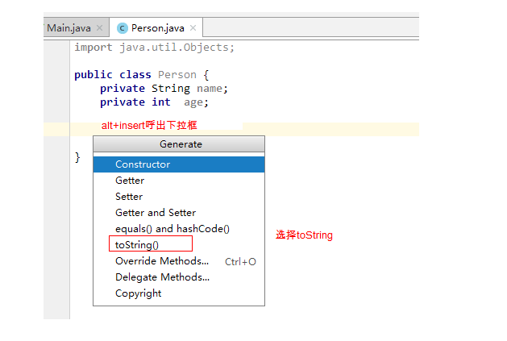
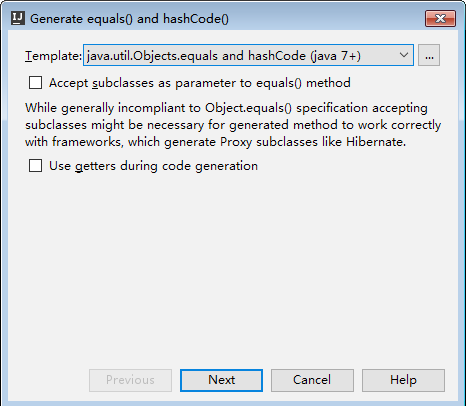
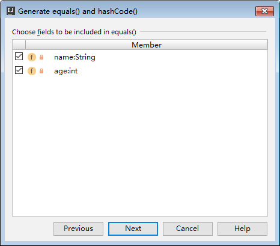

# JavaSE基础 Object&常用类 

## 今日内容

- Object类
  - API使用工程师。90%的技术都是别人写好的.我们直接调用。
  - 从这里开始，几乎没有语法了，全部是别人写好的技术我们直接调用即可，调用API。
- Date类
  * Java是面向对象的思想，会用一个类来代表一个事物。
  * Date代表了系统当前此刻日期对象！年月日时分秒。
- DateFormat类
  * 日期格式化类，认为日期对象拿到的时间是不好看的！
  * 日期格式化类可以把时间格式化成我们喜欢的格式。
  * 日期格式化类可以把字符串时间解析成日期对象!!  "2019-10-01 09:28:00"
- Calendar类  
  * 日历类，代表了此刻日期对象对应的日历对象。日历的信息更加的丰富。
- System类
  * 代表了当前JVM虚拟机对应的操作系统对象。
  * 可以拿系统时间。
  * 可以让程序退出JVM虚拟机，让程序立即死亡！！
  * 可以做数组拷贝。
- 包装器
  * 一切皆对象。   
  * int Integer   int age = 21;    Integer age1 = 21; 
  * float Float 
  * double Double
- StringBuilder类和StringBuffer类
  - String类不适合做字符串的拼接，增删等运算。不可变字符串，增删性能较差！
  - StringBuillder非常适合做字符串的增删改查操作，性能更好！！


## 教学目标

- [ ] 能够说出Object类的特点

  - [ ] 祖宗类，它的功能，全部类都 可以使用

- [ ] 能够重写Object类的toString方法

  - [ ] 自动生成：重写返回对象内容输出。

- [ ] 能够重写Object类的equals方法

  - [ ] 自动生成：比较对象的内容，制定比较规则。

- [ ] 能够使用日期类输出当前日期

  ```java
  Date d = new Date();
  System.out.println(d);
  ```

- [ ] 能够使用将日期格式化为字符串的方法

  ```java
  SimpleDateFormat sdf = new SimpleDateFormat("yyyy-MM-dd HH:mm:ss");
  String rs = sdf.format(“日期对象”)
  String rs = sdf.format("时间毫秒值")
  ```

- [ ] 能够使用将字符串转换成日期的方法

  ```java
  SimpleDateFormat sdf = new SimpleDateFormat("yyyy-MM-dd HH:mm:ss");
  String str = "2020-11-11 11:11:11";
  Data d = sdf.parse(str );
  System.out.println(d);
  ```

- [ ] 能够使用System类的数组复制方法

  ```java
  // 数组拷贝：
  int[] arrs1 = {10 , 20 , 30 , 40 , 50 , 60 , 70 , 80};
  // arrs2 = [ 0 , 0 , 0 , 0 , 0 , 0]
  // arrs2 = [0 , 0 , 30 , 40 , 50 , 0]
  // 希望把第一个数组的 30 , 40 , 50赋值到第二个数组
  int[] arrs2 = new int[6];
  
  /**
   arraycopy(Object src,  int  srcPos,
   Object dest, int destPos,
   int length)
   参数一：原数组。
   参数二：从原数组哪个位置开始复制
   参数三：目标数组
   参数四：复制到目标数组的哪个位置开始。
   参数五：复制多少个
   */
  System.arraycopy(arrs1, 2 ,arrs2 , 2 , 3);
  System.out.println(Arrays.toString(arrs2));
  ```

- [ ] 能够使用System类获取当前毫秒时刻值

  ```java
  long time = System.currentTimeMillis();
  ```

- [ ] 能够说出使用StringBuilder类可以解决的问题

  - [ ] 可以做字符串的运算（拼接，增删，反转）

- [ ] 能够使用StringBuilder进行字符串拼接操作

  - [ ] append

- [ ] 能够说出8种基本类型对应的包装类名称

  - [ ] int Integer

  - [ ] char Character

  - [ ] ```properties
    基本数据类型              包装类
    byte                 Byte
    short                Short
    int                  Integer(特殊)
    long                 Long
    float                Float
    double               Double
    char                 Character(特殊)
    boolean              Boolean
    ```

- [ ] 能够说出自动装箱、自动拆箱的概念

  - [ ] ```properties
    自动装箱：可以直接把基本数据类型的变量或者值赋值给对应的包装类对象。
    自动拆箱：可以把包装类的对象赋值给基本数据类型的变量。
    ```

- [ ] 能够将字符串转换为对应的基本类型

  ```properties
  功能3: 把字符串类型的数字转化成对应的基本数据类型的值
        Xxxx.parseXxxx("字符串类型的数字")
        Xxxx.valueOf("字符串类型的数字")：推荐使用的
  ```

- [ ] 能够将基本类型转换为对应的字符串

  ```java
  // 功能2: 包装类可以把基本数据类型的值转换成字符串。
  // 1.把基本数据类型的值转换成字符串:toString()
  Integer num = 23 ;
  String numStr1 = num.toString();
  System.out.println(numStr1+1); // 231
  
  // 2.把基本数据类型的值转换成字符串:
  Integer num1 = 23 ;
  String num1Str1 = Integer.toString(num1);
  System.out.println(num1Str1+1); // 231
  
  // 3.把基本数据类型的值转换成字符串:
  Integer num2 = 23 ;
  String num2Str1 = num2 + "" ; //常见做法
  System.out.println(num2Str1+1); // 231
  ```


# 第1章 Object类 

## 1.1 概述

`java.lang.Object`类是Java语言中的根类，即所有类的父类。它中描述的所有方法子类都可以使用。在对象实例化的时候，最终找的父类就是Object。

如果一个类没有特别指定父类，	那么默认则继承自Object类。例如：

```java
public class MyClass /*extends Object*/ {
  	// ...
}
```

根据JDK源代码及Object类的API文档，Object类当中包含的方法有11个。今天我们主要学习其中的2个：

* `public String toString()`：返回该对象的字符串表示。
* `public boolean equals(Object obj)`：指示其他某个对象是否与此对象“相等”。


## 1.2 toString方法

### 方法摘要

* `public String toString()`：返回该对象的字符串表示。

toString方法返回该对象的字符串表示，其实该字符串内容就是对象的类型+@+内存地址值。

由于toString方法返回的结果是内存地址，而在开发中，经常需要按照对象的属性得到相应的字符串表现形式，因此也需要重写它。

### 覆盖重写

如果不希望使用toString方法的默认行为，则可以对它进行覆盖重写。

例如自定义的Person类：

```java
public class Person {  
    private String name;
    private int age;

    @Override
    public String toString() {
        return "Person{" + "name='" + name + '\'' + ", age=" + age + '}';
    }

    // 省略构造器与Getter Setter
}
```

在IntelliJ IDEA中，可以点击`Code`菜单中的`Generate...`，也可以使用快捷键`alt+insert`，点击`toString()`选项。选择需要包含的成员变量并确定。如下图所示：



> 小贴士： 在我们直接使用输出语句输出对象名的时候,其实通过该对象调用了其toString()方法。


## 1.3 equals方法

### 方法摘要

* `public boolean equals(Object obj)`：指示其他某个对象是否与此对象“相等”。

调用成员方法equals并指定参数为另一个对象，则可以判断这两个对象是否是相同的。这里的“相同”有默认和自定义两种方式。

### 默认地址比较

如果没有覆盖重写equals方法，那么Object类中默认进行`==`运算符的对象地址比较，只要不是同一个对象，结果必然为false。

### 对象内容比较

如果希望进行对象的内容比较，即所有或指定的部分成员变量相同就判定两个对象相同，则可以覆盖重写equals方法。例如：

```java
import java.util.Objects;

public class Person {	
	private String name;
	private int age;
	
    @Override
    public boolean equals(Object o) {
        // 如果对象地址一样，则认为相同
        if (this == o)
            return true;
        // 如果参数为空，或者类型信息不一样，则认为不同
        if (o == null || getClass() != o.getClass())
            return false;
        // 转换为当前类型
        Person person = (Person) o;
        // 要求基本类型相等，并且将引用类型交给java.util.Objects类的equals静态方法取用结果
        return age == person.age && Objects.equals(name, person.name);
    }
}
```

这段代码充分考虑了对象为空、类型一致等问题，但方法内容并不唯一。大多数IDE都可以自动生成equals方法的代码内容。在IntelliJ IDEA中，可以使用`Code`菜单中的`Generate…`选项，也可以使用快捷键`alt+insert`，并选择`equals() and hashCode()`进行自动代码生成。如下图所示：






> tips：Object类当中的其他方法，今后学习。


# 第2章 Objects类

Objects类是对象工具类，它里面的的方法都是用来操作对象的。


## 2.1 equals方法

在刚才IDEA自动重写equals代码中，使用到了`java.util.Objects`类，那么这个类是什么呢？

在**JDK7**添加了一个Objects工具类，它提供了一些方法来操作对象，它由一些静态的实用方法组成，这些方法是null-save（空指针安全的）或null-tolerant（容忍空指针的），用于计算对象的hashcode、返回对象的字符串表示形式、比较两个对象。

在比较两个对象的时候，Object的equals方法容易抛出空指针异常，而Objects类中的equals方法就优化了这个问题。方法如下：

* `public static boolean equals(Object a, Object b)`:判断两个对象是否相等。

我们可以查看一下源码，学习一下：

```java
public static boolean equals(Object a, Object b) {  
    return (a == b) || (a != null && a.equals(b));  

```


## 2.2 isNull

static boolean isNull(Object obj) 判断对象是否为null，如果为null返回true。

```java
Student s1 = null;
Student s2 = new Student("蔡徐坤", 22);

// static boolean isNull(Object obj) 判断对象是否为null,如果为null返回true
System.out.println(Objects.isNull(s1)); // true
System.out.println(Objects.isNull(s2)); // false
```


# 第3章 Date类

## 3.1 Date概述

java.util.Date 类 表示特定的瞬间，精确到毫秒。

继续查阅Date类的描述，发现Date拥有多个构造函数，只是部分已经过时，我们重点看以下两个构造函数

- `public Date()`：从运行程序的此时此刻到时间原点经历的毫秒值,转换成Date对象，分配Date对象并初始化此对象，以表示分配它的时间（精确到毫秒）。
- `public Date(long date)`：将指定参数的毫秒值date,转换成Date对象，分配Date对象并初始化此对象，以表示自从标准基准时间（称为“历元（epoch）”，即1970年1月1日00:00:00 GMT）以来的指定毫秒数。

> tips: 由于中国处于东八区（GMT+08:00）是比世界协调时间/格林尼治时间（GMT）快8小时的时区，当格林尼治标准时间为0:00时，东八区的标准时间为08:00。

简单来说：使用无参构造，可以自动设置当前系统时间的毫秒时刻；指定long类型的构造参数，可以自定义毫秒时刻。例如：

```java
import java.util.Date;

public class Demo01Date {
    public static void main(String[] args) {
        // 创建日期对象，把当前的时间
        System.out.println(new Date()); // Tue Jan 16 14:37:35 CST 2020
        // 创建日期对象，把当前的毫秒值转成日期对象
        System.out.println(new Date(0L)); // Thu Jan 01 08:00:00 CST 1970
    }
}
```

> tips:在使用println方法时，会自动调用Date类中的toString方法。Date类对Object类中的toString方法进行了覆盖重写，所以结果为指定格式的字符串。


## 3.2 Date常用方法

Date类中的多数方法已经过时，常用的方法有：

- `public long getTime()` 把日期对象转换成对应的时间毫秒值。
- `public void setTime(long time)` 把方法参数给定的毫秒值设置给日期对象

示例代码

```java
public class DateDemo02 {
    public static void main(String[] args) {
        //创建日期对象
        Date d = new Date();
        
        //public long getTime():获取的是日期对象从1970年1月1日 00:00:00到现在的毫秒值
        //System.out.println(d.getTime());
        //System.out.println(d.getTime() * 1.0 / 1000 / 60 / 60 / 24 / 365 + "年");

        //public void setTime(long time):设置时间，给的是毫秒值
        //long time = 1000*60*60;
        long time = System.currentTimeMillis();
        d.setTime(time);

        System.out.println(d);
    }
}
```

> 小结：Date表示特定的时间瞬间，我们可以使用Date对象对时间进行操作。


**课堂练习：**

```java
// "2014-5-25"到"2012-12-28"中间有多少天？
```


# 第4章 DateFormat类

`java.text.DateFormat` 是日期/时间格式化子类的抽象类，我们通过这个类可以帮我们完成日期和文本之间的转换,也就是可以在Date对象与String对象之间进行来回转换。

- **格式化**：按照指定的格式，把Date对象转换为String对象。
- **解析**：按照指定的格式，把String对象转换为Date对象。

## 4.1 构造方法

由于DateFormat为抽象类，不能直接使用，所以需要常用的子类`java.text.SimpleDateFormat`。这个类需要一个模式（格式）来指定格式化或解析的标准。构造方法为：

- `public SimpleDateFormat(String pattern)`：用给定的模式和默认语言环境的日期格式符号构造SimpleDateFormat。参数pattern是一个字符串，代表日期时间的自定义格式。


## 4.2 格式规则

常用的格式规则为：

| 标识字母（区分大小写） | 含义 |
| ---------------------- | ---- |
| y                      | 年   |
| M                      | 月   |
| d                      | 日   |
| H                      | 时   |
| m                      | 分   |
| s                      | 秒   |

> 备注：更详细的格式规则，可以参考SimpleDateFormat类的API文档。


## 4.3 常用方法

DateFormat类的常用方法有：

- `public String format(Date date)`：将Date对象格式化为字符串。

- `public Date parse(String source)`：将字符串解析为Date对象。

  ```java
  public class SimpleDateFormatDemo {
      public static void main(String[] args) throws ParseException {
          //格式化：从 Date 到 String
          Date d = new Date();
          SimpleDateFormat sdf = new SimpleDateFormat("yyyy年MM月dd日 HH:mm:ss");
          String s = sdf.format(d);
          System.out.println(s);
          System.out.println("--------");
  
          //从 String 到 Date
          String ss = "2048-08-09 11:11:11";
          //ParseException
          SimpleDateFormat sdf2 = new SimpleDateFormat("yyyy-MM-dd HH:mm:ss");
          Date dd = sdf2.parse(ss);
          System.out.println(dd);
      }
  }
  ```

> 小结：DateFormat可以将Date对象和字符串相互转换。


# 第5章 Calendar类

## 5.1 概述

- java.util.Calendar类表示一个“日历类”，可以进行日期运算。它是一个抽象类，不能创建对象，我们可以使用它的子类：java.util.GregorianCalendar类。
- 有两种方式可以获取GregorianCalendar对象：
  - 直接创建GregorianCalendar对象；
  - 通过Calendar的静态方法getInstance()方法获取GregorianCalendar对象【本次课使用】


## 5.2 常用方法

| 方法名                                | 说明                                                         |
| ------------------------------------- | ------------------------------------------------------------ |
| public static Calendar getInstance()  | 获取一个它的子类GregorianCalendar对象。                      |
| public int get(int field)             | 获取某个字段的值。field参数表示获取哪个字段的值，<br />可以使用Calender中定义的常量来表示：<br />Calendar.YEAR : 年<br />Calendar.MONTH ：月<br />Calendar.DAY_OF_MONTH：月中的日期<br />Calendar.HOUR：小时<br />Calendar.MINUTE：分钟<br />Calendar.SECOND：秒<br />Calendar.DAY_OF_WEEK：星期 |
| public void set(int field,int value)  | 设置某个字段的值                                             |
| public void add(int field,int amount) | 为某个字段增加/减少指定的值                                  |


## 5.3 get方法示例

```java
public class Demo {
    public static void main(String[] args) {
        //1.获取一个GregorianCalendar对象
        Calendar instance = Calendar.getInstance();//获取子类对象

        //2.打印子类对象
        System.out.println(instance);

        //3.获取属性
        int year = instance.get(Calendar.YEAR);
        int month = instance.get(Calendar.MONTH) + 1;//Calendar的月份值是0-11
        int day = instance.get(Calendar.DAY_OF_MONTH);

        int hour = instance.get(Calendar.HOUR);
        int minute = instance.get(Calendar.MINUTE);
        int second = instance.get(Calendar.SECOND);

        int week = instance.get(Calendar.DAY_OF_WEEK);//返回值范围：1--7，分别表示："星期日","星期一","星期二",...,"星期六"

        System.out.println(year + "年" + month + "月" + day + "日" + 
                           	hour + ":" + minute + ":" + second);
        System.out.println(getWeek(week));

    }

    //查表法，查询星期几
    public static String getWeek(int w) {//w = 1 --- 7
        //做一个表(数组)
        String[] weekArray = {"星期日", "星期一", "星期二", "星期三", "星期四", "星期五", "星期六"};
        //            索引      [0]      [1]       [2]      [3]       [4]      [5]      [6]
        //查表
        return weekArray[w - 1];
    }
}

```


## 5.4 set方法示例

```java
public class Demo {
    public static void main(String[] args) {
        //设置属性——set(int field,int value):
		Calendar c1 = Calendar.getInstance();//获取当前日期

		//计算班长出生那天是星期几(假如班长出生日期为：1998年3月18日)
		c1.set(Calendar.YEAR, 1998);
		c1.set(Calendar.MONTH, 3 - 1);//转换为Calendar内部的月份值
		c1.set(Calendar.DAY_OF_MONTH, 18);

		int w = c1.get(Calendar.DAY_OF_WEEK);
		System.out.println("班长出生那天是：" + getWeek(w));

        
    }
    //查表法，查询星期几
    public static String getWeek(int w) {//w = 1 --- 7
        //做一个表(数组)
        String[] weekArray = {"星期日", "星期一", "星期二", "星期三", "星期四", "星期五", "星期六"};
        //            索引      [0]      [1]       [2]      [3]       [4]      [5]      [6]
        //查表
        return weekArray[w - 1];
    }
}
```


## 5.5 add方法示例

```java
public class Demo {
    public static void main(String[] args) {
        //计算200天以后是哪年哪月哪日，星期几？
		Calendar c2 = Calendar.getInstance();//获取当前日期
        c2.add(Calendar.DAY_OF_MONTH, 200);//日期加200

        int y = c2.get(Calendar.YEAR);
        int m = c2.get(Calendar.MONTH) + 1;//转换为实际的月份
        int d = c2.get(Calendar.DAY_OF_MONTH);

        int wk = c2.get(Calendar.DAY_OF_WEEK);
        System.out.println("200天后是：" + y + "年" + m + "月" + d + "日" + getWeek(wk));

    }
    //查表法，查询星期几
    public static String getWeek(int w) {//w = 1 --- 7
        //做一个表(数组)
        String[] weekArray = {"星期日", "星期一", "星期二", "星期三", "星期四", "星期五", "星期六"};
        //            索引      [0]      [1]       [2]      [3]       [4]      [5]      [6]
        //查表
        return weekArray[w - 1];
    }
}
```


**课堂练习：**

```java
// 距离当前时间500天后的日期和时间
```


# 第6章 Math类

## 6.1 概述

- java.lang.Math(类): Math包含执行基本数字运算的方法。
- 它不能创建对象，它的构造方法被“私有”了。因为他内部都是“静态方法”，通过“类名”直接调用即可。


## 6.2 常用方法

| 方法名                                       | 说明                |
| -------------------------------------------- | ------------------- |
| public static int abs(int a)                 | 获取参数a的绝对值： |
| public static double ceil(double a)          | 向上取整            |
| public static double floor(double a)         | 向下取整            |
| public static double pow(double a, double b) | 获取a的b次幂        |
| public static long round(double a)           | 四舍五入取整        |


## 6.3 示例代码

```java
public class Demo {
    public static void main(String[] args) {
        System.out.println("-5的绝对值：" + Math.abs(-5));//5
    	System.out.println("3.4向上取整：" + Math.ceil(3.4));//4.0
    	System.out.println("3.4向下取整：" + Math.floor(3.4));//3.0
    	System.out.println("2的8次幂：" + Math.pow(2, 8));//256.0
    	System.out.println("3.2四舍五入：" + Math.round(3.2));//3
    	System.out.println("3.5四舍五入：" + Math.round(3.5));//4

    }
}
```


# 第7章 System类

## 7.1 概述

`java.lang.System`类中提供了大量的静态方法，可以获取与系统相关的信息或系统级操作。


## 7.2 常用方法

| 方法名                                   | 说明                                             |
| ---------------------------------------- | ------------------------------------------------ |
| public   static void exit(int status)    | 终止当前运行的   Java   虚拟机，非零表示异常终止 |
| public   static long currentTimeMillis() | 返回当前时间(以毫秒为单位)                       |


## 7.3 练习

在控制台输出1-10000，计算这段代码执行了多少毫秒 

```java
import java.util.Date;
//验证for循环打印数字1-9999所需要使用的时间（毫秒）
public class SystemDemo {
    public static void main(String[] args) {
       	//获取当前时间毫秒值
       System.out.println(System.currentTimeMillis()); 
      //计算程序运行时间
       long start = System.currentTimeMillis();
        for (int i = 1; i <= 10000; i++) {
            System.out.println(i);
        }
        long end = System.currentTimeMillis();
        System.out.println("共耗时毫秒：" + (end - start));
    }  
}
```


# 第8章 BigInteger类和BigDecimal类

## 8.1 BigInteger类

​		整型中long类型所能表示的整数范围是最大的，但还是有限的。为了解决这些问题，Java中专门提供了用来进行不限制大小的整数计算的类——**java.math.BigInteger**。该类可以对任意大小的整数进行操作，不过在进行计算的时候是通过方法调用进行的，而不是使用算术运算符


### 8.1.1 概述

​		**Java大整数类BigInteger，继承于Number类并实现了Comparable接口**,完全按照面向对象思想构建，因为Java语言没有在C++中编程实现运算符重载的概念，所以Java的BigInteger类是通过提供方法来实现各种大整数运算的。
​		BigInteger类为所有的Java原始整型操作以及所有在java.lang.Math中的相关方法提供相似的操作。BigInteger为求模运算，位操作等提供了运算。


### 8.1.2 构造方法

常用第一种

```java
BigInteger(String val)：转换十进制的字符串表达方式为BigInteger这个字符串由一系列的10进制数字和可选择的负号组成符转数字的映射由Character.digit实现这个字符串不能包含任意无关字符(例如：空格)

BigInteger(String val, int radix）：转换字符串的表达式为指定(radix)进制的大整数这个字符串由一系列的指定进制(radix)的数字组成,任意跟上负号字符转数字的映射由Character.digit实现同样，这个字符串不能包含任意无关字符(例如：空格)

BigInteger(byte[] val)：使用一个byte数组表示来构造一个大整数。

BigInteger(int signum, byte[] magnitude)：用一个byte数组magnitude来构造大整数，用signum的-1，0，1来表示负，零，正。

BigInteger(int bitLength, int certainty, Random rnd)：构造一个随机产生的,正的,指定长度的,可能是素数的大整数,参数certainty指明要进行多少次素数测试。

BigInteger(int numBits, Random rnd)：构造一个随机产生的大整数,范围在0到2^numBits – 1之间。
```


### 8.1.3 常用方法 - 四则运算实现

```java
add(BigInteger val) 返回其值为 (this + val) 的 BigInteger。
subtract(BigInteger val) 返回其值为 (this - val) 的 BigInteger。
multiply(BigInteger val) 返回其值为 (this * val) 的 BigInteger。
divide(BigInteger val) 返回其值为 (this / val) 的 BigInteger。
remainder(BigInteger val) 返回其值为 (this % val) 的 BigInteger
mod(BigInteger m) 返回其值为 (this mod m) 的 BigInteger。
```


## 8.2 BigDecimal类

BigDecimal类浮点数做运算精度问题。

看程序说结果：

```java
public static void main(String[] args) {
    System.out.println(0.09 + 0.01);
    System.out.println(1.0 - 0.32);
    System.out.println(1.015 * 100);
    System.out.println(1.301 / 100);
}
```


### 8.2.1 概述

| 相关内容 | 具体描述                                                     |
| -------- | :----------------------------------------------------------- |
| 包       | java.math                                                                  使用时需要导包 |
| 类声明   | public class BigDecimal extends Number implements Comparable<BigDecimal> |
| 描述     | BigDecimal类提供了算术，缩放操作，舍入，比较，散列和格式转换的操作。提供了更加精准的数据计算方式 |


### 8.2.2 构造方法

| 构造方法名             | 描述                                            |
| ---------------------- | ----------------------------------------------- |
| BigDecimal(double val) | 将double类型的数据封装为BigDecimal对象          |
| BigDecimal(String val) | 将 BigDecimal 的字符串表示形式转换为 BigDecimal |

注意：推荐使用第二种方式，第一种存在精度问题；


### 8.2.3 常用方法

BigDecimal类中使用最多的还是提供的进行四则运算的方法，如下：

| 方法声明                                     | 描述     |
| -------------------------------------------- | -------- |
| public BigDecimal add(BigDecimal value)      | 加法运算 |
| public BigDecimal subtract(BigDecimal value) | 减法运算 |
| public BigDecimal multiply(BigDecimal value) | 乘法运算 |
| public BigDecimal divide(BigDecimal value)   | 除法运算 |

注意：对于divide方法来说，如果除不尽的话，就会出现java.lang.ArithmeticException异常。此时可以使用divide方法的另一个重载方法；

> BigDecimal divide(BigDecimal divisor, int scale, int roundingMode): divisor：除数对应的BigDecimal对象；scale:精确的位数；roundingMode取舍模式

> 小结：Java中小数运算有可能会有精度问题，如果要解决这种精度问题，可以使用BigDecimal


# 第9章  包装类

## 9.1 概述

Java提供了两个类型系统，基本类型与引用类型，使用基本类型在于效率，然而很多情况，会创建对象使用，因为对象可以做更多的功能，如果想要我们的基本类型像对象一样操作，就可以使用基本类型对应的包装类，如下：

| 基本类型 | 对应的包装类（位于java.lang包中） |
| -------- | --------------------------------- |
| byte     | Byte                              |
| short    | Short                             |
| int      | **Integer**                       |
| long     | Long                              |
| float    | Float                             |
| double   | Double                            |
| char     | **Character**                     |
| boolean  | Boolean                           |


## 9.2 Integer类

- Integer类概述

  包装一个对象中的原始类型 int 的值

- Integer类构造方法及静态方法

| 方法名                                  | 说明                                   |
| --------------------------------------- | -------------------------------------- |
| public Integer(int   value)             | 根据 int 值创建 Integer 对象(过时)     |
| public Integer(String s)                | 根据 String 值创建 Integer 对象(过时)  |
| public static Integer valueOf(int i)    | 返回表示指定的 int 值的 Integer   实例 |
| public static Integer valueOf(String s) | 返回保存指定String值的 Integer 对象    |

- 示例代码

```java
public class IntegerDemo {
    public static void main(String[] args) {
        //public Integer(int value)：根据 int 值创建 Integer 对象(过时)
        Integer i1 = new Integer(100);
        System.out.println(i1);

        //public Integer(String s)：根据 String 值创建 Integer 对象(过时)
        Integer i2 = new Integer("100");
		//Integer i2 = new Integer("abc"); //NumberFormatException
        System.out.println(i2);
        System.out.println("--------");

        //public static Integer valueOf(int i)：返回表示指定的 int 值的 Integer 实例
        Integer i3 = Integer.valueOf(100);
        System.out.println(i3);

        //public static Integer valueOf(String s)：返回保存指定String值的Integer对象 
        Integer i4 = Integer.valueOf("100");
        System.out.println(i4);
    }
}

```


## 9.3 装箱与拆箱

基本类型与对应的包装类对象之间，来回转换的过程称为”装箱“与”拆箱“：

- **装箱**：从基本类型转换为对应的包装类对象。
- **拆箱**：从包装类对象转换为对应的基本类型。

用Integer与 int为例：（看懂代码即可）

基本数值---->包装对象

```java
Integer i = new Integer(4);//使用构造函数函数
Integer iii = Integer.valueOf(4);//使用包装类中的valueOf方法

```

包装对象---->基本数值

```java
int num = i.intValue();
```


## 9.4 自动装箱与自动拆箱

由于我们经常要做基本类型与包装类之间的转换，从Java 5（JDK 1.5）开始，基本类型与包装类的装箱、拆箱动作可以自动完成。例如：

```java
Integer i = 4;//自动装箱。相当于Integer i = Integer.valueOf(4);
i = i + 5;//等号右边：将i对象转成基本数值(自动拆箱) i.intValue() + 5;
//加法运算完成后，再次装箱，把基本数值转成对象。

```


## 9.5 基本类型与字符串之间的转换

### 基本类型转换为String

- 转换方式
- 方式一：直接在数字后加一个空字符串
- 方式二：通过String类静态方法valueOf()
- 示例代码

```java
public class IntegerDemo {
    public static void main(String[] args) {
        //int --- String
        int number = 100;
        //方式1
        String s1 = number + "";
        System.out.println(s1);
        //方式2
        //public static String valueOf(int i)
        String s2 = String.valueOf(number);
        System.out.println(s2);
        System.out.println("--------");
    }
}

```

### String转换成基本类型 

除了Character类之外，其他所有包装类都具有parseXxx静态方法可以将字符串参数转换为对应的基本类型：

- `public static byte parseByte(String s)`：将字符串参数转换为对应的byte基本类型。
- `public static short parseShort(String s)`：将字符串参数转换为对应的short基本类型。
- **`public static int parseInt(String s)`：将字符串参数转换为对应的int基本类型。**
- **`public static long parseLong(String s)`：将字符串参数转换为对应的long基本类型。**
- `public static float parseFloat(String s)`：将字符串参数转换为对应的float基本类型。
- `public static double parseDouble(String s)`：将字符串参数转换为对应的double基本类型。
- `public static boolean parseBoolean(String s)`：将字符串参数转换为对应的boolean基本类型。

代码使用（仅以Integer类的静态方法parseXxx为例）如：

- 转换方式
  - 方式一：先将字符串数字转成Integer，再调用valueOf()方法
  - 方式二：通过Integer静态方法parseInt()进行转换
- 示例代码

```java
public class IntegerDemo {
    public static void main(String[] args) {
        //String --- int
        String s = "100";
        //方式1：String --- Integer --- int
        Integer i = Integer.valueOf(s);
        //public int intValue()
        int x = i.intValue();
        System.out.println(x);
        //方式2
        //public static int parseInt(String s)
        int y = Integer.parseInt(s);
        System.out.println(y);
    }
}

```

> 注意:如果字符串参数的内容无法正确转换为对应的基本类型，则会抛出`java.lang.NumberFormatException`异常。


# 第10章 Random类

## 10.1 概述

​		Random类中实现的随机算法是伪随机，也就是有规则的随机。在进行随机时，随机算法的起源数字称为种子数(seed)，在种子数的基础上进行一定的变换，从而产生需要的随机数字。
​		相同种子数的Random对象，相同次数生成的随机数字是完全相同的。也就是说，两个种子数相同的Random对象，第一次生成的随机数字完全相同，第二次生成的随机数字也完全相同。这点在生成多个随机数字时需要特别注意。


## 10.2 构造方法

```java
public Random()：该构造方法使用一个和当前系统时间对应的相对时间有关的数字作为种子数，然后使用这个种子数构造Random对象。

public Random(long seed)：该构造方法可以通过制定一个种子数进行创建。
```


## 10.3 常用方法

| 方法名                       | 说明                                                         |
| ---------------------------- | ------------------------------------------------------------ |
| public boolean nextBoolean() | 该方法的作用是生成一个随机的boolean值，生成true和false的值几率相等，也就是都是50%的几率。 |
| public double nextDouble()   | 该方法的作用是生成一个随机的double值，数值介于[0,1.0)之间。  |
| public int nextInt()         | 该方法的作用是生成一个随机的int值，该值介于int的区间，也就是-2^31到2^31-1之间。 |
| public int nextInt(int n)    | 该方法的作用是生成一个随机的int值，该值介于[0,n)的区间，也就是0到n之间的随机int值，包含0而不包含n。 |


## 10.4 示例代码

特殊情况：相同种子数的Random对象，相同次数生成的随机数字是完全相同的。

```java
public class Demo {
    public static void main(String[] args) {
        Random r1 = new Random(10);
        Random r2 = new Random(10);
        
        for(int i = 0;i < 2;i++){
            System.out.println(r1.nextInt());
            System.out.println(r2.nextInt());
        }
    }
}
```

注意：

​		在该代码中，对象r1和r2使用的种子数都是10，则这两个对象相同次数生成的随机数是完全相同的。如果想避免出现随机数字相同的情况，则需要注意，无论项目中需要生成多少个随机数字，都只使用一个Random对象即可。


# 第11章  String、StringBuffer、StringBuilder

## 11.1 String类

### 11.1.1 概述

通过JDK提供的API，查看String类的说明

A:"abc"是String类的一个实例,或者成为String类的一个对象

B:字符串字面值"abc"也可以看成是一个字符串对象

C:字符串是常量，一旦被赋值，就不能被改变

D:字符串本质是一个字符数组


### 11.1.2 构造方法

```java
String(String original):把字符串数据封装成字符串对象
String(char[] value):把字符数组的数据封装成字符串对象
```


### 11.1.3 常用方法

```java
1.获取
1.1 int length() ：获取字符串长度
1.2 char charAt(int index):从指定的位置获取字符
1.3 int indexOf(int ch):返回指定的字符（ASCII码值）在此的字符串中第一次出现的索引位置
    int indexOf(int ch, int fromIndex):从指定位置的索引处开始搜索，返回指定的字符（ASCII码值）在此的字符串中第一次出现的索引位置
    int lastIndexOf(int ch):返回指定的字符（ASCII码值）在此的字符串中最后一次出现的索引位置
    int lastIndexOf(int ch, int fromIndex):从指定位置的索引处开始搜索，返回指定的字符（ASCII码值）在此的字符串中最后一次出现的索引位置
1.4 String substring(int beginIndex) 
          返回一个新的字符串，它是此字符串的一个子字符串。 
    String substring(int beginIndex, int endIndex) 
          返回一个新字符串，它是此字符串的一个子字符串。 

2.转换
2.1  String[] split(String regex) 
          根据给定“字符串”的匹配拆分此字符串。 
2.2  char[] toCharArray() 
          将此字符串转换为一个新的字符数组。 
2.3  byte[] getBytes() 
          使用平台的默认字符集将此 String 编码为 byte 序列，并将结果存储到一个新的 byte 数组中 
2.4  String toLowerCase() 
          使用默认语言环境的规则将此 String 中的所有字符都转换为小写。 
2.5  String toUpperCase() 
          使用默认语言环境的规则将此 String 中的所有字符都转换为大写。
2.6  String replace(char oldChar, char newChar) 
          返回一个新的字符串，它是通过用 newChar 替换此字符串中出现的所有 oldChar 得到的。 
     String replace(String target, String replacement) 
          使用指定的字面值替换序列替换此字符串所有匹配字面值目标序列的子字符串。 
     String replaceAll(String regex, String replacement) 
          使用给定的 replacement 替换此字符串所有匹配给定的正则表达式的子字符串。 
2.7  String trim() 
          返回字符串的副本，忽略前导空白和尾部空白。 
2.8  String concat(String str) 
          将指定字符串连接到此字符串的结尾。 

3.判断
3.1  boolean equals(Object anObject) 
          将此字符串与指定的对象比较。
     boolean equalsIgnoreCase(String anotherString) 
          将此 String 与另一个 String 比较，不考虑大小写。 
3.2  boolean contains(String s) 
          当且仅当此字符串包含指定的 char 值序列时，返回 true。 
3.3  boolean endsWith(String suffix) 
          测试此字符串是否以指定的后缀结束。 
     boolean startsWith(String prefix) 
          测试此字符串是否以指定的前缀开始。 
3.4  boolean matches(String regex) 
		  告诉是否这个字符串匹配给定 regular expression。  
  

4.比较
4.1  int compareTo(String anotherString) 
          按字典顺序比较两个字符串。 
4.2  int compareToIgnoreCase(String str) //按字典顺序比较两个字符串，不考虑大小写
```


### 11.1.4 课堂练习

```java
//练习1：统计一个字符串中大写字母字符，小写字母字符，数字字符出现的次数。(不考虑其他字符)

//练习2：键盘录入一个字符串，把该字符串的首字母转成大写，其余为小写。(只考虑英文大小写字母字符)

//练习3：给定一个字符串数组。按照字典顺序进行从小到大的排序。{"nba","abc","cba","zz","qq","haha"}

//练习4：模拟一个trim()功能一致的方法。
```


## 11.2 StringBuffer类

### 11.2.1 概述

​		StringBuffer类用于表示可以修改的字符串，称为字符串缓冲对象；使用运算符的字符串将自动创建字符串缓冲对象。

​		在Java中一旦创建了字符串就不能直接更改，这就是字符串String的不变性；而StringBuffer类正是针对此题而提供的字符可变序列；StringBuffer与String是同等的类，唯一区别是可以进行更改。


### 11.2.2 构造方法

```java
StringBuffer()	创建一个空的StringBuffer对象，默认保留16个字符的缓冲空间
StringBuffer(String str)	根据字符串str的内容创建StringBuffer对象，并默认保留 16 个字符的缓冲空间
StringBuffer(int capacity)	创建一个空的StringBuffer对象，缓冲空间大小由capacity指定
```


### 11.2.3 常用方法

| **方 法 原 型**                                      | **说  明**                                                   |
| ---------------------------------------------------- | ------------------------------------------------------------ |
| StringBuffer insert(int index, x x)                  | 将x插入到索引为index的位置，x可以为任何类型的数据            |
| int length()                                         | 获得当前StringBuffer对象的长度                               |
| void setCharAt(int index, char ch)                   | 使用 ch 指定的新值替换 index指定的位置上的字符               |
| String toString()                                    | 转换为字符串形式                                             |
| StringBuffer reverse()                               | 将当前StringBuffer对象中的字符序列倒置                       |
| StringBuffer delete(int start, int end)              | 删除当前对象中从start位置开始直到 end 指定的索引 位置的字符序列 |
| StringBuffer deleteCharAt(int index)                 | 将删除 index 指定的索引处的字符                              |
| StringBuffer replace(int start, int end, String str) | 此方法使用一组字符替换另一组字符。将用替换字符串从 start指定的位置开始替换，直到 end 指定的位置结束 |
| StringBuffer append(Object obj)                      | 追加的 Object参数的字符串表示形式。                          |


### 11.2.4 案例

```java
public class StringBufferDemo {
    public static void main(String[] args) {
        StringBuffer strBuf = new StringBuffer("Java");
    
        strBuf.append(" Guide Ver1/");  //连接
        System.out.println(strBuf);
        strBuf.append(3);
        System.out.println(strBuf);

        strBuf.insert(5, "Student");    //插入
        System.out.println(strBuf);
    
        strBuf.setCharAt(20, '.');      //替换字符
        System.out.println(strBuf);
    
        strBuf.reverse();               //倒序
        System.out.println(strBuf);
    
        String str = strBuf.toString();
        System.out.println(str);
    }
}
```


### 11.2.5 总结

```java
1.StringBuffer是一个容器对象，可以具有添加、删除、查找、修改。
线程安全的可变字符序列

2.功能：
1.1 添加： StringBuffer append(data) 
          将 boolean、char、char[]等 参数的字符串表示形式追加到序列。 
	      StringBuffer insert(int dstOffset, CharSequence s, int start, int end) 
          将指定 CharSequence 的子序列插入此序列中。
	  
1.2 删除： StringBuffer delete(int start, int end) ：包含头，不包含尾
          移除此序列的子字符串中的字符。 
          StringBuffer deleteCharAt(int index) 
          移除此序列指定位置的 char。 

1.3 查找： char charAt(int index) 
          返回此序列中指定索引处的 char 值。 
	  	  int indexOf(String str) 
          返回第一次出现的指定子字符串在该字符串中的索引。 
          int indexOf(String str, int fromIndex) 
          从指定的索引处开始，返回第一次出现的指定子字符串在该字符串中的索引。 
          int lastIndexOf(String str) 
          返回最右边出现的指定子字符串在此字符串中的索引。 
          int lastIndexOf(String str, int fromIndex) 
          返回最后一次出现的指定子字符串在此字符串中的索引。 

1.4 修改： StringBuffer replace(int start, int end, String str) 
          使用给定 String 中的字符替换此序列的子字符串中的字符。 
	      void setCharAt(int index, char ch) 
          将给定索引处的字符设置为 ch。 
```


## 11.3 StringBuilder类

### 11.3.1 概述

StringBuilder：是一个可变字符序列。字符串缓冲区类。

|              | **StringBuffer**     | **StringBuilder**          | String                                     |
| ------------ | -------------------- | -------------------------- | ------------------------------------------ |
| 线程是否安全 | 线程安全，多线程并发 | 线程不安全，单个线程访问时 | String是不可变类,是线程安全的              |
| 效率         | 相对低               | 相对高                     | 执行拼接等，效率低，大量浪费有限的内存空间 |
| 是否可变     | 可变字符序列         | 可变字符序列               | 不可变字符串                               |
| 出现版本     | JDK1.0               | JDK1.5                     | JDK1.0                                     |


注意：+=拼接字符串耗费内存原因，每次拼接都会产生新的字符串对象，而利用StringBuilder来拼接字符串自始至终用的都是同一个StringBuilder容器。


### 11.3.2 构造方法

```java
StringBuilder()
```


### 11.3.3 常用方法

```java
public int capacity():返回当前容量 (理论值)

public int length():返回长度(已经存储的字符个数)（实际值）

public StringBuilder append(任意类型):添加数据，并返回自身对象
	
public StringBuilder reverse():反转功能
```


```java
public class StringBuilderDemo1 {
	public static void main(String[] args) {
		//创建对象
		StringBuilder sb = new StringBuilder();
		System.out.println("sb:"+sb);
		System.out.println("sb.capacity():"+sb.capacity());
		System.out.println("sb.length():"+sb.length());
	}

}
```


```java
public class StringBuilderDemo2 {
	public static void main(String[] args) {
		//创建对象
		StringBuilder sb = new StringBuilder();
		
		//public StringBuilder append(任意类型)
		//StringBuilder sb2 = sb.append("hello");
		
		/*
		System.out.println("sb:"+sb);
		System.out.println("sb2:"+sb2);
		System.out.println(sb == sb2); //true
		*/
		
		/*
		sb.append("hello");
		sb.append("world");
		sb.append(true);
		sb.append(100);
		*/
		
		//链式编程
		sb.append("hello").append("world").append(true).append(100);
		
		System.out.println("sb:"+sb);
		
		//public StringBuilder reverse()
		sb.reverse();
		System.out.println("sb:"+sb);
	}
}
```


### 11.3.4 StringBuilder和String相互转换

```java
/**  
*    
* StringBuilder -- String
* 		public String toString():通过toString()就可以实现把StringBuilder转成String
* 
* String -- StringBuilder
* 		StringBuilder(String str):通过构造方法就可以实现把String转成StringBuilder
*/
public class StringBuilderTest1 {
	public static void main(String[] args) {
		//StringBuilder -- String
		/*
		StringBuilder sb = new StringBuilder();
		sb.append("hello").append("world");
		
		String s = sb.toString();
		System.out.println(s);
		*/
		
		//String -- StringBuilder
		String s = "helloworld";
		StringBuilder sb = new StringBuilder(s);
		System.out.println(sb);
	}
}
```


### 11.3.5 课堂练习

```java
//练习1：用StringBuilder把数组拼接成一个字符串    举例：int[] arr = {1,2,3};  结果：[1, 2, 3]

//练习2：利用StringBuilder完成字符串反转

//练习3：判断一个字符串是否是对称字符串。 例如"abc"不是对称字符串，"aba"、"abba"、"aaa"、"mnanm"是对称字符串
```


# 第12章 正则表达式

## 12.1 正则表达式的概念及演示

- 在Java中，我们经常需要验证一些字符串，例如：年龄必须是2位的数字、用户名必须是8位长度而且只能包含大小写字母、数字等。正则表达式就是用来验证各种字符串的规则。它内部描述了一些规则，我们可以验证用户输入的字符串是否匹配这个规则。


```java
/*
  需求：下面的程序让用户输入一个QQ号码，我们要验证：
	- QQ号码必须是5--15位长度
	- 而且必须全部是数字
	- 而且首位不能为0
*/
```

- 不使用正则表达式验证的例子：

```java
public class Demo {
	public static void main(String[] args) {
		Scanner sc = new Scanner(System.in);
		
		System.out.println("请输入你的QQ号码：");
		String qq = sc.next();
		
		System.out.println(checkQQ(qq));
	}
	//我们自己编写代码，验证QQ号码
	private static boolean checkQQ(String qq) {
		//1.验证5--15位
		if(qq.length() < 5 || qq.length() > 15){
			return false;
		}
		//2.必须都是数字；
		for(int i = 0;i < qq.length() ; i++){
			char c = qq.charAt(i);
			if(c < '0' || c > '9'){
				return false;
			}
		}
		//3.首位不能是0；
		char c = qq.charAt(0);
		if(c == '0'){
			return false;
		}
		return true;//验证通过
	}
	
}
```

- 使用正则表达式验证：

```java
public class Demo {
	public static void main(String[] args) {
		Scanner sc = new Scanner(System.in);
		
		System.out.println("请输入你的QQ号码：");
		String qq = sc.next();
		
		System.out.println(checkQQ2(qq));
	}
	//使用正则表达式验证
	private static boolean checkQQ2(String qq){
		String regex = "[1-9]\\d{4,14}";//正则表达式
		return qq.matches(regex);
	}
}

```

上面程序checkQQ2()方法中String类型的变量regex就存储了一个"正则表达式 "，而这个正则表达式就描述了我们需要的三个规则。matches()方法是String类的一个方法，用于接收一个正则表达式，并将"本对象"与参数"正则表达式"进行匹配，如果本对象符合正则表达式的规则，则返回true，否则返回false。

**我们接下来就重点学习怎样写正则表达式**


## 12.2 正则表达式-字符类

- 语法示例

```java
// [abc]：代表a或者b，或者c字符中的一个。

// [^abc]：代表除a,b,c以外的任何字符。

// [a-z]：代表a-z的所有小写字符中的一个。

// [A-Z]：代表A-Z的所有大写字符中的一个。

// [0-9]：代表0-9之间的某一个数字字符。

// [a-zA-Z0-9]：代表a-z或者A-Z或者0-9之间的任意一个字符。

// [a-dm-p]：a 到 d 或 m 到 p之间的任意一个字符。
```


- 代码示例：

```java
public class Demo {
	public static void main(String[] args) {
		String str = "ead";
		
		//1.验证str是否以h开头，以d结尾，中间是a,e,i,o,u中某个字符
		String regex = "h[aeiou]d";
		System.out.println("1." + str.matches(regex));
		
		//2.验证str是否以h开头，以d结尾，中间不是a,e,i,o,u中的某个字符
		regex = "h[^aeiou]d";
		System.out.println("2." +  str.matches(regex));
		
		//3.验证str是否a-z的任何一个小写字符开头，后跟ad
		regex = "[a-z]ad";
		System.out.println("3." + str.matches(regex));
		
		//4.验证str是否以a-d或者m-p之间某个字符开头，后跟ad
		regex = "[[a-d][m-p]]ad";
		System.out.println("4." + str.matches(regex));
	}
}


```


## 12.3 正则表达式-逻辑运算符

- 语法示例

  ```java
  // &&：并且
  
  // |：或者
  ```

  

- 代码示例：

```java
public class Demo {
	public static void main(String[] args) {
		String str = "had";
		
		//1.要求字符串是小写辅音字符开头，后跟ad
		String regex = "[a-z&&[^aeiou]]ad";
		System.out.println("1." + str.matches(regex));
		
		//2.要求字符串是aeiou中的某个字符开头，后跟ad
		regex = "[a|e|i|o|u]ad";//这种写法相当于：regex = "[aeiou]ad";
		System.out.println("2." + str.matches(regex));
	}
}
```


## 12.4 正则表达式-预定义字符

- 语法示例

  ```java
  // "." ： 匹配任何字符
  
  // "\d"：任何数字[0-9]的简写
  
  // "\D"：任何非数字[^0-9]的简写
  
  // "\s"： 空白字符：[ \t\n\x0B\f\r] 的简写
  
  // "\S"： 非空白字符：[^\s] 的简写
  
  // "\w"：单词字符：[a-zA-Z_0-9]的简写
  
  // "\W"：非单词字符：[^\w]
  ```

  

- 代码示例：

```java
public class Demo {
	public static void main(String[] args) {
		String str = "258";
		
		//1.验证str是否3位数字
		String regex = "\\d\\d\\d";
		System.out.println("1." + str.matches(regex));
		
		//2.验证手机号：1开头，第二位：3/5/8，剩下9位都是0-9的数字
        str = "13513153355";//要验证的字符串
		regex = "1[358]\\d\\d\\d\\d\\d\\d\\d\\d\\d";//正则表达式
		System.out.println("2." + str.matches(regex));
		
		//3.验证字符串是否以h开头，以d结尾，中间是任何字符
		str = "had";//要验证的字符串
		regex = "h.d";//正则表达式
		System.out.println("3." + str.matches(regex));
		
		//4.验证str是否是：had.
        str = "had.";//要验证的字符串
		regex = "had\\.";//\\.代表'.'符号，因为.在正则中被预定义为"任意字符"，不能直接使用
		System.out.println("4." + str.matches(regex));
		
	}
}
```


## 12.5 正则表达式-数量词

- 语法示例

  ```java
  // X? : 0次或1次
  
  // X* : 0次到多次
  
  // X+ : 1次或多次
  
  // X{n} : 恰好n次
  
  // X{n,} : 至少n次
  
  // X{n,m}: n到m次(n和m都是包含的)
  ```

  

- 代码示例：

```java
public class Demo {
	public static void main(String[] args) {
		String str = "";
		
		//1.验证str是否是三位数字
        str = "012";
		String regex = "\\d{3}";
		System.out.println("1." + str.matches(regex));
		
		//2.验证str是否是多位数字
        str = "88932054782342";
		regex = "\\d+";
		System.out.println("2." + str.matches(regex));
		
		//3.验证str是否是手机号：
        str = "13813183388";
		regex = "1[358]\\d{9}";
		System.out.println("3." + str.matches(regex));
		
		//4.验证小数:必须出现小数点，但是只能出现1次
		String s2 = "3.1";
		regex = "\\d*\\.{1}\\d+";
		System.out.println("4." + s2.matches(regex));
		
		//5.验证小数：小数点可以不出现，也可以出现1次
		regex = "\\d+\\.?\\d+";
		System.out.println("5." + s2.matches(regex));
		
		//6.验证小数：要求匹配：3、3.、3.14、+3.14、-3.
        s2 = "-3.";
		regex = "[+-]\\d+\\.?\\d*";
		System.out.println("6." + s2.matches(regex));
		
		//7.验证qq号码：1).5--15位；2).全部是数字;3).第一位不是0
        s2 = "1695827736";
		regex = "[1-9]\\d{4,14}";
		System.out.println("7." + s2.matches(regex));
	}
}


```


## 12.6 正则表达式-分组括号( )

```java
public class Demo {
	public static void main(String[] args) {
		String str = "DG8FV-B9TKY-FRT9J-99899-XPQ4G";
		
		//验证这个序列号：分为5组，每组之间使用-隔开，每组由5位A-Z或者0-9的字符组成
		String regex = "([A-Z0-9]{5}-){4}[A-Z0-9]{5}";
		System.out.println(str.matches(regex));
	}
}


```


## 12.7 String的split方法中使用正则表达式

- String类的split()方法原型：

  ```java
  public String[] split(String regex)//参数regex就是一个正则表达式。可以将当前字符串中匹配regex正则表达式的符号作为"分隔符"来切割字符串。
  
  ```

- 代码示例：

```java
public class Demo {
	public static void main(String[] args) {
		String str = "18  4 567       99     56";
		String[] strArray = str.split(" +");
		for (int i = 0; i < strArray.length; i++) {
			System.out.println(strArray[i]);
		}
	}
}


```


## 12.8 String类的replaceAll方法中使用正则表达式

- String类的replaceAll()方法原型：

```java
public String replaceAll(String regex,String newStr)//参数regex就是一个正则表达式。可以将当前字符串中匹配regex正则表达式的字符串替换为newStr。

```

- 代码示例：

```java
public class Demo {
    public static void main(String[] args) {
        //将下面字符串中的"数字"替换为"*"
        String str = "jfdk432jfdk2jk24354j47jk5l31324";
        System.out.println(str.replaceAll("\\d+", "*"));
    }
}

```

