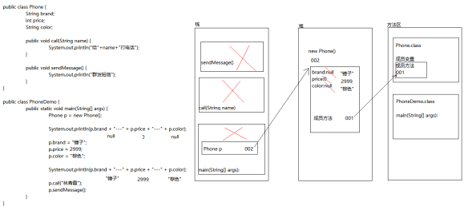
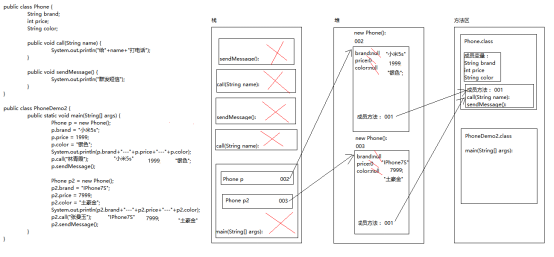
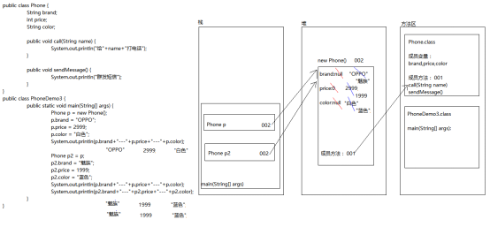

# Java面向对象 第1章 - 类、对象、构造方法及封装

【学习目标】理解、了解、应用、记忆


**1.【理解】面向过程和面向对象的思想**

a. 【理解】过程的概念

b. 【理解】面向过程解决问题的步骤

c. 【理解】对象的概念

d. 【理解】面向对象解决问题的步骤

e. 【理解】举例解释面向对象的思想

f. 【理解】面向过程和面向对象的联系和区别


**2.【理解】能够理解类和对象的区别**

a. 【理解】java中类的作用

b. 【应用】java中对象的作用

c. 【理解】java中类和对象的关系


**3.【应用】能够独立使用成员变量和局部变量**

a. 【理解】成员变量和局部变量的概念

b. 【应用】成员变量和局部变量的用法

c. 【理解】成员变量和局部变量的区别


**4. 【应用】能够独立使用封装**

a. 【理解】封装的概念

b. 【理解】java中封装的体现

c. 【理解】使用封装的好处

d. 【理解】private关键字的作用

e. 【应用】封装的代码实例


**5. 【应用】能够独立使用构造函数**

a. 【理解】构造函数的作用

b. 【应用】构造函数的写法

c. 【应用】构造函数的调用方式


**6. 【应用】能够独立使用this关键字**

a. 【理解】this关键字的作用

b. 【应用】this关键字的用法

 

# 第1章 面向对象基础

## 1.1 编程思想概述

### 1.1.1 面向过程思想概述

我们回想一下，这几天我们完成一个需求的步骤：首先是搞清楚我们要做什么，然后在分析怎么做，最后我们再代码体现。一步一步去实现，而具体的每一步都需要我们去实现和操作。这些步骤相互调用和协作，完成我们的需求。

在上面的每一个具体步骤中我们都是参与者，并且需要面对具体的每一个步骤和过程，这就是面向过程最直接的体现。

那么什么是面向过程开发呢? 面向过程开发，其实就是面向着具体的每一个步骤和过程，把每一个步骤和过程完成，然后由这些功能方法相互调用，完成需求。

面向过程的代表语言：C语言


### 1.1.2 面向对象思想概述

当需求单一，或者简单时，我们一步一步去操作没问题，并且效率也挺高。可随着需求的更改，功能的增多，发现需要面对每一个步骤很麻烦了，这时就开始思索，能不能把这些步骤和功能在进行封装，封装时根据不同的功能，进行不同的封装，功能类似的封装在一起。这样结构就清晰了很多。用的时候，找到对应的类就可以了。这就是面向对象的思想。


## 1.2 面向对象思想特点及举例

### 1.2.1 面向对象思想特点

​	面向对象是基于面向过程的编程思想；

​	面向过程：强调的是每一个功能的步骤；

​	面向对象：强调的是对象，然后由对象去调用功能；

A：是一种更符合我们思考习惯的思想

B：可以将复杂的事情简单化

C：将我们从执行者变成了指挥者

角色发生了转换


### 1.2.2 面向对象思想举例

买电脑：

​	面向过程：我要买电脑--我要明确买电脑的意义--上网查对应的参数信息--去电脑城买电脑--讨价还价--买回电脑

​	面向对象：我要买电脑--让采购去给我买电脑--买回电脑

洗衣服：

​	面向过程：把衣服脱下来--找一个盆--放点洗衣粉--加点水--浸泡10分钟--揉一揉--清洗衣服--拧干--晾起来

​	面向对象：把衣服脱下来--扔给全自动洗衣机--晾起来


## 1.3 类与对象的关系

我们学习编程语言，就是为了模拟现实世界的事物，实现信息化。比如：去超市买东西的计费系统，去银行办业务的系统。 

**我们如何表示一个现实世界事物呢？**

**A：属性	就是该事物的描述信息** 

**B：行为	就是该事物能够做什么** 


我们学习的Java语言最基本单位是类，所以，我们就应该把事物用一个类来体现。 

类：是一组相关的属性和行为的集合 

对象：是该类事物的具体体现 


举例： 

类	学生 

对象	班长就是一个对象 


# 第2章 类和对象

## 2.1 类的定义

### 2.1.1 现实世界的事物 

类是用来描述现实世界的事物的。

事物：

属性	事物的描述信息 

行为	事物能做什么 


### 2.1.2 Java中用class描述事物也是如此 

成员变量	就是事物的属性 

成员方法	就是事物的行为 


### 2.1.3 定义类其实就是定义类的成员(成员变量和成员方法) 

1:成员变量	和以前定义变量是一样的。

只不过位置发生了改变：**在类中，方法外。**

初始化值：不需要给初始化值。


2:成员方法	和以前定义方法是一样的。

只不过把static去掉，后续再详细讲解static的作用。


## 2.2 类与对象的案例

### 2.2.1 学生类

#### 2.2.1.1 如何定义 

按照事物到类的过程一步步分析 


#### 2.2.1.2 案例

```java
/* 
 * 学生类：
 *    成员变量：姓名，年龄
 *    成员方法：学习，吃饭
 */
public class Student {
	//成员变量
	
	/**  
	* @Fields name : 姓名
	*/  
	String name;
	
	/**  
	* @Fields age : 年龄
	*/  
	int age;
	
	//成员方法
	/**  
	* @Title: study  
	* @Description: 学习的方法      
	*/
	public void study(){
		System.out.println("好好学习，天天向上！");
	}
	
	/**  
	* @Title: eat  
	* @Description: 吃饭的方法      
	*/
	public void eat(){
		System.out.println("学习饿了，要吃饭。");
	}
}
```


#### 2.2.1.3 如何使用 

使用一个类，其实就是使用该类的成员。(成员变量和成员方法)

而我们要想使用一个类的成员，就必须首先拥有该类的对象。

1.我们该如何拥有一个类的对象呢？

​	创建对象就可以了。

2.我们如何创建对象呢？

​	创建对象的格式：  **类名 对象名 = new 构造方法();**

3.对象如何访问成员呢？

​	**成员变量：对象名.成员变量** 

​	**成员方法：对象名.成员方法()** 


#### 2.2.1.4 案例

```java
public class StudentDemo {
	public static void main(String[] args) {
		//格式：类名  对象名=new 类名();
		Student s=new Student();
		System.out.println("s:"+s);//s:com.igeek_02.Student@feb48
		
		//直接输出成员变量值
		System.out.println("姓名："+s.name);//null
		System.out.println("年龄："+s.age);//0
		System.out.println("---------------");
		
		//给成员变量赋值
        s.name="吴京";
		s.age=35;
		
		//再次输出成员变量的值
		System.out.println("姓名："+s.name);//吴京
		System.out.println("年龄："+s.age);//35
		System.out.println("---------------");
		
		//调用成员方法
		s.study();
		s.eat();
	}
}
```


### 2.2.2 手机类练习 

#### 2.2.2.1 案例

```java
/**  
* @ClassName: Phone  
* @Description: 手机类 
* Company www.igeekhome.com
*    
*    手机类：
*    	成员变量：品牌、价格、颜色...
*    	成员方法：打电话、发短信...
*/
public class Phone {
	/**  
	* @Fields brand : 品牌  
	*/  
	String brand;
	/**  
	* @Fields price : 价格  
	*/  
	int price;
	/**  
	* @Fields color : 颜色  
	*/  
	String color;
	
	/**  
	* @Title: call  
	* @Description: 打电话  
	* @param name    
	*/
	public void call(String name){
		System.out.println("给"+name+"打电话");
	}
	
	/**  
	* @Title: sendMessage  
	* @Description: 发短信      
	*/
	public void sendMessage(){
		System.out.println("群发短信");
	}
}
```


#### 2.2.2.2 案例

手机类的使用

```java
/**  
* @ClassName: PhoneDemo  
* @Description: 手机类的测试类
* @date 2017年11月10日 下午4:19:28    
* Company www.igeekhome.com
*    
*/
public class PhoneDemo {
	public static void main(String[] args) {
		//创建对象
		Phone p=new Phone();
		
		//输出成员变量
		System.out.println("品牌："+p.brand);//null
		System.out.println("价格："+p.price);//0
		System.out.println("颜色："+p.color);//null
		System.out.println("-------------------");
		
		//给成员变量赋值
		p.brand="华为Mate10";
		p.price=3999;
		p.color="黑色";
		
		//再次输出成员变量
		System.out.println("品牌："+p.brand);//华为Mate10
		System.out.println("价格："+p.price);//3999
		System.out.println("颜色："+p.color);//黑色
		System.out.println("-------------------");
		
		//调用成员方法
		p.call("吴京");
		p.sendMessage();
	}
}
```


## 2.3 对象内存图

### 2.3.1 一个对象的情况

#### 2.3.1.1 案例

```java
/**  
* @ClassName: Phone  
* @Description: 手机类  
* Company www.igeekhome.com
*    
*    手机类：
*    	成员变量：品牌、价格、颜色...
*    	成员方法：打电话、发短信...
*/
public class Phone {
	/**  
	* @Fields brand : 品牌  
	*/  
    String brand;
	/**  
	* @Fields price : 价格  
	*/  
	int price;
	/**  
	* @Fields color : 颜色  
	*/  
	String color;
	
	/**  
	* @Title: call  
	* @Description: 打电话  
	* @param name    
	*/
	public void call(String name){
		System.out.println("给"+name+"打电话");
	}
	
	/**  
	* @Title: sendMessage  
	* @Description: 发短信      
	*/
	public void sendMessage(){
		System.out.println("群发短信");
	}
}
```


```java
/**  
* @ClassName: PhoneDemo  
* @Description: 手机类的测试类 
* Company www.igeekhome.com
*    
*/
public class PhoneDemo {
	public static void main(String[] args) {
		//创建对象
		Phone p=new Phone();
		
		//输出成员变量
		System.out.println(p.brand+"---"+p.price+"---"+p.color);
        //给成员变量赋值
		p.brand="锤子";
		p.price=2999;
		p.color="棕色";
		
		//再次输出成员变量
		System.out.println(p.brand+"---"+p.price+"---"+p.color);
		
		//调用成员方法
		p.call("林青霞");
		p.sendMessage();
	}
}
```


#### 2.3.1.2 1个对象的内存图 - 一个对象的基本初始化过程 




### 2.3.2 两个对象的情况一

#### 2.3.2.1 案例

```java
public class PhoneDemo2 {
	public static void main(String[] args) {
		// 创建对象
		Phone p = new Phone();

		// 给成员变量赋值
		p.brand = "小米5s";
		p.price = 1999;
		p.color = "银色";

		// 输出成员变量
		System.out.println(p.brand + "---" + p.price + "---" + p.color);

		// 调用成员方法
		p.call("林青霞");
		p.sendMessage();

		// 创建对象
		Phone p2 = new Phone();

		// 给成员变量赋值
		p2.brand = "IPhone7S";
		p2.price = 7999;
		p2.color = "土豪金";

		// 输出成员变量
		System.out.println(p2.brand + "---" + p2.price + "---" + p2.color);

		// 调用成员方法
		p2.call("张曼玉");
		p2.sendMessage();
	}
}
```


#### 2.3.2.2 2个对象的内存图 - 方法的共用 




### 2.3.3 两个对象的情况二

#### 2.3.3.1 案例

```java
public class PhoneDemo3 {
	public static void main(String[] args) {
		// 创建对象
		Phone p = new Phone();

		// 给成员变量赋值
		p.brand = "OPPO";
		p.price = 2999;
		p.color = "白色";

		// 输出成员变量
		System.out.println(p.brand + "---" + p.price + "---" + p.color);
        // 把p对象赋值给p2
		Phone p2 = p;

		// 给成员变量赋值
		p2.brand = "魅族";
		p2.price = 1999;
		p2.color = "蓝色";

		// 再次输出成员变量
		System.out.println(p.brand + "---" + p.price + "---" + p.color);
		System.out.println(p2.brand + "---" + p2.price + "---" + p2.color);

	}
}
```


#### 2.3.3.2 2个对象的内存图 - 两个引用指向同一个对象 




## 2.4 成员变量和局部变量的区别

### 2.4.1 在类中的位置不同 

成员变量： 类中方法外 

局部变量： 方法内或者方法声明上(形式参数) 


### 2.4.2 在内存中的位置不同 

成员变量： 堆内存 

局部变量： 栈内存 


### 2.4.3 生命周期不同 

成员变量： 随着对象的存在而存在，随着对象的消失而消失 

局部变量： 随着方法的调用而存在，随着方法的调用完毕而消失 


### 2.4.4 初始化值不同 

成员变量： 有默认的初始化值 

局部变量： 没有默认的初始化值，必须先定义，赋值，才能使用。 


### 2.4.5 案例

```java
public class Variable {
	/**  
	* @Fields x : 成员变量x  
	*/  
	int x;
	
	/**  
	* @Title: show  
	* @Description: 显示变量      
	*/
	public void show(){
		//局部变量
		int y=0;
		
		System.out.println(x);
		System.out.println(y);
	}
}
```


## 2.5 类名作为形式参数和返回值

### 2.5.1 类名作为形式参数案例 

要的其实是该类的对象 


#### 2.5.1.1 案例

```java
public class Student {
	/**  
	* @Title: study  
	* @Description: 学习方法      
	*/
	public void study(){
		System.out.println("好好学习，天天向上");
	}
}
```

 

```java
public class Teacher {
	/**  
	* @Title: test  
	* @Description: 测试学生学习的方法  
	* @param s    
	*/
	public void test(Student s){
		s.study();
	}
}
```


```java
//测试类
public class Test {
	public static void main(String[] args) {
		Teacher t=new Teacher();
		Student s=new Student();
		t.test(s);
	}
}
```


### 2.5.2 类名作为返回值案例 

返回的其实是该类的对象 


#### 2.5.2.1 案例

```java
public class Student {
	/**  
	* @Title: study  
	* @Description: 学习方法      
	*/
	public void study(){
		System.out.println("好好学习，天天向上");
	}
}
```

 

```java
public class Teacher {
	/**  
	* @Title: getStudent  
	* @Description: 获取学生对象  
	* @return    
	*/
	public Student getStudent(){
		Student s=new Student();
		return s;
	}
}
```


```java
//通过Teacher对象得到Student对象，然后调用Student对象的方法
//如果方法的返回值是类名：其实返回的是该类的对象
public class Test {
	public static void main(String[] args) {
		Teacher t=new Teacher();
		Student s=t.getStudent();
		s.study();
	}
}
```


# 第3章 包及访问权限

## 3.1 包的概述及定义格式

### 3.1.1 包的概念

分包管理是组织软件项目结构的基本方式。我们将同类功能放到一个包中，方便管理。并且日常项目的分工也是以包作为边界。

包在文件系统中是以**文件夹**的形式存在的。类中定义的包必须与实际class文件所在的文件夹情况相统一，即定义包后，如果类在a包下，则生成的.class文件必须在a文件夹下，否则找不到类。


### 3.1.2 包的定义格式

使用公司域名反写，多级包**全部小写，用”.”连接**

​	如：极客营网址为igeekhome.com那么域名反写就为com.igeekhome

甲骨文公司oracle.com 那么域名反写就为 com.oracle

​	**类中的定义格式： package 包名;**

```java
一般建议四级目录结构：
    - com org gov 根据当前项目的性质
    - igeek 开发商名字，或者甲方的名字
    - javase bank 项目名称
    - entity dao service controller 层名称
```


编译时：直接编译java文件即可

运行时：由于类的全名是包含包名的，所以必须运行加入了包名的全类名

```java
全类名 = 包名 + 类名  类似于：com.igeek.javase.day01.Student
```


总结：

1.是java程序管理资源的方式

2.为了避免类重名


### 3.1.3 案例

```java
package com.igeek_01;

/**  
* @ClassName: PackageDemo  
* @Description: 包的作用
* Company www.igeekhome.com
*    
*    包：是java程序管理资源的方式
*    
*    类中声明的包，必须与真正该.class文件所在的文件夹一致
*    
*    声明的格式:
*    	package 包(文件夹).包(文件夹).包(文件夹)...
*    
*/
public class PackageDemo {

}
```

 

## 3.2 类的全名访问

在访问类时，为了能够找到该类，使用类时，应该使用包含包名的类全名。 

如：字符串String在使用时，可以按照如下方式访问：

​	**java.lang.String** s = “一个字符串”;  

等价于 String s = “一个字符串”;


### 3.2.1 案例

Person类：

```java
package com.igeek_02;

/**  
* @ClassName: Person  
* @Description: Person类  
* Company www.igeekhome.com
*    
*/
public class Person {
	/**  
	* @Fields name : 姓名  
	*/  
	private String name;
	
	/**  
	* @Title: Person  
	* @param name    
	*/
	public Person(String name) {
		this.name=name;
	}

	/**
	 * @return the name
	 */
	public String getName() {
		return name;
	}

	/**
	 * @param name the name to set
	 */
	public void setName(String name) {
		this.name = name;
	}
}
```


其他包中的Person类：

```java
package com.igeek_02.other;

/**  
* @ClassName: Person  
* @Description: Person类	
* Company www.igeekhome.com
*    
*/
public class Person {
	/**  
	* @Fields name : 姓名  
	*/  
	private String name;
	
	/**  
	* @Title: Person  
	* @param name    
	*/
	public Person(String name) {
		this.name=name;
	}

	/**
	 * @return the name
	 */
	public String getName() {
		return name;
	}

	/**
	 * @param name the name to set
	 */
	public void setName(String name) {
		this.name = name;
	}
}
```


类全名创建对象测试类：


```java 
package com.igeek_02;

/**  
* @ClassName: PackageDemo  
* @Description: package包的作用
* Company www.igeekhome.com
*    
*  包:是java程序管理资源的方式
*  
*  类中声明的包,必须与真正该.class文件所在的文件夹一致
*  
*  声明格式:
*  		package 文件夹(包).文件夹(包).文件夹(包)...
*  
*  如何带包使用其他的类:应该加入全名,即包名+类名
*/

public class PackageDemo {
	public static void main(String[] args) {
		//使用类全名访问JRE提供好的类
		java.lang.String s = "abc";
		System.out.println(s);
		
		//使用类全名访问同包下的其他类
		com.igeek_02.Person person=new com.igeek_02.Person("Jack");
		person.setName("Rose");
		System.out.println(person.getName());
		
		//使用类全名访问不同包(跨包)下的其他类
		com.igeek_02.other.Person person2=new com.igeek_02.other.Person("Rose");
		System.out.println(person2.getName());
	}
}
```


## 3.3 带包的类访问

### 3.3.1 同包下省略包名

当被使用的类与使用的类在同一个文件夹下，或者被使用的类是java.lang包下时，我们通常可以省略掉类的包，直接使用类型，避免使用类全名。


### 3.3.2 跨包时导包访问

当被使用的类与使用的类不在同一个文件夹下时，我们可以通过导包的方式使用该类，避免使用类全名。

导包格式：

​	package后，class前

​    使用**import 包名.包名.类名;**

当多个文件夹下有相同的类名时，只能有一个导包使用，其他必须仍然书写全名。

​	当想一下导入包中多个类时，可以使用代表该包下的所有类。


### 3.3.3 案例

同包下的Person类：

```java
package com.igeek_03;

/**  
* @ClassName: Person  
* @Description: Person类
* Company www.igeekhome.com
*    
*/
public class Person {
	/**  
	* @Fields name : 姓名  
	*/  
	private String name;
	
	/**  
	* @Title: Person  
	* @param name    
	*/
	public Person(String name) {
		this.name=name;
	}

	/**
	 * @return the name
	 */
	public String getName() {
		return name;
	}

	/**
	 * @param name the name to set
	 */
	public void setName(String name) {
		this.name = name;
	}
}
```


com.igeek_03.other1包下的PersonOther类：

```java
package com.igeek_03.other1;

/**  
* @ClassName: PersonOther  
* @Description: PersonOther类  
* Company www.igeekhome.com
*    
*/
public class PersonOther {
	/**  
	* @Fields name : 姓名  
	*/  
	private String name;
	
	/**  
	* @Title: Person  
	* @param name    
	*/
	public PersonOther(String name) {
		this.name=name;
	}

	/**
	 * @return the name
	 */
	public String getName() {
		return name;
	}

	/**
	 * @param name the name to set
	 */
	public void setName(String name) {
		this.name = name;
    }
}
```


com.igeek_03.other2包下的PersonOther类：

```java
package com.igeek_03.other2;

/**  
* @ClassName: PersonOther  
* @Description: PersonOther类
* Company www.igeekhome.com
*    
*/
public class PersonOther {
	/**  
	* @Fields name : 姓名  
	*/  
	private String name;
	
	/**  
	* @Title: Person  
	* @param name    
	*/
	public PersonOther(String name) {
		this.name=name;
	}

	/**
	 * @return the name
	 */
	public String getName() {
		return name;
	}

	/**
	 * @param name the name to set
	 */
	public void setName(String name) {
		this.name = name;
	}
}
```


不同包中各个类的导入测试类：

```java
package com.igeek_03;

//导包声明
import com.igeek_03.other1.PersonOther;

//不能导入相同名称的类,所以,当多个文件夹下有相同的类名时，只能有一个导包使用，其他必须仍然书写全名
//import com.igeek_03.other2.PersonOther;

/**  
* @ClassName: PackageAccessDemo  
* @Description: 不同包下面各个类的访问方式
* Company www.igeekhome.com
*    
*  JRE提供的java.lang包下的类,是可以直接使用类名,无需加包名的,比如String
*  
*  同包访问时,可以省略全名,使用类名
*  
*  跨包访问:
*  		可以不使用全名,使用导包的方式声明出要使用的类时哪个
*  
*  导包格式：
*  	package后，class前
*  	使用import 包名.包名.类名;
*/

public class PackageAccessDemo {
	public static void main(String[] args) {
		
		//JRE提供的lang包下的类,是可以直接使用类名,无需加包名的,比如String
		String s = "hit the road";
		
		//同包访问时,可以省略全名,使用类名
		Person person = new Person("Jack");
		System.out.println(person.getName());
		
		//跨包访问,需要先导包,再使用
		PersonOther Person2 = new PersonOther("Rose");
		System.out.println(Person2.getName());
		
		//不能导入相同名称的类,所以,当多个文件夹下有相同的类名时，只能有一个导包使用，其他必须仍然书写全名
		com.igeek_03.other2.PersonOther Person3 = new 
            com.igeek_03.other2.PersonOther("Rose");
		System.out.println(Person3.getName());
		
	}

}
```


## 3.4 访问权限

### 3.4.1 四种权限访问修饰符

在Java中提供了四种访问权限，使用不同的访问权限时，被修饰的内容会有不同的访问权限，以下表来说明不同权限的访问能力：

|                        | public | protected | 空的(default) | private |
| ---------------------- | ------ | --------- | ------------- | ------- |
| 同一类中               | √      | √         | √             | √       |
| 同一包中(子类与无关类) | √      | √         | √             |         |
| 不同包的子类           | √      | √         |               |         |
| 不同包中的无关类       | √      |           |               |         |

​	归纳一下：在日常开发过程中，编写的类、方法、成员变量的访问

l 要想仅能在本类中访问使用private修饰；

l 要想本包中的类都可以访问不加修饰符即可；

l 要想本类的子类可以访问使用protected修饰

l 要想任意包中的任意类都可以访问使用public修饰。

l 注意：如果类用public修饰，则类名必须与文件名相同。一个文件中只能有一个public修饰的类。


### 3.4.2 同包中权限访问测试

#### 3.4.2.1 案例

AccessClass类

```java
package com.igeek_04_02;

/**  
* @ClassName: AccessClass  
* @Description: 测试访问权限的类  
* Company www.igeekhome.com
*    
*/
public class AccessClass {
	
	/**  
	* @Title: method  
	* @Description: 私有化的方法      
	*/
	private void method() {
		System.out.println("私有化的方法");
	}
	
	/**  
	* @Title: method2  
	* @Description: 默认权限的方法      
	*/
	void method2() {
		System.out.println("默认权限的方法");
	}
	
	/**  
	* @Title: method3  
	* @Description: 受保护的方法      
	*/
	protected void method3() {
		System.out.println("受保护的方法");
	}
	
	/**  
	* @Title: method4  
	* @Description: 公共的方法      
	*/
	public void method4() {
		System.out.println("公共的方法");
	}
	
	/**  
	* @Title: testAccess  
	* @Description: 本类当中的权限测试方法     
	*/
	public void testAccess() {
		method();
		method2();
		method3();
		method4();
	}

	public static void main(String[] args) {
		
		AccessClass ac = new AccessClass();
		
		//本类当中,可以访问所有的方法
		ac.method();
		ac.method2();
		ac.method3();
		ac.method4();
	}

}
```


 

AccessDemo类

```java
package com.igeek_04_02;

/**  
* @ClassName: AccessDemo  
* @Description: 访问权限的测试类 
* Company www.igeekhome.com
*    
*/
public class AccessDemo {
	public static void main(String[] args) {
		
		AccessClass ac = new AccessClass();
        //同包下,可以访问其他类的非私有方法
		//ac.method();
		ac.method2();
		ac.method3();
		ac.method4();
	}
}
```


### 3.4.3 跨包访问

#### 3.4.3.1 案例

AccessDemo类

```java
package com.igeek_04_03;

import com.igeek_04_02.AccessClass;

/**  
* @ClassName: AccessDemo  
* @Description: 访问权限的测试类
* Company www.igeekhome.com
*    
*/
public class AccessDemo {
	public static void main(String[] args) {
		
		AccessClass ac = new AccessClass();
		
		//测试跨包访问,只能访问公共方法
		//ac.method();
		//ac.method2();
		//ac.method3();
		ac.method4();
	}

}
```


### 3.4.4 不同包下子父类之间访问

#### 3.4.4.1 案例

```java
package com.igeek_04_04;

import com.igeek_04_02.AccessClass;

/**  
* @ClassName: AccessDemo  
* @Description: 访问权限的测试类
* @date 2017年11月15日 下午2:26:38    
* Company www.igeekhome.com
*    
*    AccessDemo类继承父类AccessClass
*/
public class AccessDemo extends AccessClass{
	
	public static void main(String[] args) {
		
		AccessClass ac = new AccessClass();
		
		//测试跨包访问,只能访问公共方法
		//ac.method();
		//ac.method2();
		//ac.method3();
		ac.method4();
		
		AccessDemo ad=new AccessDemo();
		ad.method0();
	}
	
	/**  
	* @Title: method0  
	* @Description: 子类可以访问父类的公共与受保护方法,无论是否同包      
	*/
	public void method0() {
		//super.method();
		//super.method2();
		super.method3();
		super.method4();
    }

}
```


# 第4章 封装

## 4.1 什么是封装

### 4.1.1 封装概述 

是面向对象三大特征之一 

是面向对象编程语言对客观世界的模拟，客观世界里成员变量都是隐藏在对象内部的，外界无法直接操作和修改。就像上章说的年龄。 


### 4.1.2 封装原则

将不需要对外提供的内容都隐藏起来。

把属性隐藏，提供公共方法对其访问。 

成员变量private，提供对应的getXxx()/setXxx()方法 


### 4.1.3 好处

通过方法来控制成员变量的操作，提高了代码的安全性 

把代码用方法进行封装，提高了代码的复用性，实现代码的组件化设计。


## 4.2 private关键字

### 4.2.1 private关键字

是一个权限修饰符。

可以修饰成员(成员变量和成员方法)

被private修饰的成员只在本类中才能访问。 


### 4.2.2 案例

```java
/**    
 *    通过对象直接访问成员变量，会存在数据安全问题
 *    这个时候，我们就想能不能不让外界的对象直接访问成员变量呢？
 *    能！
 *    如何实现呢？
 *    	private关键字
 *    
 *    private：
 *    	是一个权限修饰符。
 *    	可以修饰成员(成员变量和成员方法)
 *    	被private修饰的成员只能在本类中才能访问。
 *    
 *    针对private修饰的成员变量，我们会相应的提供getXxx()和setXxx()用于获取和设置成员变量的值，方法用     public修饰
 */
public class Student {
	/**  
	* @Fields name : 姓名  
	*/  
	String name;
	/**  
	* @Fields age : 年龄 
	*/  
	//int age;
	private int age;	

	/**  
	* @Title: setAge  
	* @Description: 设置年龄  
	* @param a    
	*/
	public void setAge(int a){
		if(a<0||a>200){
			System.out.println("你给的年龄有误");
		}else{
			age=a;
		}
	}
	
	/**  
	* @Title: getAge  
	* @Description: 获取年龄  
	* @return    
	*/
    public int getAge(){
		return age;
	}
	
	/**  
	* @Title: show  
	* @Description: 显示学生信息      
	*/
	public void show(){
		System.out.println("姓名是："+name+"，年龄是："+age);
	}
}
```


```java
//测试类
public class StudentDemo {
	public static void main(String[] args) {
		//创建学生对象
		Student s=new Student();
		s.show();
		
		s.name="林青霞";
		//s.age=28;
		//s.age=-28;
		//s.setAge(-28);
		s.setAge(28);
		s.show();
	}
}
```


 

### 4.2.3 private最常见的应用

把成员变量用private修饰 

提供对应的getXxx()/setXxx()方法 

一个标准的案例的使用

 

### 4.2.4 案例

```java
public class Student {
	/**  
	* @Fields name : 姓名  
	*/  
	private String name;
	/**  
	* @Fields age : 年龄  
	*/  
	private int age;
	
	/**  
	* @Title: setName  
	* @Description: 设置姓名  
	* @param n    
	*/
	public void setName(String n){
		name=n;
	}
	
	/**  
	* @Title: getName  
	* @Description: 获取姓名  
	* @return    
	*/
	public String getName(){
		return name;
	}
	
	/**  
	* @Title: setAge  
	* @Description: 设置年龄  
	* @param a    
	*/
	public void setAge(int a){
		age=a;
	}
	
	/**  
	* @Title: getAge  
	* @Description: 获取年龄  
	* @return    
	*/
	public int getAge(){
		return age;
	}
	
}
```


```java
//测试类
public class StudentDemo {
	public static void main(String[] args) {
		//创建学生对象
		Student s=new Student();
		System.out.println(s.getName()+"---"+s.getAge());
		
		s.setName("吴京");
		s.setAge(35);
		System.out.println(s.getName()+"---"+s.getAge());
	}
}
```


## 4.3 this关键字

this:		代表所在类的对象引用 

记住：	方法被哪个对象调用，this就代表那个对象 

什么时候使用this呢?		局部变量隐藏成员变量


```java
package com.igeek_02;

/**  
* @ClassName: Student  
* @Description: 学生类
* Company www.igeekhome.com
*    
*    起名字我们要求做到见名知意。
*    而我们现在的代码中的n和a就没有做到见名知意，所以我们要改进。
*    
*    如果有局部变量名和成员变量名相同，在局部使用的时候，采用的是就近原则。
*    
*    我们有没有办法把局部变量的name赋值给成员变量的name呢？有
*    
*    什么办法呢？
*    	用this关键字就可以解决这个问题。
*    
*    this:	代表所在类的对象引用
*    		方法被哪个对象调用，this就代表那个对象
*    
*    使用场景：局部变量隐藏成员变量
*/
public class Student {
	/**  
	* @Fields name : 姓名  
	*/  
	private String name;
	/**  
	* @Fields age : 年龄  
	*/  
	private int age;
	
	/**  
	* @Title: setName  
	* @Description: 设置姓名  
	* @param n    
	*/
	public void setName(String name){//吴京
		//name=name;
		this.name=name;
	}
	
	/**  
	* @Title: getName  
	* @Description: 获取姓名  
	* @return    
	*/
	public String getName(){
		return name;
	}
	
	/**  
	* @Title: setAge  
	* @Description: 设置年龄  
	* @param a    
	*/
	public void setAge(int age){
		//age=age;
		this.age=age;
	}
	
	/**  
	* @Title: getAge  
	* @Description: 获取年龄  
	* @return    
	*/
	public int getAge(){
		return age;
	}
	
}
```


```java
public class StudentDemo {
	public static void main(String[] args) {
		//创建学生对象
		Student s=new Student();
		System.out.println(s.getName()+"---"+s.getAge());
        s.setName("吴京");
		s.setAge(35);
		System.out.println(s.getName()+"---"+s.getAge());
	}
}
```


## 4.4 构造方法

### 4.4.1 构造方法作用概述 

给对象的数据进行初始化 


### 4.4.2 构造方法格式 

方法名与类名相同 

没有返回值类型，连void都没有 

没有具体的返回值 


#### 4.4.2.1 案例

```java
/**  
* @ClassName: Student  
* @Description: 学生类   
* Company www.igeekhome.com
*    
*    构造方法：
*    		给对象的数据进行初始化
*    
*    格式：
*    		方法名与类名相同 
*    		没有返回值类型，连void都没有 
*    		没有具体的返回值 
*    
*/
public class Student {
	/**  
	* @Title: Student类的无参构造方法      
	*/
	public Student(){
		System.out.println("这是构造方法");
	}
}
```


```java
//测试类
public class StudentDemo {
	public static void main(String[] args) {
		//如何调用构造方法呢？
		//通过new关键字调用
		//格式：类名  对象名 = new 构造方法(...);
		//也就是创建对象的格式
		Student s=new Student();
	}
}
```


### 4.4.3 构造方法注意事项 

如果你不提供构造方法，系统会给出默认构造方法 

如果你提供了构造方法，系统将不再提供 

构造方法也是可以重载的 


#### 4.4.3.1 案例

```java
/**  
* @ClassName: Student  
* @Description: 学生类   
* Company www.igeekhome.com
*    
*    构造方法：
*    		给对象的数据进行初始化
*    
*    格式：
*    		方法名与类名相同 
*    		没有返回值类型，连void都没有 
*    		没有具体的返回值 
*    
*    构造方法注意事项:
*    		A:如果你不提供构造方法，系统会给出一个默认无参构造方法
*    		B:如果你提供了构造方法，系统将不再提供默认无参构造方法
*    			这个时候，如果想使用无参构造方法，就必须自己提供
*    			推荐：自己给出无参构造方法
*    		C:构造方法也是可以重载的
*    
*    成员变量赋值：
*    		A：setXxx()方法
*    		B：带参数构造方法
*/
public class Student {
	/**  
	* @Fields name : 姓名  
	*/  
	private String name;
	/**  
	* @Fields age : 年龄  
	*/  
	private int age;
	
	/**  
	* @Title: Student类的无参构造方法      
	*/
	/*
	public Student(){
		System.out.println("这是构造方法");
	}*/
	
	public Student(){}
	
	/**  
	* @Title: Student  
	* @param name    
	*/
	public Student(String name){
		this.name=name;
	}

	/**  
	* @Title: Student  
	* @param age    
	*/
	public Student(int age){
		this.age=age;
	}
	
	/**  
	* @Title: Student  
	* @param name
	* @param age    
	*/
	public Student(String name,int age){
		this.name=name;
		this.age=age;
	}
	
	/**  
	* @Title: show  
	* @Description: 显示学生信息方法      
	*/
	public void show(){
		System.out.println(name+"---"+age);
	}
}
```


```java
//测试类
public class StudentDemo {
	public static void main(String[] args) {
		//如何调用构造方法呢？
		//通过new关键字调用
		//格式：类名  对象名 = new 构造方法(...);
		//也就是创建对象的格式
		//public Student()
		Student s=new Student();
		s.show();
		
		//public Student(String name)
		Student s2=new Student("吴京");
		s2.show();
		
		//public Student(int age)
		Student s3=new Student(35);
		s3.show();
		
		//public Student(String name,int age)
		Student s4=new Student("吴京", 35);
		s4.show();
	}
}
```


## 4.5 标准类的代码写法和测试

### 4.5.1 类 

- 成员变量 

- 构造方法 

  ​	无参构造方法 

  ​	带参构造方法 

- 成员方法 

  ​	getXxx()

  ​	setXxx()


### 4.5.2 给成员变量赋值的方式 

无参构造方法+setXxx()

带参构造方法 


### 4.5.3 面向对象标准案例

#### 4.5.3.1 学生类

#### 4.5.3.2 案例

```java
public class Student {
	//成员变量
	/**  
	* @Fields name : 姓名  
	*/  
	private String name;
	
    /**  
	* @Fields age : 年龄  
	*/  
	private int age;
   
    //构造方法
	/**  
	* @Title: Student      
	*/	
	public Student(){}
	
	/**  
	* @Title: Student  
	* @param name
	* @param age    
	*/
	public Student(String name,int age){
		this.name=name;
		this.age=age;
	}
	
	//成员方法
	/**  
	* @Title: setName  
	* @Description: 设置姓名  
	* @param name    
	*/
	public void setName(String name){
		this.name=name;
	}
	
	/**  
	* @Title: getName  
	* @Description: 获取姓名  
	* @return    
	*/
	public String getName(){
		return name;
	}
	
	/**  
	* @Title: setAge  
	* @Description: 设置年龄  
	* @param age    
	*/
	public void setAge(int age){
		this.age=age;
	}
    /**  
	* @Title: getAge  
	* @Description: 获取年龄  
	* @return    
	*/
	public int getAge(){
		return age;
	}
	
}
```

 

```java
//测试类
public class StudentDemo {
	public static void main(String[] args) {
		//无参构造方法+setXxx()方法
		Student s=new Student();
		s.setName("吴京");
		s.setAge(35);
		System.out.println(s.getName()+"---"+s.getAge());
		
		//带参构造方法
		Student s2=new Student("吴京", 35);
		System.out.println(s2.getName()+"---"+s2.getAge());
	}
}
```


### 4.5.4 面向对象课堂练习

```java
//1、封装一个银行账户类，里面有账户id、户主姓名、户主身份证号、户主电话、户主邮箱5个属性，私有化这些属性并提供对应的get以及set方法，并在测试类中测试。

//2、封装一个账单类，里面有账单编号、账单时间、账单金额、账单的所有者4个属性，私有化这些属性并提供对应的get以及set方法，并在测试类中测试。

//3、封装一个汽车类，里面有汽车品牌，汽车颜色，汽车重量，汽车牌照，是否新款5个属性，提供一个方法用来显示所有属性，私有化这些属性并提供对应的get以及set方法，并在测试类中测试。

//4.封装一个皇帝类，里面有姓名，在位时间，政绩，描述4个属性，提供一个方法用来显示所有属性，私有化这些属性并提供对应的get以及set方法，并在测试类中测试。

//5.封装一个学生类，里面有姓名、年龄、性别3个属性，提供一个方法用来显示所有属性，一个方法用来学习（并显示谁正在学习），私有化这些属性并提供对应的get以及set方法，并在测试类中测试。

/**6.该实例为定义一个成绩计算类。
类中包含的内容有：
  1、三个float类型的成员属性（Java成绩、C#成绩、数据库成绩）；
  2、对三个私有属性的公开的getter/setter方法；
  3、一个无参的构造方法和一个带参数的构造方法；
  4、计算三个科目的平均值的方法；
  5、计算三个科目的总成绩的方法；
  6、程序入口main方法。

在main中分别通过有参和无参的构造方法实例化成绩计算类的对象实体并传入成绩参数。
再通过对象调用计算平均值和总成绩的方法打印输出。
在计算平均值和总成绩的方法中，分别获取到属性的值进行计算。
*/
```
