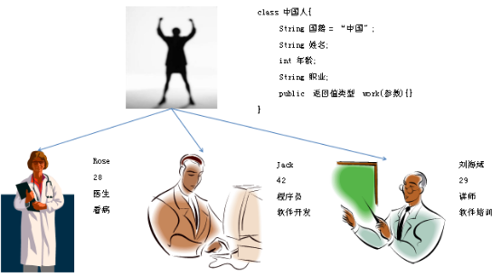
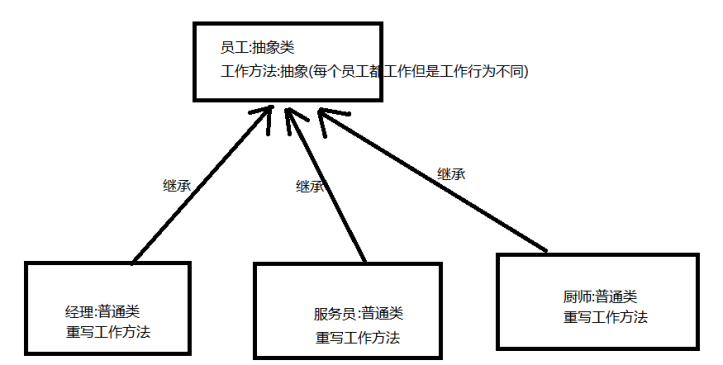

# Java面向对象 第3章 - static、final、抽象、单例模式

## 今日内容

- static关键字
  - 静态。 
  - 修饰方法和变量都是属于类的。没有static修饰的方法和变量是属于每个对象的。
- final关键字
  * final是最终的意思。可以修饰类，变量，和方法。
  * 修饰类：类不能被继承。类绝育了。
  * 修饰方法：方法不能被重写。
  * 修饰变量：变量有且仅能被赋值一次。
- 抽象类
  - 拥有抽象方法的类就是抽象类。
  - 抽象方法：是只有方法签名没有方法体，必须用abstract修饰。
  - 抽象类本身也要用abstract修饰的，作用是让子类继承，子类一定要重写抽象方法。
  - 模板思想，设计模板模式。
- 单例设计模式
  - 设计模式，面试必考，经典模式。

 

## 教学目标

- [ ] 能够掌握static关键字修饰的变量调用方式
  - [ ] 类名.静态变量
  - [ ] 对象.静态变量 （不推荐使用）
  
- [ ] 能够掌握static关键字修饰的方法调用方式
  - [ ] 类名.静态方法
  - [ ] 对象.静态方法（不推荐使用）
  
- [ ] 描述final修饰的类的特点

  - [ ] 类不能被继承

- [ ] 描述final修饰的方法的特点

  - [ ] 方法不能被重写了

- [ ] 描述final修饰的变量的特点

  - [ ] 变量有且仅能被赋值一次
  
- [ ] 能够写出抽象类的格式

  - [ ] **abstract** class Animal{

    }

- [ ] 能够写出抽象方法的格式

  - [ ] **public abstract void run();**

  - [ ] 只有方法签名，没有方法体，必须用abstract修饰。

- [ ] 父类抽象方法的意义

  - [ ] 被子类继承


# 第1章 static修饰符

## 1.1 static简介

### 1.1.1 概述

​	static是静态修饰符，一般修饰成员。被static修饰的成员属于类，不属于单个这个类的某个对象。

​	static修饰的成员被多个对象共享。

​	static修饰的成员属于类，但是会影响每一个对象。

​	被static修饰的成员又叫类成员，不叫对象的成员。

​	如下例中国籍变量，所有中国人国籍均应该为中国，不应各自定义各自的国籍，所以可以将国籍定义为static，属于类，被多个对象共享。




### 1.1.2 案例

Chinese类

```java
/**  
* @ClassName: Chinese  
* @Description: Chinese中国人类
*    
* 中国人类
* 	国籍,姓名,年龄,职业
* 	其中,国籍应该被共享
* 	姓名,年龄,职业各个对象有各个对象的值
* 
*/

public class Chinese {
	//静态成员,被多个对象共享
	/**  
	* @Fields country : 国籍  
	*/  
	public static String country = "中国";
	//普通成员,每个对象的普通成员其内容不同
	/**  
	* @Fields name : 姓名  
	*/  
	private String name;
	/**  
	* @Fields age : 年龄  
	*/  
	private int age;
	/**  
	* @Fields work : 职业  
	*/  
	private String work;

	/**  
	* @Title: Chinese      
	*/
	public Chinese() {
		super();
	}

	/**  
	* @Title: Chinese  
	* @param name
	* @param age
	* @param work    
	*/
	public Chinese(String name, int age, String work) {
		super();
		this.name = name;
		this.age = age;
		this.work = work;
	}

	/**
	 * @return the name
	 */
	public String getName() {
		return name;
	}

	/**
	 * @param name the name to set
	 */
	public void setName(String name) {
		this.name = name;
	}

	/**
	 * @return the age
	 */
	public int getAge() {
		return age;
	}

	/**
	 * @param age the age to set
	 */
	public void setAge(int age) {
		this.age = age;
	}

	/**
	 * @return the work
	 */
	public String getWork() {
		return work;
	}

	/**
	 * @param work the work to set
	 */
	public void setWork(String work) {
		this.work = work;
	}

}
```


StaticDemo类

```java
/**  
* @ClassName: StaticDemo  
* @Description: static,静态特征测试类
*    
*  static是静态修饰符，一般修饰成员。
*  被static修饰的成员属于类，不属于单个这个类的某个对象。
*  
*  static修饰的成员被多个对象共享。
*  static修饰的成员属于类，但是会影响每一个对象。
*  被static修饰的成员又叫类成员，不叫对象的成员。
*  
*  所有中国人国籍均应该为中国，不应各自定义各自的国籍，所以可以将国籍定义为static，属于类，被多个对象共享。
*  国籍,姓名,年龄,职业
*  其中,国籍应该被共享
*  姓名,年龄,职业各个对象有各个对象的值
*  
*  一般static修饰的成员,直接赋值
*  
*  当多个对象共享使用同一个类中静态成员时,只要该值改变,就会影响所有的对象
* 
*/
public class StaticDemo {
	public static void main(String[] args) {
		//创建人类对象,验证静态static修饰的成员被多个对象共享
		Chinese c = new Chinese("王宝强", 34, "演员");
		System.out.println(c.getAge()+"岁的"+c.getName()+"是"+c.country+"人");
		
		Chinese c2 = new Chinese("周星驰", 48, "演员或导演或制片");
		System.out.println(c2.getAge()+"岁的"+c2.getName()+"是"+c2.country+"人");
		
		c.country = "中华人名共和国";
		System.out.println("================================");
		
		System.out.println(c.getAge()+"岁的"+c.getName()+"是"+c.country+"人");
		
		System.out.println(c2.getAge()+"岁的"+c2.getName()+"是"+c2.country+"人");

	}
}
```


## 1.2 静态的使用方式及加载原理

### 1.2.1 概述

被static修饰的成员可以并且建议通过类名直接访问。也可以通过某个对象访到属于类的静态成员，原因即多个对象均属于一个类，共享使用同一个静态成员。

格式：

类名.静态成员变量名

类名.静态成员方法名(参数)

对象名.静态成员变量名   	------不建议，出现警告

对象名.静态成员方法名(参数) 	------不建议，出现警告


### 1.2.2 案例

StaticDemo1.java类

```java
/**  
* @ClassName: StaticDemo  
* @Description: static,静态特征测试类
* @date 2017年11月15日 上午9:22:05    
* Company www.igeekhome.com
*    
* 静态成员直接使用类名访问
* 	类名.静态成员变量名
* 	类名.静态成员方法名(参数)
* 
*/
public class StaticDemo1 {
	public static void main(String[] args) {
		//创建人类对象,验证静态static修饰的成员被多个对象共享
		Chinese c = new Chinese("王宝强", 34, "演员");
		System.out.println(c.getAge()+"岁的"+c.getName()+"是"+Chinese.country+"人");
		
		Chinese c2 = new Chinese("周星驰", 48, "演员或导演或制片");
		System.out.println(c2.getAge()+"岁的"+c2.getName()+"是"+Chinese.country+"人");
		
		Chinese.country = "中华人名共和国";
		System.out.println("================================");
		
		System.out.println(c.getAge()+"岁的"+c.getName()+"是"+Chinese.country+"人");
		
		System.out.println(c2.getAge()+"岁的"+c2.getName()+"是"+Chinese.country+"人");
		
		//类名.方法名()
		Chinese.method();
	}
}
```


StaticDemo2类

```java
/**  
* @ClassName: StaticDemo2  
* @Description: 静态成员的访问
*    
* 静态成员只能直接访问静态成员
* 
* 原因为:静态内容优先于对象存在
*/
public class StaticDemo2 {
	
	public static void main(String[] args) {
		//由于静态内容随类的加载而加载,有类则有该方法
		//但是此时是可以没有对象的
		StaticDemo2.method();
	}

	/**  
	* @Fields name : 姓名的实例成员变量  
	*/  
	private String name;
	
	/**  
	* @Title: normalMethod  
	* @Description: 普通的实例成员方法      
	*/
	public void normalMethod() {
		System.out.println("普通方法");
	}
	
	/**  
	* @Title: method  
	* @Description: 静态成员方法      
	*/
	public static void method() {
		//静态方法不能直接访问非静态成员
		//System.out.println(name);
		//normalMethod();
	}

}
```


## 1.3 静态关键字的课堂练习

```java
/*
1).Employee类有姓名，薪资属性
2).EmployeeUtil 工具类中，有涨工资bonus(Employee e)的方法（要求方法静态）；
若获得到的薪资>10000，则涨薪水20%，否则涨薪10%。
*/
```


# 第2章 final关键字  

## 2.1 概述

​		学习了继承后，我们知道，子类可以在父类的基础上改写父类内容，比如，方法重写。那么我们能不能随意的继承API中提供的类，改写其内容呢？显然这是不合适的。为了避免这种随意改写的情况，Java提供了`final` 关键字，用于修饰**不可改变**内容。

- **final**：  不可改变，最终的含义。可以用于修饰类、方法和变量。

  - 类：被修饰的类，不能被继承。

  - 方法：被修饰的方法，不能被重写。

  - 变量：被修饰的变量，有且仅能被赋值一次。

    ```java
    final int a = 10;  //则a无法被2次赋值
    ```

**注意：**

1.我们通常使用public static final来定义静态常量（如接口中的固定修饰符）	

2.引用类型的变量用final修饰，是指其所引用的对象不能改变，即该变量引用的地址值不能改变。


## 2.2 使用方式

### 2.2.1 修饰类

**final修饰的类，不能被继承。**

格式如下：

```java
final class 类名 {
}
```

代码:

```java
final class Fu {
}
// class Zi extends Fu {} // 报错,不能继承final的类
```

查询API发现像 `public final class String` 、`public final class Math` 、`public final class Scanner` 等，很多我们学习过的类，都是被final修饰的，目的就是供我们使用，而不让我们所以改变其内容。


### 2.2.2 修饰方法

**final修饰的方法，不能被重写。**
格式如下：

```java
修饰符 final 返回值类型 方法名(参数列表){
    //方法体
}
```

代码: 

```java
class Fu2 {
	final public void show1() {
		System.out.println("Fu2 show1");
	}
	public void show2() {
		System.out.println("Fu2 show2");
	}
}

class Zi2 extends Fu2 {
//	@Override
//	public void show1() {
//		System.out.println("Zi2 show1");
//	}
	@Override
	public void show2() {
		System.out.println("Zi2 show2");
	}
}
```


### 2.2.3 修饰变量-局部变量

**局部变量——基本类型**
基本类型的局部变量，被final修饰后，只能赋值一次，不能再更改。代码如下：

```java
public class FinalDemo1 {
    public static void main(String[] args) {
        // 声明变量，使用final修饰
        final int a;
        // 第一次赋值 
        a = 10;
        // 第二次赋值
        a = 20; // 报错,不可重新赋值

        // 声明变量，直接赋值，使用final修饰
        final int b = 10;
        // 第二次赋值
        b = 20; // 报错,不可重新赋值
    }
}
```

思考，如下两种写法，哪种可以通过编译？

写法1：

```java
final int c = 0;
for (int i = 0; i < 10; i++) {
    c = i;
    System.out.println(c);
}
```

写法2：

```java
for (int i = 0; i < 10; i++) {
    final int c = i;
    System.out.println(c);
}
```

根据 `final` 的定义，写法1报错！写法2，为什么通过编译呢？因为每次循环，都是一次新的变量c。这也是大家需要注意的地方。


### 2.2.4 修饰变量-实例成员变量

成员变量涉及到初始化的问题，初始化方式有显示初始化和构造器初始化，只能选择其中一个：

- 显示初始化(在定义成员变量的时候立马赋值)；

```java
public class Student {
    final int num = 10;
}
```

- 构造器初始化(在构造器中赋值一次)。

  
  
  **注意：每个构造器中都要赋值一次！**

```java
public class Student {
    final int num = 10;
    final int num2;

    public Student() {
        this.num2 = 20;
//     this.num2 = 20;
    }
    
     public Student(String name) {
        this.num2 = 20;
//     this.num2 = 20;
    }
}
```

> 被final修饰的常量名称，一般都有书写规范，所有字母都**大写**。


# 第3章 抽象类与抽象方法

## 3.1 抽象类与抽象方法引入

​		抽象类用来描述一种类型应该具备的基本特征与功能，具体如何去完成这些行为由子类通过方法重写来完成，如:犬科均会吼叫，但属于犬科的狼与狗其吼叫内容不同。所以犬科规定了有吼叫功能，但并不明确吼叫的细节。吼叫的细节应该由狼与狗这样的犬科子类重写吼叫的方法具体实现。

​		类似上边犬科中的吼叫功能，并不明确实现细节但又需要声明的方法可以使用抽象方法的方式完成。即抽象方法指只有功能声明，没有功能主体实现的方法。

​		那么犬科就可以定义为抽象类，吼叫方法为抽象方法，没有方法体。


**我们把没有方法体的方法称为抽象方法。Java语法规定，包含抽象方法的类就是抽象类**。

- **抽象方法** ： 没有方法体的方法。
- **抽象类**：包含抽象方法的类。


### 3.1.1 案例需求

```java
酒店中员工、经理、服务员、厨师之间的关系是怎样的？你会与一个员工沟通还是会与一个具体职位的服务员或经理等沟通？
    
员工父类,定义了其他类的共性内容
 	成员变量:工号,姓名,年龄,工资
 	成员方法:工作方法(work),父类简单地完成工作方法,声明只要是员工就应该有工作方法的逻辑
       
经理,服务员,厨师
```


### 3.1.2 需求分析

```java
真正创建对象,使用对象时,我们往往只使用其子类.对于上边父类中work的这个方法,每个子类都会重写该方法.

通过以上分析发现:
	员工的work方法一定会被子类重写为具体的逻辑,此时可以将该方法定义为抽象方法,仅仅声明有该方法,但是没有具体的方法体,该方法称为抽象方法.
	员工父类通常不应该创建对象,又包含了抽象方法,则该员工类应该定义为抽象类.
```


## 3.2 抽象类的定义格式

**抽象类定义的格式：**abstract在class前修饰类

```java
public abstract class 类名 {

}
```


**抽象方法定义的格式：**abstract在访问权限后，返回值类型前修饰方法，方法没有方法体:

```java
public abstract 返回值类型 方法名(参数);
```


### 3.2.1 抽象类和抽象方法案例

需求：已知员工,经理,服务员,厨师,他们都要工作,分析他们的继承关系以及谁作为抽象类



 

### 3.2.2 案例(只实现服务员分支)

Employee抽象父类：

```java
public abstract class Employee {
	//抽象方法：需要abstract修饰，并分号;结束
	
    // 抽象工作方法
	public abstract void work();
}
```


Waiter具体子类：

```java
public class Waiter extends Employee {

	/*
	* 重写了父类的抽象方法,加入了方法体,描述出具体逻辑
	*/
	
    //服务员的工作类  
	@Override
	public void work() {
		System.out.println("等着顾客叫餐!");
	}

}
```


测试类AbstractDemo：

```java
public class AbstractDemo {
	public static void main(String[] args) {
		//创建一个父类对象不可以,因为该类为抽象类
		//Employee e = new Employee();
		
		//创建具体的子类对象
		Waiter waiter = new Waiter();
		//调用子类重写的父类抽象方法
		waiter.work();

	}
}
```


## 3.3 抽象类的构造方法

### 3.3.1 抽象类的构造方法存在的意义

​		子类构造方法中通过super语句调用抽象父类的构造方法,为抽象父类中的成员变量赋值初始化；而赋好值的成员变量可以被子类的对象使用。


### 3.3.2 案例

Employee抽象父类：

```java
public abstract class Employee {
	
	//抽象类中定义正常的成员变量
	/**  
	* @Fields name : 姓名  
	*/  
	private String name;
	
	//构造方法
	/**  
	* @Title: Employee      
	*/
	public Employee() {
		super();
	}
	
	//该构造方法,不能直接被程序员调用,因为该类为抽象类,不能直接创建对象.
	//但是在创建子类对象时,子类的构造方法,可以调用父类的构造方法,为子类对象中的父类存储空间赋值
	/**  
	* @Title: Employee  
	* @param name    
	*/
	public Employee(String name) {
		super();
		this.name = name;
	}
	
	//抽象方法。需要abstract修饰，并分号;结束
	/**  
	* @Title: work  
	* @Description: 抽象工作方法      
	*/
	public abstract void work();

	/**
	 * @return the name
	 */
	public String getName() {
		return name;
	}

	/**
	 * @param name the name to set
	 */
	public void setName(String name) {
		this.name = name;
	}
}
```


Waiter具体子类：

```java
public class Waiter extends Employee {
	
	/**  
	* @Title: Waiter      
	*/
	public Waiter() {
		super();
	}

	//子类的构造方法可以调用父类的构造方法
	//这里,一个参数的子类构造,调用了父类一个参数的构造,为父类的成员变量赋值
	//但是最终还是子类对象自己使用这个成员变量
	/**  
	* @Title: Waiter  
	* @param name    
	*/
	public Waiter(String name) {
		super(name);
	}

	/*
	* 重写了父类的抽象方法,加入了方法体,描述出具体逻辑
	*/
	/**  
	* @Title: work  
	* @Description: 服务员的工作类  
	* @see com.igeek_03.Employee#work()
	*/
	@Override
	public void work() {
		System.out.println("等着顾客叫餐!");
	}

}
```


测试类AbstractDemo：

```java
/**  
* 抽象类的测试类
*    
* 抽象类不能创建对象,抽象有构造方法
* 抽象父类的构造方法,可以完成类似为成员变量赋值的动作,从而这些成员变量可以被子类对象使用.
*/
public class AbstractDemo {
	public static void main(String[] args) {
		//创建具体的子类对象时,子类的构造会调用父类的构造
		//为成员变量赋值
		Waiter waiter = new Waiter("Rose");
		//调用子类重写的父类抽象方法
		waiter.work();

		System.out.println(waiter.getName());
	}
}
```


## 3.4 抽象类的特点及常见疑惑

### 3.4.1 特点

A：抽象类和抽象方法都需要被abstract修饰。抽象方法一定要定义在抽象类中。

B：抽象类不可以直接创建对象，原因：调用抽象方法没有意义。

C：只有覆盖了抽象类中所有的抽象方法后，其子类才可以创建对象。否则该子类还是一个抽象类。

之所以继承抽象类，更多的是在思想，是面对共性类型操作会更简单。


### 3.4.2 疑虑

A：抽象类一定是个父类，因为抽象类是不断抽取共性需求而来的。

B：抽象类中是可以不定义抽象方法的，此时仅仅是不让该类创建对象，用于某些特殊的设计需要。

C：设计时由具体类抽取出抽象类，而开发阶段应该先定义抽象父类，再根据不同需求由父类定义子类。


## 3.5 抽象总结

抽象相关的具体定义:

​		1.抽象类用来描述一种类型应该具备的基本特征与功能，具体如何去完成这些行为由子类通过方法重写来完成

​		2.抽象方法指只有功能声明，没有功能主体实现的方法

​		3.具有抽象方法的类一定为抽象类

​		4.抽象定义关键字:abstract

​		5.抽象类不能创建对象

​		6.抽象类也有构造方法


## 3.6 抽象类的注意事项

关于抽象类的使用，以下为语法上要注意的细节，虽然条目较多，但若理解了抽象的本质，无需死记硬背。

1. 抽象类**不能创建对象**，如果创建，编译无法通过而报错。只能创建其非抽象子类的对象。

   > 理解：假设创建了抽象类的对象，调用抽象的方法，而抽象方法没有具体的方法体，没有意义。

2. 抽象类中，可以有构造器，是供子类创建对象时，初始化父类成员使用的。

   > 理解：子类的构造方法中，有默认的super()，需要访问父类构造方法。

3. 抽象类中，不一定包含抽象方法，但是有抽象方法的类必定是抽象类。

   > 理解：未包含抽象方法的抽象类，目的就是不想让调用者创建该类对象，通常用于某些特殊的类结构设计。

4. 抽象类的子类，必须重写抽象父类中**所有的**抽象方法，否则子类也必须定义成抽象类，编译无法通过而报错。 

   > 理解：假设不重写所有抽象方法，则类中可能包含抽象方法。那么创建对象后，调用抽象的方法，没有意义。

5. 抽象类存在的意义是为了被子类继承，抽象类体现的是模板思想。

   > 理解：抽象类中已经实现的是模板中确定的成员，抽象类不确定如何实现的定义成抽象方法，交给具体的子类去实现。


## 3.7 抽象类存在的意义

​		抽象类存在的意义是为了被子类继承，否则抽象类将毫无意义，**抽象类体现的是模板思想**，模板是通用的东西抽象类中已经是具体的实现（抽象类中可以有成员变量和实现方法），而模板中不能决定的东西定义成抽象方法，让使用模板（继承抽象类的类）的类去重写抽象方法实现需求，这是典型的模板思想。


## 3.8 第一个设计模式：模板模式

​		我们现在使用抽象类设计一个模板模式的应用，例如在小学的时候，我们经常写作文，通常都是有模板可以套用的。假如我现在需要定义新司机和老司机类，新司机和老司机都有开车功能，开车的步骤都一样，只是驾驶时的姿势有点不同，`新司机:开门,点火,双手紧握方向盘,刹车,熄火`，`老司机:开门,点火,右手握方向盘左手抽烟,刹车,熄火`。我们可以将固定流程写到父类中，不同的地方就定义成抽象方法，让不同的子类去重写，代码如下:

```java
// 司机开车的模板类
public abstract class Driver {
    public void go() {
        System.out.println("开门");
        System.out.println("点火");
        // 开车姿势不确定?定义为抽象方法
        ziShi();
        System.out.println("刹车");
        System.out.println("熄火");
    }

    public abstract void ziShi();
}
```

现在定义两个使用模板的司机：

```java
public class NewDriver extends Driver {

    @Override
    public void ziShi() {
        System.out.println("新司机双手紧握方向盘");
    }
}

public class OldDriver extends Driver {
    @Override
    public void ziShi() {
        System.out.println("老司机右手握方向盘左手抽烟...");
    }
}
```

编写测试类

```java
public class Demo02 {
    public static void main(String[] args) {
        NewDriver nd = new NewDriver();
        nd.go();

        OldDriver od = new OldDriver();
        od.go();
    }
}
```


**可以看出，模板模式的优势是，模板已经定义了通用架构，使用者只需要关心自己需要实现的功能即可！非常的强大！**


## 3.9 抽象类的课堂练习

```java
/*
1.补充Game的案例：
将角色类Role改为抽象类，其中的攻击方法变为抽象方法，英雄类Hero和怪兽类Monster继承Role类（属性，方法）
*/

/*
2.假如我们开发一个系统时需要对员工进行建模，员工包含3个属性：姓名、工号以及工资。经理也是员工，除了含有员工的属性外，另外还有一个分红的属性。
请设计出员工类和经理类，要求类中提供必要的方法进行属性访问。
员工类: name  id  pay  抽象的addSalary()方法
经理类：继承员工类，并有自己特有的bonus分红属性，实现自己的addSalary()涨薪方法
*/
```


# 第4章 单例设计模式

正常情况下一个类可以创建多个对象

```java
public static void main(String[] args) {
	// 正常情况下一个类可以创建多个对象
	Person p1 = new Person();
	Person p2 = new Person();
	Person p3 = new Person();
}
```


## 4.1 单例设计模式的作用

单例模式，是一种常用的软件设计模式。通过单例模式可以保证系统中，应用该模式的这个类只有一个实例。即一个类只有一个对象实例。


## 4.2 单例设计模式实现步骤

1. 将构造方法私有化，使其不能在类的外部通过new关键字实例化该类对象。

2. 在该类内部产生一个唯一的实例化对象，并且将其封装为private static类型的成员变量。

3. 定义一个静态方法返回这个唯一对象。


## 4.3 单例设计模式的类型

根据实例化对象的时机单例设计模式又分为以下两种:

1. 饿汉单例设计模式
2. 懒汉单例设计模式
3. 静态内部类的单例设计模式
4. 线程安全的单例设计模式


## 4.4 饿汉单例设计模式

饿汉单例设计模式就是使用类的时候已经将对象创建完毕，不管以后会不会使用到该实例化对象，先创建了再说。很着急的样子，故被称为“饿汉模式”。

代码如下：

```java
public class Singleton {
    // 1.将构造方法私有化，使其不能在类的外部通过new关键字实例化该类对象。
    private Singleton() {}

    // 2.在该类内部产生一个唯一的实例化对象，并且将其封装为private static类型的成员变量。
    private static final Singleton instance = new Singleton();
    
    // 3.定义一个静态方法返回这个唯一对象。
    public static Singleton getInstance() {
        return instance;
    }
}
```


## 4.5 懒汉单例设计模式

懒汉单例设计模式就是调用getInstance()方法时实例才被创建，先不急着实例化出对象，等要用的时候才例化出对象。不着急，故称为“懒汉模式”。

代码如下：

```java
public class Singleton {

    // 2.在该类内部产生一个唯一的实例化对象，并且将其封装为private static类型的成员变量。
    private static Singleton instance;
    
    // 1.将构造方法私有化，使其不能在类的外部通过new关键字实例化该类对象。
    private Singleton() {}
    
    // 3.定义一个静态方法返回这个唯一对象。要用的时候才例化出对象
    public static Singleton getInstance() {
        if(instance == null) {
            instance = new Singleton();
        }
        return instance;
    }
}
```

> 注意：懒汉单例设计模式在多线程环境下可能会实例化出多个对象，不能保证单例的状态。我们在学习完多线程的时候还会再讲解如何解决这个问题。


## 4.6 小结

单例模式可以保证系统中一个类只有一个对象实例。

实现单例模式的步骤：

1. 将构造方法私有化，使其不能在类的外部通过new关键字实例化该类对象。
2. 在该类内部产生一个唯一的实例化对象，并且将其封装为private static类型的成员变量。
3. 定义一个静态方法返回这个唯一对象。
